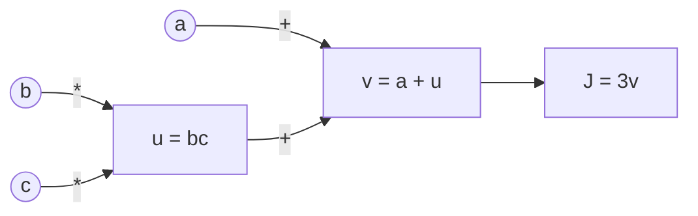

## 1. Neural Networks and Backpropagation

Before we can build a language model that generates human-like text, we need to understand the absolute ground floor of modern AI: the **Artificial Neural Network (ANN)**.

Every complex architecture we will study—from Autoencoders to Transformers—is just a clever arrangement of this basic mechanism. 

### The Core Idea: Function Approximation
At its heart, a neural network is just a mathematical function. It takes numbers as input, does some math, and spits out numbers as output. 

Imagine you want a machine to look at a photo of a handwritten number (a $28 \times 28$ grid of pixels) and output the digit (0-9). 
1. The **input** is 784 numbers (the pixel brightness values).
2. The **output** is 10 numbers (the probability that the image is a 0, a 1, a 2, etc.).

A neural network is the "black box" in the middle that learns how to map those 784 inputs to the correct 10 outputs.

### The Anatomy of a Neuron
The building block of this black box is the **neuron** (or node). A single neuron does a very simple calculation:

1. **Weights ($w$)**: It takes multiple inputs and multiplies each by a specific "weight". A weight is just a dial that determines how important that input is.
2. **Bias ($b$)**: It adds a single "bias" number to the total. This is like a threshold shift.
3. **Activation Function**: It passes the final sum through a mathematical filter to introduce non-linearity.

Mathematically, for a neuron with inputs $x$:
$$z = w_1 x_1 + w_2 x_2 + \dots + b$$
$$a = \sigma(z)$$
*(Where $a$ is the activation output, and $\sigma$ is the activation function, like the Sigmoid function $\frac{1}{1 + e^{-z}}$).*

### The Cost Function (Log-Loss / Cross-Entropy)
To train the network, we must define how "wrong" its predictions are. For classification tasks, we typically use the **Cross-Entropy** (or Log-Loss) function. 

If $y$ is the true label (0 or 1) and $\hat{y}$ is the predicted probability, the cost function $J$ over $m$ examples is:
$$J(w,b) = -\frac{1}{m} \sum_{i=1}^{m} \left( y^{(i)} \log(\hat{y}^{(i)}) + (1 - y^{(i)}) \log(1 - \hat{y}^{(i)}) \right)$$

### How Does it Learn? (Backpropagation & Gradient Descent)
We use a process called **Gradient Descent** to learn the weights of the function. We calculate the derivative of the cost function with respect to every weight and bias, and update them using a learning rate $\alpha$:

$$w = w - \alpha \frac{\partial J(w,b)}{\partial w}$$
$$b = b - \alpha \frac{\partial J(w,b)}{\partial b}$$

#### The Computational Graph and Chain Rule
Calculating these derivatives for a massive network would be impossible without the **Chain Rule**. Backpropagation uses a computational graph to make calculating gradients simple by re-using previously calculated values.

Consider a simple function $J(a,b,c) = 3(a + bc)$. We can break this down into intermediate variables:
1. $u = bc$
2. $v = a + u$
3. $J = 3v$

Using the chain rule, we work backwards from $J$:
1. $\frac{\partial J}{\partial v} = 3$
2. $\frac{\partial J}{\partial a} = \frac{\partial J}{\partial v} \cdot \frac{\partial v}{\partial a} = 3 \cdot 1 = 3$
3. $\frac{\partial J}{\partial b} = \frac{\partial J}{\partial v} \cdot \frac{\partial v}{\partial u} \cdot \frac{\partial u}{\partial b} = 3 \cdot 1 \cdot c = 3c$

By storing intermediate derivatives ($\frac{\partial J}{\partial v}$), we avoid re-calculating the entire formula for every single weight. This is the magic of backpropagation!

### The Limitation of ANNs
This basic Feed-Forward architecture is incredibly powerful, but it has one fatal flaw when it comes to language: **It requires a fixed-size input.** 

If your network is built with 784 input neurons, it can *only* accept 784 numbers. But language is variable. Sentences can be 3 words long or 3,000 words long. 

To process language, we had to invent new architectures that could handle sequences over time. But first, let's look at Activation Functions and how we regularize these networks to prevent them from memorizing the data.
