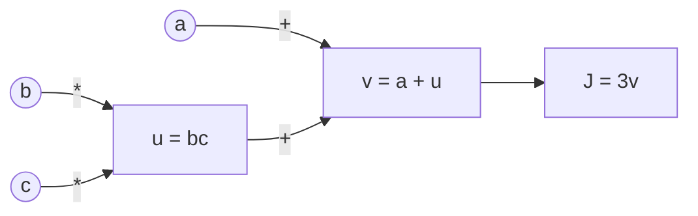

## 1. Neural Networks and Backpropagation

Before we can build a language model that generates human-like text, we need to understand the absolute ground floor of modern AI: the **Artificial Neural Network (ANN)**.

Every complex architecture we will study—from Autoencoders to Transformers—is just a clever arrangement of this basic mechanism. 

### The Core Idea: Function Approximation
At its heart, a neural network is just a mathematical function. It takes numbers as input, does some math, and spits out numbers as output. 

Imagine you want a machine to look at a photo of a handwritten number (a $28 \times 28$ grid of pixels) and output the digit (0-9). 
1. The **input** is 784 numbers (the pixel brightness values).
2. The **output** is 10 numbers (the probability that the image is a 0, a 1, a 2, etc.).

A neural network is the "black box" in the middle that learns how to map those 784 inputs to the correct 10 outputs.

### The Anatomy of a Neuron
The building block of this black box is the **neuron** (or node). A single neuron does a very simple calculation. Think of it like a tiny committee member trying to make a decision:

1. **Weights ($w$)**: It receives input from previous neurons, but it trusts some more than others. It multiplies each input by a specific "weight". A weight is just a dial that determines how important that input is.
2. **Bias ($b$)**: It adds a single "bias" number to the total. This is like a baseline tendency. A highly positive bias means the neuron is very eager to activate, even if the inputs are weak.
3. **Activation Function**: It passes the final sum through a mathematical filter to introduce non-linearity (more on this in the next chapter).

Mathematically, for a neuron with inputs $x$:
$$z = (w_1 x_1 + w_2 x_2 + \dots + w_n x_n) + b$$
$$a = \text{ActivationFunction}(z)$$

If you arrange thousands of these neurons into layers—where the output of one layer feeds into the input of the next—you have a **Deep Neural Network**.

---

### The Cost Function (How to measure failure)
When a neural network is first created, its weights and biases are completely random. If you feed it an image of a "3", it might output a 99% probability that it's a "7". 

To train the network, we must mathematically define how "wrong" its predictions are. For classification tasks, we typically use the **Cross-Entropy** (or Log-Loss) function. 

If $y$ is the true label (0 or 1) and $\hat{y}$ is the predicted probability, the cost function $J$ over $m$ examples is:
$$J(w,b) = -\frac{1}{m} \sum_{i=1}^{m} \left( y^{(i)} \log(\hat{y}^{(i)}) + (1 - y^{(i)}) \log(1 - \hat{y}^{(i)}) \right)$$

This looks intimidating, but it just means: *Penalize the network heavily if it confidently predicts the wrong answer, and reward it if it confidently predicts the right answer.*

---

### Backpropagation: The Algorithm that Changed the World
If the network is wrong, how do we fix it? 

Imagine you are standing on the side of a foggy mountain blindfolded, and you want to get to the bottom. You can't see the valley, but you can feel the slope of the ground beneath your feet. If you take a step in the direction that slopes downward most steeply, you will eventually reach the bottom. 

This is **Gradient Descent**. We want to find the lowest possible point of our Cost Function (where the error is zero). 
To do this, we calculate the **derivative** (the slope) of the cost function with respect to every single weight and bias in the network. Then, we adjust the weights in the opposite direction of the slope, controlled by a small step size called the **Learning Rate ($\alpha$)**:

$$w_{\text{new}} = w_{\text{old}} - \alpha \frac{\partial J}{\partial w}$$

#### The Problem with Deep Networks
Calculating the derivative for a 1-layer network is easy. But modern networks have hundreds of layers and billions of parameters. Trying to calculate a single massive derivative equation for a weight in the very first layer would be computationally impossible.

#### The Solution: The Chain Rule & Computational Graphs
Backpropagation solves this using the calculus **Chain Rule**. By working backwards from the output to the input, we can break down massive, complex derivatives into a series of tiny, simple multiplications.

Consider a simple function $J(a,b,c) = 3(a + bc)$. We can break this down into a computational graph of intermediate variables:
1. $u = bc$
2. $v = a + u$
3. $J = 3v$

Using the chain rule, we work backwards from the final error $J$:
1. $\frac{\partial J}{\partial v} = 3$
2. $\frac{\partial J}{\partial a} = \frac{\partial J}{\partial v} \cdot \frac{\partial v}{\partial a} = 3 \cdot 1 = 3$
3. $\frac{\partial J}{\partial b} = \frac{\partial J}{\partial v} \cdot \frac{\partial v}{\partial u} \cdot \frac{\partial u}{\partial b} = 3 \cdot 1 \cdot c = 3c$

By storing the intermediate derivative ($\frac{\partial J}{\partial v}$), we didn't have to recalculate the entire formula for $b$. We just multiplied the saved value by the local derivative of $u$. 

In a neural network with billions of parameters, this backward pass is incredibly fast and efficient. It is the engine that makes all modern AI possible.

### The Limitation of standard ANNs
This basic Feed-Forward architecture is incredibly powerful, but it has one fatal flaw when it comes to language: **It requires a fixed-size input.** 

If your network is built with 784 input neurons, it can *only* accept 784 numbers. But language is variable. Sentences can be 3 words long or 3,000 words long. 

To process language, we had to invent new architectures that could handle sequences over time (which we will cover in Phase 1). But first, let's look at how we tune these networks to prevent them from breaking during training.
