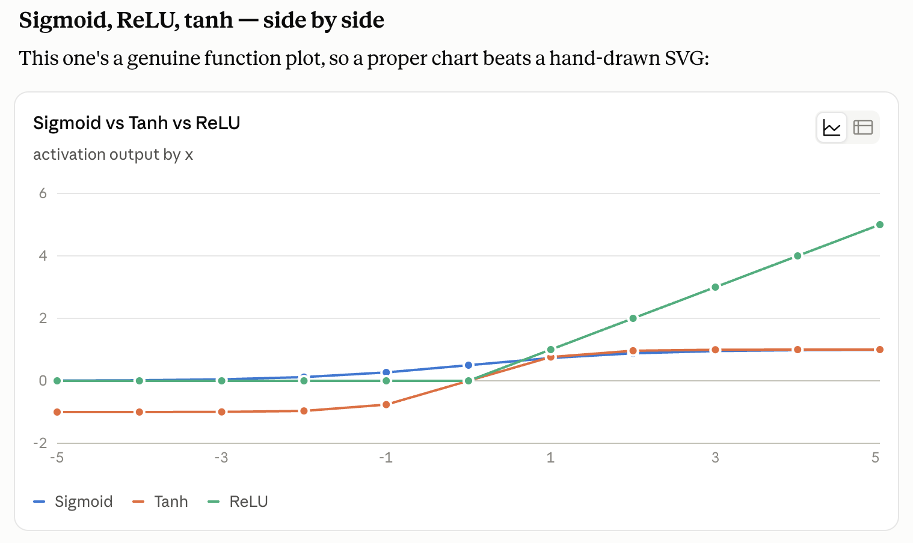

## 2. Activation Functions and Regularization

As a neural network gets deeper, it encounters two major problems:
1. **Mathematical instability during training** (Gradients becoming too large or too small).
2. **Overfitting** (The network simply memorizes the training data instead of learning general patterns).

To solve these, we must carefully choose our **Activation Functions** and employ **Regularization** techniques.

---

### Part 1: Activation Functions

An activation function introduces non-linearity into the network. Without it, stacking 100 layers would just collapse into one giant linear equation. 

Three things to notice in the chart above:
- **Sigmoid** (blue): output is always positive (0 to 1), saturates at both ends → vanishing gradients
- **Tanh** (orange): zero-centred (−1 to 1), still saturates → vanishing gradients but less bias shift
- **ReLU** (green): linear for x > 0, zero for x ≤ 0, never saturates on the positive side → gradient stays exactly 1

#### 1. Sigmoid
The Sigmoid function squashes inputs into a range between `0` and `1`.
$$a = \sigma(z) = \frac{1}{1 + e^{-z}}$$
**Derivative:** $da = \sigma(z) \cdot (1 - \sigma(z))$

#### 2. Tanh (Hyperbolic Tangent)
Tanh is similar to Sigmoid but squashes inputs between `-1` and `1`, which centres the data around zero.
$$a = \tanh(z) = \frac{e^z - e^{-z}}{e^z + e^{-z}}$$
**Derivative:** $da = 1 - (\tanh(z))^2$

#### The Problem: Vanishing Gradients
Why are Sigmoid and Tanh rarely used in deep networks today? Because of the **Vanishing Gradient Problem**. 

Look at the derivative of the Sigmoid function: $da = \sigma(z)(1 - \sigma(z))$. 
The maximum possible value of this derivative is `0.25` (when $\sigma(z) = 0.5$). 

Because the derivative is always $\le 1$, the chain rule causes a massive problem. When backpropagating through many layers, we continuously multiply these small derivatives together ($0.25 \times 0.25 \times 0.25 \dots$). 
As we get to the initial layers of a deep network, the gradient becomes exponentially small, effectively freezing the weights and preventing the early layers from learning anything.

#### 3. ReLU (Rectified Linear Unit)
To fix this, modern networks use **ReLU**. 
$$a = \max(0, z)$$
If $z > 0$, the derivative is exactly `1`. If $z \le 0$, the derivative is exactly `0`.
Because the derivative is `1` for positive values, the gradient does not vanish when multiplied across many layers!

**The Downside of ReLU:**
1. **Exploding Gradients:** Because gradients don't vanish, they can instead grow exponentially large. This is solved using **Gradient Clipping** (capping the maximum gradient value).
2. **Dead Neurons:** If a neuron's weights update such that it always outputs a negative number, its ReLU output becomes `0`, and its gradient becomes `0`. It can never recover and "dies". 

**Leaky ReLU** solves the dead neuron problem by allowing a tiny negative slope:
$$a = \max(0.01z, z)$$

#### Initialization Matters
To further prevent exploding/vanishing gradients, we must initialize our weights smartly rather than purely randomly. 
For ReLU activation functions, we use **He Initialization** (setting the variance of the weights to $\frac{2}{n}$). For Tanh, we use **Xavier Initialization** (variance $\frac{1}{n}$).

---

### Part 2: Regularization (Solving Overfitting)

**High Bias** means the network is underfitting (it can't even learn the training data). The solution is a bigger network and longer training.
**High Variance** means the network is overfitting (it memorized the training data and fails on test data). The solution is Regularization.

#### 1. L2 Regularization (Weight Decay)
L2 Regularization penalizes the network for having excessively large weights by adding the **Frobenius Norm** to the cost function.

$$J_{reg} = J(w,b) + \frac{\lambda}{2m} \|W\|_F^2$$

During backpropagation, this naturally shrinks the weights on every step:
$$w = w - \alpha \cdot dw - \alpha \frac{\lambda}{m} w$$
$$w = w(1 - \frac{\alpha \lambda}{m}) - \alpha \cdot dw$$
Because we constantly multiply $w$ by a fraction $(1 - \frac{\alpha \lambda}{m})$, this is also known as **Weight Decay**.

#### 2. Dropout Regularization
Dropout is a highly effective, adaptive form of regularization. 

During every pass of training, we set a probability (e.g., `keepprob = 0.8`) and randomly turn off 20% of the neurons in the network. 
*Why does this work?* The network can no longer rely on any single specific feature or neuron, because that neuron might be randomly dropped. It is forced to spread out its weights and learn redundant, robust features.

*(Note: Inverted Dropout mathematically scales the remaining neurons during training by dividing by `keepprob`, so that during test time, the full network can run without any scaling adjustments).*

#### 3. Other Methods
1. **Data Augmentation:** Modifying the training set (e.g., randomly distorting or flipping images) to artificially increase the size of the dataset and force the model to generalize.
2. **Early Stopping:** Tracking the error on a Dev Set during training. If the Training error continues to drop but the Dev Set error begins to rise (the exact moment of overfitting), we stop training early.
3. **Normalizing Inputs:** By modifying the optimization problem (subtracting the mean $\mu$ and dividing by the variance $\sigma^2$), we turn elongated, skewed loss landscapes into perfect bowls, making gradient descent converge much faster.
