## 3. Advanced Optimization and Convolutional Neural Networks

As networks get larger and datasets grow to millions of examples, standard Gradient Descent becomes impossibly slow. Furthermore, standard Feed-Forward ANNs have far too many parameters to process large images efficiently. 

In this section, we cover the optimization algorithms that make deep learning fast, and the **Convolutional Neural Network (CNN)**, which gave AI its "eyes".

---

### Part 1: Optimization Algorithms

If you have a dataset of 5,000,000 examples, calculating the loss over the *entire* dataset before taking a single gradient step (Batch Gradient Descent) is too slow.

#### 1. Mini-Batch Gradient Descent
Instead, we divide the training set into smaller **mini-batches** (e.g., chunks of 1000). The network calculates the loss and updates its weights after every 1000 examples. This allows the model to make 5000 weight updates in a single epoch, drastically speeding up learning.

#### 2. Exponentially Weighted Averages
To make optimization algorithms smarter, we use a concept from statistics: Exponentially Weighted Averages. This allows us to track the trend of a value (like the gradient) over time, rather than just its instantaneous value.
$$V_t = \beta \cdot V_{t-1} + (1-\beta) \theta_t$$
*(Where $\beta$ is usually 0.9, meaning we average over the last ~10 days/steps. This smooths out noise).*

#### 3. Gradient Descent with Momentum
Standard gradient descent often oscillates wildly in some directions while moving too slowly in the direction of the minimum. **Momentum** solves this by computing the exponentially weighted average of the gradients, and using *that* to update the weights.
$$V_{dw} = \beta V_{dw} + (1-\beta)dw$$
$$W = W - \alpha V_{dw}$$
This smooths out the oscillations and accelerates progress towards the minimum, much like a ball rolling down a bowl building up speed.

#### 4. RMSProp & Adam Optimization
**RMSProp** (Root Mean Square Propagation) takes this further by dividing the learning rate by an exponentially decaying average of squared gradients. 
**Adam** (Adaptive Moment Estimation) combines both Momentum and RMSProp. It is currently the most popular optimization algorithm for training deep networks (including LLMs).

#### 5. Learning Rate Decay
Instead of keeping the learning rate $\alpha$ constant, we slowly decrease it over time. Early on, we want large steps to traverse the loss landscape quickly. Later, we want tiny steps to settle into the exact minimum without overshooting.
$$\alpha = \frac{1}{1 + \text{decay\_rate} \times \text{epoch\_num}} \alpha_0$$

---

### Part 2: Convolutional Neural Networks (CNNs)

A standard $1000 \times 1000$ pixel color image has 3 million input features. If the first hidden layer of a standard ANN had just 1000 neurons, the weight matrix would have **3 billion parameters**. This is computationally impossible and practically guarantees overfitting.

**CNNs** solve this via two core concepts:
1. **Parameter Sharing:** A feature detector (like a vertical edge detector) that is useful in one part of the image is probably useful in another part of the image.
2. **Sparsity of Connections:** In each layer, an output value only depends on a small number of inputs (its local receptive field), not the entire image.

#### The Convolution Operation
Instead of a giant weight matrix, we define a small **Filter** (or Kernel), such as a $3 \times 3$ grid. 
For example, a **Vertical Edge Detector** filter looks like this:
```
[ 1  0 -1 ]
[ 1  0 -1 ]
[ 1  0 -1 ]
```
We slide (convolve) this filter across the input image. At each step, we multiply the overlapping pixels by the filter values and sum them up. If there is a vertical edge in that patch of the image, the sum will be large! 
During training, the network *learns* the numbers inside these filters via backpropagation.



#### Padding and Strides
- **Strides:** By default, we slide the filter 1 pixel at a time. If we use a Stride of 2, we skip every other pixel, which shrinks the output size.
- **Padding:** Convolving an image naturally shrinks it (a $6\times6$ image with a $3\times3$ filter yields a $4\times4$ output). It also throws away information at the edges. To prevent this, we add a border of zeros around the image (Zero Padding).
- **Formula for Output Size:** $\lfloor \frac{n + 2p - f}{s} + 1 \rfloor$ *(where $n$ is input size, $p$ is padding, $f$ is filter size, $s$ is stride).*

#### Pooling Layers
To drastically reduce the spatial dimensions and computations, we use **Pooling Layers**. 
**Max Pooling** simply takes a $2 \times 2$ window and outputs only the maximum value within that window. It has no parameters to learn! It just extracts the strongest feature from that region.

#### Advanced Architectures
1. **ResNets (Residual Networks):** Training incredibly deep networks (100+ layers) usually fails due to vanishing gradients. ResNets solve this using **Skip Connections** (or shortcuts). We take the activation from an earlier layer $a^{[l]}$ and add it to the output of a deeper layer before applying the ReLU: 
   $$a^{[l+2]} = g(z^{[l+2]} + a^{[l]})$$
   This allows gradients to bypass the deep layers entirely, making it easy to train massive networks.
2. **$1 \times 1$ Convolutions:** A $1 \times 1$ filter seems useless spatially, but it is actually used to squish the "depth" (number of channels) of a volume, massively reducing computational costs.
3. **Inception Networks:** Instead of guessing whether a layer needs a $3 \times 3$ filter, a $5 \times 5$ filter, or a Max Pool layer, an Inception module simply computes *all* of them in parallel and concatenates the results!
