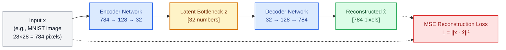
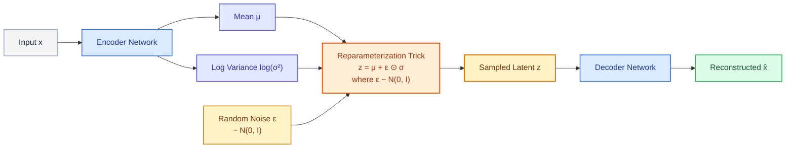
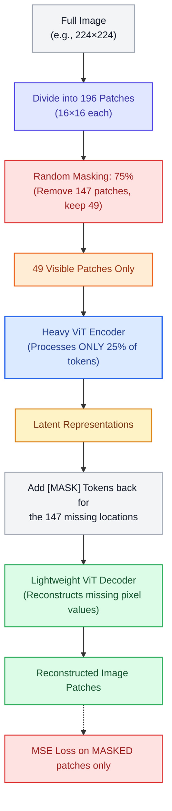

# Reconstruction Family — Learning by Rebuilding

Before Transformers took over modern AI, researchers discovered the most powerful paradigm in deep learning: **Self-Supervised Learning (SSL)**. Instead of paying humans to annotate millions of labels ($x \to y$), we make the **raw data supervise itself** ($x \to x$ or $\tilde{x} \to x$).

The **Reconstruction Family** is the foundational pillar of this paradigm. By forcing a model to compress, clean, or reconstruct data through an information bottleneck, the model is compelled to discover the underlying laws of the data — whether those are grammar rules in language, anatomy in images, or phonetics in audio.

---

## The Big Picture: Why Reconstruction Matters for LLMs & Transformers

If you are building LLMs, you might ask: *"Why are Autoencoders in an LLM curriculum?"*

Because modern foundation models are direct descendants of this family:
* **BERT & RoBERTa:** Literally **Masked Denoising Autoencoders for text**. They hide 15% of the words and train a Transformer to reconstruct them.
* **Vision Transformers (MAE):** State-of-the-art vision models train by masking 75% of image patches and reconstructing pixels.
* **Multimodal LLMs & Diffusion:** Models like LLaMA-Vision, Chameleon, and Stable Diffusion rely on **VAEs and VQ-VAEs** to compress high-resolution images into compact discrete tokens that an LLM can understand.

### Cross-Modality Mapping: Reconstruction Across Data Types

Reconstruction uses the same principle regardless of whether data is pixels, words, or audio:

| Modality | Raw Input $x$ | Bottleneck / Corruption | Reconstruction Target $\hat{x}$ | Landmark Model |
| :--- | :--- | :--- | :--- | :--- |
| **Vision (Pixels)** | $28 \times 28$ image (784 numbers) | Low-dim code $z \in \mathbb{R}^{32}$ | Original clean image | **Vanilla AE / VAE** |
| **Vision (Patches)** | $224 \times 224$ image ($196$ patches) | Mask 75% of image patches | Missing pixel values | **MAE (He et al., 2021)** |
| **Language (Tokens)** | Sequence of word embeddings | Replace 15% tokens with `[MASK]` | Original missing words | **BERT (Devlin et al., 2018)** |
| **Audio (Frames)** | Spectrogram / Raw audio wave | Mask blocks of time frames | Reconstructed acoustic frames | **Wav2Vec 2.0 / HuBERT** |
| **Discrete Latents** | Continuous image / video | Quantize vectors to codebook indices | Decoded high-res image | **VQ-VAE / VQGAN** |

---

## §1 — Vanilla Autoencoder (AE): Compression & Representation

The simplest formulation. Map high-dimensional input $x$ to a lower-dimensional latent space $z$ (the **bottleneck**), then reconstruct $\hat{x}$.



### Architecture Internals: How Dimension is Natively Reduced

How does the network physically squeeze 784 numbers down into 32? **Through rectangular weight matrices.**

```
Input Image (28×28) ──► Flatten ──► Linear(784, 128) ──► ReLU ──► Linear(128, 32) ──► Latent Code z (32 dims)
```

1. **The Encoder:**
   * **Layer 1:** Input $\mathbf{x} \in \mathbb{R}^{1 \times 784}$ is multiplied by weight matrix $\mathbf{W}_1 \in \mathbb{R}^{784 \times 128}$.
     $$\mathbf{h}_1 = \text{ReLU}(\mathbf{x} \mathbf{W}_1 + \mathbf{b}_1) \implies \text{Shape: } [1 \times 128]$$
   * **Layer 2 (Bottleneck):** $\mathbf{h}_1$ is multiplied by $\mathbf{W}_2 \in \mathbb{R}^{128 \times 32}$.
     $$\mathbf{z} = \mathbf{h}_1 \mathbf{W}_2 + \mathbf{b}_2 \implies \text{Shape: } [1 \times 32]$$
   * The dimensional collapse happens purely because $\mathbf{W}_1$ and $\mathbf{W}_2$ have fewer output columns than input rows.
   *(In a **Convolutional Autoencoder**, dimension reduction is achieved using **Strided Convolutions** (`stride=2`) or **Max Pooling** layers, which downsample the 2D spatial grid: $28 \times 28 \to 14 \times 14 \to 7 \times 7 \to \text{flatten}$).*

2. **The Decoder (Symmetrical Expansion):**
   * **Layer 1:** Latent $\mathbf{z} \in \mathbb{R}^{1 \times 32}$ multiplied by $\mathbf{W}_3 \in \mathbb{R}^{32 \times 128} \implies [1 \times 128]$.
   * **Layer 2:** Hidden state multiplied by $\mathbf{W}_4 \in \mathbb{R}^{128 \times 784} \implies [1 \times 784]$.
   * **Output Activation (`Sigmoid`):** Squashes all 784 output values into the range $[0.0, 1.0]$, matching valid normalized pixel intensities!

---

### How Loss is Computed on Pixels (Step-by-Step with a Small Image)

In language models, words are discrete IDs; the model produces a softmax probability distribution over 50,000 vocabulary tokens and minimizes **Categorical Cross-Entropy**.

In image autoencoders, **pixels are continuous real numbers**. We compare the predicted intensity directly against the true pixel intensity using regression.

#### Concrete Walkthrough: A Tiny $2 \times 2$ Image (4 Pixels)
Suppose we feed a tiny $2 \times 2$ grayscale patch into our autoencoder. Pixels are normalized from $[0, 255]$ to $[0.0, 1.0]$:

```
  Original Image x (2×2):           Reconstructed Image x̂ (2×2):
  ┌──────────────┬──────────────┐   ┌──────────────┬──────────────┐
  │ Pixel 1: 0.00│ Pixel 2: 0.85│   │ Pixel 1: 0.02│ Pixel 2: 0.78│  (Dark background &
  ├──────────────┼──────────────┤   ├──────────────┼──────────────┤   bright stroke)
  │ Pixel 3: 0.92│ Pixel 4: 0.10│   │ Pixel 3: 0.88│ Pixel 4: 0.15│
  └──────────────┴──────────────┘   └──────────────┴──────────────┘
```

The network compares every corresponding pixel element-by-element:

| Pixel Position $i$ | Actual Pixel $x_i$ | Reconstructed Pixel $\hat{x}_i$ | Error $(x_i - \hat{x}_i)$ | Squared Error $(x_i - \hat{x}_i)^2$ |
| :--- | :--- | :--- | :--- | :--- |
| **Pixel 1** (Dark background) | $0.00$ | $0.02$ | $-0.02$ | $(-0.02)^2 = \mathbf{0.0004}$ |
| **Pixel 2** (Bright stroke) | $0.85$ | $0.78$ | $+0.07$ | $(+0.07)^2 = \mathbf{0.0049}$ |
| **Pixel 3** (Bright stroke) | $0.92$ | $0.88$ | $+0.04$ | $(+0.04)^2 = \mathbf{0.0016}$ |
| **Pixel 4** (Dark background) | $0.10$ | $0.15$ | $-0.05$ | $(-0.05)^2 = \mathbf{0.0025}$ |

**1. Mean Squared Error (MSE) Loss:**
$$\text{MSE Loss} = \frac{1}{4}\sum_{i=1}^{4} (x_i - \hat{x}_i)^2 = \frac{0.0004 + 0.0049 + 0.0016 + 0.0025}{4} = \mathbf{0.00235}$$

**2. Can we use Cross-Entropy on Pixels? (BCE on Pixels):**
Yes! If pixels are normalized between $[0, 1]$, they can be mathematically treated as the **Bernoulli probability of a pixel being lit up (black vs white)**. Many seminal VAE papers use Binary Cross-Entropy (BCE):
$$\text{BCE Loss} = -\sum_{i=1}^{D} \Big[ x_i \log(\hat{x}_i) + (1 - x_i) \log(1 - \hat{x}_i) \Big]$$
BCE penalizes confident wrong pixels much more harshly than MSE, which often prevents blurry reconstructions.

#### Continuous Regression (Images) vs. Discrete Cross-Entropy (Text)

| Property | Pixel Reconstruction (Autoencoders / MAE) | Word Reconstruction (BERT / GPT) |
| :--- | :--- | :--- |
| **Data Nature** | Continuous real values ($x_i \in [0.0, 1.0]$) | Discrete integer symbols (Token ID $\in \{1, \dots, V\}$) |
| **Model Output** | Vector of predicted intensities $\hat{x}_i \in [0, 1]$ | Vector of logits over full vocabulary $[1 \times V]$ |
| **Loss Objective** | **MSE** ($\|x - \hat{x}\|^2$) or **BCE** | **Categorical Cross-Entropy** ($-\log p_{\text{target}}$) |
| **Question Asked** | *"How close is your predicted brightness to 0.85?"* | *"Did you pick the correct word index from the 50,000 dictionary?"* |

---

### Why Does the Bottleneck Force Learning?
If the network had unlimited dimensions at the bottleneck ($z$ had 784 dims), it would learn the **identity function** — simply copying pixel 1 to output 1 without understanding anything.

By squeezing 784 dimensions down to just **32 numbers**:
* The network **cannot memorize** individual pixels or random background noise.
* It is forced to discover **global semantic factors** (e.g., digit angle, loop closure, stroke thickness).
* Think of it as **Non-linear Principal Component Analysis (PCA)**.

### What $z$ Actually Learns
* **Clustering:** Similar digits or faces naturally cluster close together in $z$-space.
* **Semantic Axes:** In face models, specific axes in $z$ emerge corresponding to "lighting direction," "smile intensity," or "pose angle" — without any human ever providing those labels.

### The Fatal Flaws of Vanilla Autoencoders
1. **Unstructured Latent Space ("Swiss Cheese"):** The network only cares about minimizing error for training points. The space between clusters is completely undefined.
2. **Cannot Generate New Data:** If you pick a random coordinate $z \sim \mathcal{N}(0, 1)$ in empty space and feed it to the decoder, you get nonsensical static or hybrid blur. It is a compression model, **not a generative model**.

---

## §2 — Denoising Autoencoder (DAE): Learning Robust Representations

Introduced by Vincent et al. (2008), the Denoising Autoencoder changed the goal: **Do not reconstruct the input you received. Reconstruct the clean version of a corrupted input.**

```mermaid
flowchart LR
    X["Clean Input x"] --> NOISE["Apply Corruption\n(Noise / Masking)"]
    NOISE --> XT["Corrupted x̃"]
    XT --> ENC["Encoder"]
    ENC --> Z["Bottleneck z"]
    Z --> DEC["Decoder"]
    DEC --> XH["Reconstruction x̂"]
    
    X -.-> LOSS["Loss = ||x - x̂||²\n(Target is CLEAN x!)"]
    XH -.-> LOSS

    style X fill:#f3f4f6,stroke:#9ca3af,stroke-width:1.5px,color:#111827
    style NOISE fill:#fee2e2,stroke:#dc2626,stroke-width:1.5px,color:#991b1b
    style XT fill:#ffedd5,stroke:#ea580c,stroke-width:1.5px,color:#9a3412
    style ENC fill:#dbeafe,stroke:#2563eb,stroke-width:1.5px,color:#1e3a8a
    style Z fill:#fef3c7,stroke:#d97706,stroke-width:2px,color:#78350f
    style DEC fill:#dbeafe,stroke:#2563eb,stroke-width:1.5px,color:#1e3a8a
    style XH fill:#dcfce7,stroke:#16a34a,stroke-width:1.5px,color:#14532d
    style LOSS fill:#fee2e2,stroke:#dc2626,stroke-width:1.5px,color:#991b1b
```



### Common Corruption Strategies
1. **Additive Gaussian Noise:** $\tilde{x} = x + \epsilon, \quad \epsilon \sim \mathcal{N}(0, \sigma^2)$
2. **Masking Noise (Zero-out):** Randomly set 20–50% of input elements to 0.
3. **Salt-and-Pepper Noise:** Randomly flip pixels to pure min/max.

### Why DAE Forces True Understanding
If an eye is masked out of a face image, the model cannot copy it. To reconstruct the missing eye, the network **must know what a human face looks like**, that faces are symmetric, and where an eye belongs relative to the nose.

> [!IMPORTANT]
> **The Direct Line to BERT:** 
> When BERT masks 15% of words in a sentence (`"The [MASK] sat on the mat"`) and predicts `"cat"`, **BERT is operating as a Denoising Autoencoder for discrete language tokens**.

---

## §3 — Variational Autoencoder (VAE): Making the Latent Space Generative

Published by Kingma & Welling (2013), the VAE transformed autoencoders into true **generative models**. 

Instead of encoding an input $x$ to a single deterministic point $z$, the encoder predicts the parameters of a probability distribution: **mean vector $\mu$** and **log-variance vector $\log \sigma^2$**.



### The Reparameterization Trick: Why Sampling Didn't Break Backpropagation

In a naive formulation, you would sample $z \sim \mathcal{N}(\mu, \sigma^2)$. But **sampling is a stochastic operation**: you cannot compute a mathematical derivative through a random number generator! Backpropagation would die at the sampling node.

The solution is the **Reparameterization Trick**:
Separate the randomness from the learned parameters:

$$z = \mu + \sigma \odot \varepsilon, \quad \text{where } \varepsilon \sim \mathcal{N}(0, I)$$

* $\varepsilon$ is drawn from a standard normal distribution with no trainable parameters.
* $\mu$ and $\sigma$ remain deterministic outputs of neural network layers.
* Gradients flow seamlessly through $\mu$ and $\sigma$ back into the encoder!

### The Loss Function: Evidence Lower Bound (ELBO)

$$\mathcal{L}_{\text{VAE}} = \underbrace{\mathbb{E}_{q(z|x)}[\log p(x|z)]}_{\text{Reconstruction Fidelity (MSE or BCE)}} - \underbrace{D_{\text{KL}}\left(q(z|x) \parallel \mathcal{N}(0, I)\right)}_{\text{KL Divergence Regularizer}}$$

| Term | Mathematical Goal | Physical Interpretation |
| :--- | :--- | :--- |
| **Reconstruction Term** | Maximize log-likelihood $\log p(x\|z)$ | "Make $\hat{x}$ look identical to input $x$." |
| **KL Divergence Term** | Minimize distance to $\mathcal{N}(0, I)$ | "Keep all cluster centers near 0 and variance near 1. Fill all empty holes." |

### Why KL Regularization Creates a Generative Latent Space

```
  Vanilla AE (No Regularization):          VAE (With KL Regularization):
  
      Digit 1           Digit 2               Digit 1      Digit 2
       ● ● ●             ▲ ▲ ▲                 ● ● ●        ▲ ▲ ▲
       ● ● ●             ▲ ▲ ▲                 ● ● ● ──*─── ▲ ▲ ▲
                                                       │
           [DEAD SPACE / GAPS]                 Interpolation works!
       Sampling here = GARBAGE                 Sampling here = Smooth hybrid digit
       
       ■ ■ ■                                        ■ ■ ■
      Digit 3                                      Digit 3
```

Because the KL term pulls all encodings toward a standard normal Gaussian $\mathcal{N}(0, I)$:
1. **Completeness:** There are no dead spaces or missing gaps.
2. **Smoothness:** Walking from one point in $z$-space to another smoothly transitions the output (e.g., smoothly turning a frowning face into a smiling face).
3. **Generation:** You can draw a random vector $z \sim \mathcal{N}(0, I)$, pass it through the decoder, and generate a brand-new, realistic image!

---

## §4 — Masked Autoencoders (MAE): Reconstruction at Foundation Scale

Published by Kaiming He et al. (2021), **Masked Autoencoders (MAE)** proved that denoising reconstruction scales brilliantly to massive Vision Transformers (ViT).



### Why 75% Masking for Vision vs 15% for Language?
* **Language is dense and symbolic:** If you remove 50% of the words from a paragraph, humans cannot decipher the meaning. Every word contains high semantic entropy. Hence BERT only masks **15%**.
* **Vision is spatially redundant:** Pixels next to each other are almost identical. If you mask 15% of an image, the model just copies neighboring pixel values without learning semantics. Masking **75% to 80%** forces the model to understand high-level concepts (e.g., predicting an entire airplane wing from just a tip).

### The Asymmetric Compute Advantage
Notice a brilliant architectural trick in MAE:
1. The **Encoder is large and deep**, but it **only processes the 25% visible patches**. Because Transformer complexity is quadratic with sequence length ($O(N^2)$), running on 25% of tokens speeds up training by over **3× to 4×**!
2. The **Decoder is tiny and shallow**, used only during pretraining to reconstruct pixels, and discarded during downstream fine-tuning.

---

## §5 — Summary: The Complete Reconstruction Family

| Model | Primary Modality | Bottleneck / Constraint | Objective | Core Superpower | Primary Limitation |
| :--- | :--- | :--- | :--- | :--- | :--- |
| **Vanilla AE** | Any (Pixels, features) | Low dimensionality ($z \ll x$) | Minimize $\|x - \hat{x}\|^2$ | Non-linear dimensionality reduction | Gaps in latent space; non-generative |
| **Denoising AE** | Images, Tabular | Noise / zero-out corruption | Predict clean $x$ from noisy $\tilde{x}$ | Learns robust manifold structure | Reconstruction targets can be blurry |
| **VAE** | Images, Audio, Latents | KL Divergence constraint to $\mathcal{N}(0, I)$ | ELBO (Reconstruction + KL) | Smooth, continuous generative space | Blurry image outputs compared to GANs/Diffusion |
| **VQ-VAE** | Images, Audio, Video | Discrete vector codebook ($e_k$) | Vector quantization + reconstruction | Converts continuous signals into discrete tokens for LLMs | Training codebook requires EMA or commitment loss |
| **BERT (MLM)** | Natural Language | 15% Token Masking (`[MASK]`) | Cross-Entropy over vocabulary | Deep bidirectional language representations | Cannot generate autoregressive text naturally |
| **MAE** | Vision Patches | 75% Patch Masking | Pixel MSE on masked patches | Extremely scalable pretraining for ViT encoders | Specialized for encoder representations |

---

## Landmark Papers to Know

1. **Autoencoders & Dimensionality Reduction:** [Hinton & Salakhutdinov (2006) — *Reducing the Dimensionality of Data with Neural Networks*](https://www.science.org/doi/10.1126/science.1127647)
2. **Denoising Autoencoders:** [Vincent et al. (2008) — *Extracting and Composing Robust Features with Denoising Autoencoders*](https://dl.acm.org/doi/10.1145/1390156.1390294)
3. **Variational Autoencoders:** [Kingma & Welling (2013) — *Auto-Encoding Variational Bayes*](https://arxiv.org/abs/1312.6114)
4. **Vector-Quantized VAE (VQ-VAE):** [van den Oord et al. (2017) — *Neural Discrete Representation Learning*](https://arxiv.org/abs/1711.00937)
5. **BERT:** [Devlin et al. (2018) — *BERT: Pre-training of Deep Bidirectional Transformers for Language Understanding*](https://arxiv.org/abs/1810.04805)
6. **Masked Autoencoders (MAE):** [He et al. (2021) — *Masked Autoencoders Are Scalable Vision Learners*](https://arxiv.org/abs/2111.06377)
