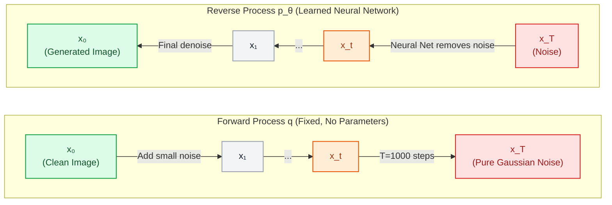
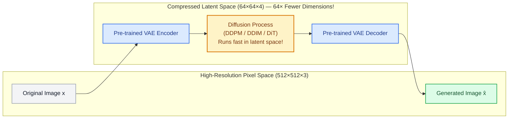
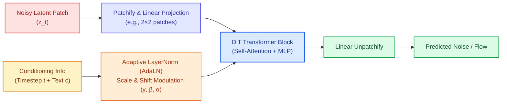

# Generative Flows and Diffusion

In language models (like GPT and LLaMA), generation is **autoregressive and discrete**: the model predicts one discrete token at a time from left to right: $p(x_t \mid x_{<t})$.

However, for continuous modalities — **images, video, audio waveforms, and robotic physical actions** — autoregressive generation can be slow and struggles with high-dimensional continuity. The modern standard for generating continuous data is **Diffusion Models and Flow Matching**.

---

## The Big Picture: Why Diffusion & Flow Matter for LLM Builders

If your focus is LLMs, why do you need to know this?

1. **The Architecture Convergence (DiT):** Modern diffusion models (like OpenAI **Sora**, **FLUX.1**, and **Stable Diffusion 3**) threw away convolutional U-Nets and replaced them with **Diffusion Transformers (DiT)**. Diffusion models today *are* Transformers!
2. **Multimodal Foundation Models:** Frontiers are converging. Models don't just generate text; unified architectures emit text tokens autoregressively while emitting visual latents or robot trajectories via diffusion or flow matching.
3. **Physical AI & Robotics:** Robot foundation models (like Physical Intelligence's $\pi_0$) use **Flow Matching** to generate smooth, continuous 50Hz motor actions instead of choppy token bins.

```
       Discrete Generation (LLMs)             Continuous Generation (Diffusion & Flows)
    ┌───────────────────────────────┐     ┌─────────────────────────────────────────────────┐
    │  Predict next discrete token  │     │  Start from pure Gaussian noise: x_T ~ N(0, I)  │
    │  Token 1 ──► Token 2 ──► ...  │     │  Iteratively denoise toward clean data: x_0     │
    │  Loss: Cross-Entropy          │     │  Loss: Mean Squared Error (MSE) on noise/flow   │
    └───────────────────────────────┘     └─────────────────────────────────────────────────┘
```

---

## §1 — Denoising Diffusion Probabilistic Models (DDPM)

Published by Ho et al. (2020), DDPM frames generative modeling as reversing a gradual destruction process inspired by non-equilibrium thermodynamics.



### 1. The Forward (Noising) Process
The forward process $q(x_t \mid x_{t-1})$ systematically injects Gaussian noise according to a predefined schedule $\beta_1, \beta_2, \dots, \beta_T$:

$$q(x_t \mid x_{t-1}) = \mathcal{N}\left(x_t; \; \sqrt{1 - \beta_t}\, x_{t-1}, \; \beta_t I\right)$$

#### The Closed-Form Shortcut
You do **not** need to simulate $t$ sequential steps during training. Because the sum of Gaussians is another Gaussian, you can jump directly from clean image $x_0$ to any arbitrary timestep $t$:

$$x_t = \sqrt{\bar{\alpha}_t}\, x_0 + \sqrt{1 - \bar{\alpha}_t}\, \varepsilon \qquad \text{where } \varepsilon \sim \mathcal{N}(0, I)$$

where $\alpha_t = 1 - \beta_t$ and $\bar{\alpha}_t = \prod_{s=1}^t \alpha_s$.

### 2. The Reverse (Denoising) Process & Training Loss
During training, we pick a random image $x_0$, sample a random timestep $t \in [1, T]$, add noise $\varepsilon \sim \mathcal{N}(0, I)$ to obtain $x_t$, and train a neural network $\varepsilon_\theta(x_t, t)$ to **predict the exact noise that was added**:

$$\mathcal{L}_{\text{DDPM}} = \mathbb{E}_{x_0, \varepsilon, t}\left[\|\varepsilon - \varepsilon_\theta(x_t, t)\|^2\right]$$

> [!NOTE]
> **Why predict noise instead of the image?**
> Predicting the noise $\varepsilon$ is mathematically equivalent to predicting the **score function** $\nabla_x \log p(x)$ (the gradient of the data distribution). It is numerically far more stable than predicting raw pixel values directly.

---

## §2 — Acceleration: DDIM & Latent Diffusion (Stable Diffusion)

Vanilla DDPM required **$T = 1,000$ sequential evaluation steps** to generate a single image. Two breakthroughs made diffusion commercially viable:

### 1. DDIM (Denoising Diffusion Implicit Models)
Song et al. (2020) demonstrated that the reverse process can be re-cast as a **deterministic ordinary differential equation (ODE)** rather than a stochastic process.
* **DDPM:** Requires ~1,000 stochastic steps.
* **DDIM:** Can skip intermediate steps safely, producing high-fidelity images in **20 to 50 deterministic steps** with the exact same trained model weights.

### 2. Latent Diffusion Models (LDM / Stable Diffusion)
Rombach et al. (2022) solved the compute bottleneck: **Pixel-space diffusion is wasteful.**
In a $512 \times 512$ RGB image, billions of FLOPs are wasted diffusing high-frequency imperceptible details (individual skin pores or grass blades).



By using a pretrained VAE to compress images into a compact latent space:
* The dimension shrinks from $512 \times 512 \times 3 = 786,432$ values to $64 \times 64 \times 4 = \mathbf{16,384}$ values (**48× compression**).
* Training and sampling become fast enough to run on consumer GPUs.

---

## §3 — Text Conditioning & Classifier-Free Guidance (CFG)

How does a diffusion model know to generate *"an astronaut riding a green horse"*?

### Cross-Attention Conditioning
Text prompts are passed through a text encoder (like CLIP or T5). The resulting text token embeddings $c$ are injected into the diffusion network via **Cross-Attention layers**, where the image latents act as Queries ($Q$) and the text tokens act as Keys and Values ($K, V$).

### Classifier-Free Guidance (CFG)
Without guidance, conditional models often ignore the prompt and generate generic pretty images. **Classifier-Free Guidance** (Ho & Salimans, 2022) amplifies the prompt's influence:

$$\hat{\varepsilon} = \varepsilon_\theta(x_t, \varnothing) + w \cdot \Big(\varepsilon_\theta(x_t, c) - \varepsilon_\theta(x_t, \varnothing)\Big)$$

Where:
* $\varepsilon_\theta(x_t, \varnothing)$ is the **unconditional prediction** (generated with an empty text prompt).
* $\varepsilon_\theta(x_t, c)$ is the **conditional prediction** (conditioned on prompt $c$).
* $w$ is the **Guidance Scale**.

```
  Vector push along prompt direction:
  
  Unconditional ε(∅) ─────────► Conditional ε(c)
                              \
                               \──────► Extrapolated Result: ε(∅) + w · (ε(c) - ε(∅))
                                        (Sharp prompt adherence)
```

| Scale $w$ | Visual Behavior |
| :--- | :--- |
| **$w = 1.0$** | Standard conditional generation (often ignores subtle prompt instructions). |
| **$w = 7.0 - 8.5$** | **The sweet spot.** Crisp prompt following, vivid contrast, high aesthetic appeal. |
| **$w \ge 15.0$** | **Over-saturation.** Extreme contrast, unnatural artifacts, destroyed details. |

---

## §4 — The DiT Revolution: Diffusion Meets Transformers

From 2015 to 2022, convolutional **U-Nets** were the undisputed backbone of diffusion models. 

In 2023, William Peebles and Saining Xie published **DiT (Diffusion Transformers)**, answering a critical question: *Can a pure Vision Transformer replace the U-Net in diffusion?*

The answer changed the generative landscape completely. DiT powered **OpenAI Sora, FLUX.1, and Stable Diffusion 3**.



### Why DiT Won Over U-Nets:
1. **Predictable Scaling Laws:** Transformers scale predictably with increased compute (Gflops) and model parameter count. U-Nets plateaued; DiT models improved steadily as they grew from DiT-S (small) to DiT-XL.
2. **Adaptive Layer Normalization (AdaLN):** Instead of injecting time $t$ and text $c$ via convolutional additions, DiT modulates the transformer activations using learned scale and shift parameters:
   $$\text{AdaLN}(h) = \gamma(c, t) \odot \left(\frac{h - \mu}{\sigma}\right) + \beta(c, t)$$
3. **Unified Infrastructure:** Training image/video models now uses the exact same optimized GPU Transformer kernels (FlashAttention, Megatron-LM) developed for LLMs.

---

## §5 — Flow Matching: The Modern Frontier (FLUX.1, SD3, & Robotics)

While DDPM curved through Brownian-like trajectories, **Flow Matching** (Lipman et al., 2022; Albergo & Vanden-Eijnden, 2022) redesigns the transport path from noise to data as **straight lines (Optimal Transport)**.

Flow Matching is the core engine behind **FLUX.1, SD3, and physical robotics policies like $\pi_0$**.

```
  Curved Diffusion Trajectory (Stochastic):       Flow Matching Trajectory (Straight):
  
  Noise x₁ ───\                                   Noise x₁ ──────────────────────────► Data x₀
               \──┐                                        (Straight velocity vector:
                  \───► Data x₀                             u_t = x₁ - x₀)
```

### The Mathematics of Flow Matching
Instead of adding Gaussian noise according to complex schedules, interpolate between clean data $x_0$ and pure Gaussian noise $x_1 \sim \mathcal{N}(0, I)$ linearly:

$$x_t = (1 - t)\, x_0 + t\, x_1, \qquad t \in [0, 1]$$

The true velocity vector field pointing from data to noise is simply:

$$u_t(x_t) = \frac{d x_t}{d t} = x_1 - x_0$$

Train a neural network $v_\theta(x_t, t)$ to predict this vector field:

$$\mathcal{L}_{\text{FM}} = \mathbb{E}_{t, x_0, x_1}\left[\|v_\theta(x_t, t) - (x_1 - x_0)\|^2\right]$$

### Why Flow Matching Outperforms Classical Diffusion:
* **Straight Paths = Fewer Inference Steps:** Because ODE trajectories are straight lines rather than erratic curves, ordinary numerical ODE solvers (Euler, Midpoint) can reach high-fidelity images in just **10 to 20 steps** without distortion.
* **Simpler Math:** No $\beta_t, \alpha_t, \bar{\alpha}_t$ schedules or variance-preserving noise bounds to tune.
* **Physical AI & Continuous Action Spaces:** In robotics (e.g. $\pi_0$), the robot's arm trajectories are continuous vectors in 3D space. Flow Matching models the probability flow over joint angles and end-effector positions natively, eliminating the discretization error of tokenized actions.

---

## §6 — Generative Paradigm Comparison

| Paradigm | Sampling Speed | Sample Quality | Training Stability | Latent Space Property | Modern Frontier Example |
| :--- | :--- | :--- | :--- | :--- | :--- |
| **Autoregressive (LLM)** | $O(N)$ sequential steps | State of the Art (text) | Very stable (NLL loss) | Discrete tokens | GPT-4, LLaMA-3 |
| **GANs** | 1 step (instant) | High fidelity | Highly unstable (minimax game) | Entangled | StyleGAN3 |
| **VAEs** | 1 step (instant) | Blurry | Stable (ELBO) | Smooth Gaussian | VQ-VAE-2 |
| **Diffusion (DDPM/DDIM)** | 20–50 steps | State of the Art | Very stable (MSE loss) | Continuous / Score-based | Midjourney v5, SDXL |
| **Flow Matching** | 10–20 steps | State of the Art | Very stable (MSE loss) | Continuous Optimal Transport | **FLUX.1, SD3, $\pi_0$ (Robotics)** |

---

## Landmark Papers to Know

1. **Foundations of Non-Equilibrium Diffusion:** [Sohl-Dickstein et al. (2015) — *Deep Unsupervised Learning using Nonequilibrium Thermodynamics*](https://arxiv.org/abs/1503.03585)
2. **The DDPM Breakthrough:** [Ho, Jain, & Abbeel (2020) — *Denoising Diffusion Probabilistic Models*](https://arxiv.org/abs/2006.11239)
3. **Fast ODE Sampling (DDIM):** [Song, Meng, & Ermon (2020) — *Denoising Diffusion Implicit Models*](https://arxiv.org/abs/2010.02502)
4. **Classifier-Free Guidance:** [Ho & Salimans (2022) — *Classifier-Free Diffusion Guidance*](https://arxiv.org/abs/2207.12598)
5. **Latent Diffusion & Stable Diffusion:** [Rombach et al. (2022) — *High-Resolution Image Synthesis with Latent Diffusion Models*](https://arxiv.org/abs/2112.10752)
6. **Diffusion Transformers (DiT):** [Peebles & Xie (2023) — *Scalable Diffusion Models with Transformers*](https://arxiv.org/abs/2212.09748)
7. **Flow Matching:** [Lipman et al. (2022) — *Flow Matching for Generative Modeling*](https://arxiv.org/abs/2210.02747)
