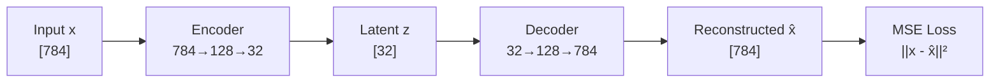
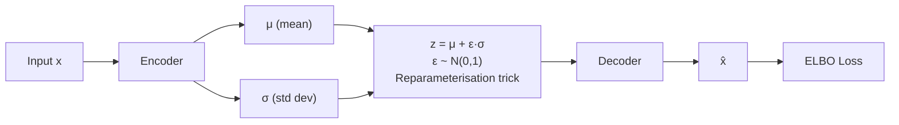
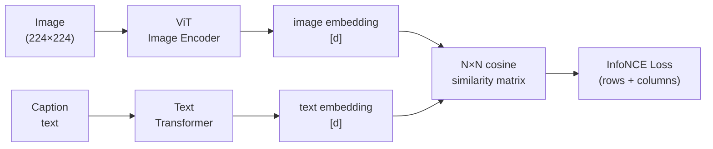

# Foundations and Learning Roadmap

> A bottom-up guide to everything that leads to modern LLMs, VLMs, and VLAs.
> Read this file first. It is the map — all other files are the territory.

---

## Table of Contents

1. [The Full Learning Map](#1-the-full-learning-map)
2. [Phase 0 — The RNN Era and Why It Ended](#2-phase-0--the-rnn-era-and-why-it-ended)
3. [Reconstruction Family — Learning by Rebuilding](#3-reconstruction-family--learning-by-rebuilding)
   - 3.1 [Vanilla Autoencoder](#31-vanilla-autoencoder)
   - 3.2 [Denoising Autoencoder](#32-denoising-autoencoder)
   - 3.3 [Variational Autoencoder (VAE)](#33-variational-autoencoder-vae)
   - 3.4 [Masked Autoencoder (MAE)](#34-masked-autoencoder-mae)
4. [Contrastive Family — Learning by Comparing](#4-contrastive-family--learning-by-comparing)
   - 4.1 [Word2Vec — The Original Contrastive Idea](#41-word2vec--the-original-contrastive-idea)
   - 4.2 [Triplet Loss](#42-triplet-loss)
   - 4.3 [InfoNCE / SimCLR](#43-infonce--simclr)
   - 4.4 [CLIP](#44-clip)
   - 4.5 [SigLIP](#45-siglip)
5. [Where the Other Files Fit](#5-where-the-other-files-fit)

---

## 1. The Full Learning Map

```
PHASE 0 — Bridge from RNN era
  ├─ Seq2seq + Bahdanau attention      ← attention before transformers
  └─ Why transformers replaced RNNs    ← parallelism, long-range gradients

PHASE 1 — Transformer mechanics        ← file 01
  ├─ Token embeddings, QKV attention, scaling
  ├─ Multi-head attention, FFN, residuals, LayerNorm
  └─ Positional encodings: sinusoidal, ALiBi, RoPE

PHASE 2 — Architectures               ← file 02
  ├─ Encoder-decoder (original Transformer, T5)
  ├─ Decoder-only (GPT, LLaMA, Mistral)
  └─ Encoder-only (BERT) + MLM + NSP

PHASE 3 — Reconstruction family        ← THIS FILE §3
  ├─ Vanilla Autoencoder
  ├─ Denoising Autoencoder
  ├─ VAE (Variational Autoencoder)
  └─ MAE (Masked Autoencoder)          ← also in file 06

PHASE 4 — Contrastive family           ← THIS FILE §4
  ├─ Word2Vec / negative sampling
  ├─ Triplet loss
  ├─ InfoNCE / SimCLR
  ├─ CLIP                              ← also in file 06
  └─ SigLIP                            ← also in file 06

PHASE 5 — Vision Transformers
  ├─ ViT (patch tokenisation, CLS, classification)
  └─ ViT pretraining (classification / CLIP / MAE) ← file 06 §1

PHASE 6 — Full stack
  ├─ VLMs (ViT + adapter + LLM)        ← file 06
  ├─ VLAs (VLM + action bins)          ← file 06
  ├─ Decoding strategies               ← file 03
  ├─ Inference optimisation            ← file 04
  └─ Mixture of Experts                ← file 05
```

> **You already know:** RNN, LSTM, seq2seq basics.
> **This file covers:** everything in Phase 0, 3, and 4 — the pieces that files 01–07 assume but don't explain.

---

## 2. Phase 0 — The RNN Era and Why It Ended

### What RNNs do

An RNN processes a sequence one token at a time, passing a hidden state $h_t$ forward:

```
  x₁ → [RNN] → h₁
               x₂ → [RNN] → h₂
                             x₃ → [RNN] → h₃ → output
```

For seq2seq (e.g. translation), an encoder RNN reads the source and compresses it into a **single fixed vector** $h_T$ (the final hidden state). A decoder RNN then generates the target from that vector.

```
  Encoder:  "The cat sat" → h₁ → h₂ → h₃   (context = h₃ only)
                                              ↓
  Decoder:  h₃ → "Le" → "chat" → "s'est" → "assis"
```

**Problem:** $h_T$ is a bottleneck. All information about a 100-word source sentence must be crammed into one fixed-size vector. Long sentences lose early context.

---

### Bahdanau Attention (2015) — Attention Before Transformers

The fix: instead of passing only $h_T$ to the decoder, let the decoder **look at all encoder hidden states** at each step, with a learned weighting.

```
  Encoder hidden states:  h₁  h₂  h₃  h₄   (one per source token)

  Decoder at step t:
    1. Compute score:  eᵢ = score(sₜ₋₁, hᵢ)   ← how relevant is hᵢ?
    2. Normalise:      αᵢ = softmax(eᵢ)
    3. Context vector: cₜ = Σ αᵢ hᵢ            ← weighted sum of all encoder states
    4. Generate:       sₜ = RNN(sₜ₋₁, cₜ)
```

This is attention. The model learns to align — when generating "chat", it learns to weight $h_2$ (the "cat" hidden state) most heavily. This is exactly the cross-attention mechanism in the transformer, but computed on top of RNN hidden states rather than projected Q/K/V vectors.

```
  Attention matrix (learned alignment):

              The   cat   sat
  Le        [ 0.9   0.1   0.0 ]   ← "Le" attends mainly to "The"
  chat      [ 0.1   0.8   0.1 ]   ← "chat" attends mainly to "cat"
  s'est     [ 0.1   0.2   0.7 ]   ← "s'est" attends mainly to "sat"
```

---

### Why Transformers Replaced RNNs

| Problem with RNNs | Transformer solution |
|---|---|
| **Sequential** — step $t$ needs $h_{t-1}$; can't parallelise | All tokens processed simultaneously — fully parallel on GPU |
| **Vanishing gradients** — gradient from position 1 passes through 100 multiplications to reach position 100 | Residual connections + attention gives direct gradient path between any two positions |
| **Fixed-size bottleneck** ($h_T$) | Every token attends directly to every other token — no compression |
| Bahdanau attention bolted on top of RNN | Attention *is* the architecture — no RNN at all |

The transformer didn't invent attention — it threw away the RNN and let attention do all the work.

---

## 3. Reconstruction Family — Learning by Rebuilding

**Core idea across all variants:** train a model to reconstruct its input (or a clean version of it). The bottleneck forces the model to learn a compressed, useful representation.

```
  Input x  ──►  Encoder  ──►  Bottleneck z  ──►  Decoder  ──►  x̂  ──►  Loss(x, x̂)
```

---

### 3.1 Vanilla Autoencoder

The simplest form. Compress input to a lower-dimensional latent code $z$, then reconstruct.



$$L = \|x - \hat{x}\|^2$$

**Why this works:** to reconstruct well, $z$ must capture the most important structure of $x$. Random noise, redundant pixels — these can't be encoded in 32 dims and get discarded. What survives is signal.

**What $z$ learns:**
- For faces: $z$ dimensions capture things like "face angle", "lighting", "smile intensity" — not explicitly, but as emergent structure needed for reconstruction
- Similar inputs end up near each other in $z$-space

**Limitations:**
- $z$-space is not structured — there are gaps between clusters; sampling a random $z$ often produces garbage
- No way to generate new examples (not generative)

---

### 3.2 Denoising Autoencoder

Corrupt the input, train the model to reconstruct the **clean original**:

```
  Clean x  ──► corrupt  ──►  x̃  ──►  Encoder  ──►  z  ──►  Decoder  ──►  x̂

  Corruption types:
    - Gaussian noise:  x̃ = x + ε,   ε ~ N(0, σ²)
    - Masking:         x̃ = x with 30% of values set to 0
    - Salt & pepper:   x̃ = x with random pixels set to 0 or 1

  Loss:  ||x - x̂||²   (against the CLEAN x, not the corrupted x̃)
```

**Why this is better:** predicting the clean image from a corrupt one forces the model to understand the underlying data distribution — not just memorise. The model must learn what a "face" looks like to fill in masked pixels correctly. This is the conceptual parent of MAE and BERT's MLM.

---

### 3.3 Variational Autoencoder (VAE)

The key upgrade: instead of encoding $x$ to a **point** $z$, encode it to a **distribution** $q(z|x) = \mathcal{N}(\mu, \sigma^2)$.



**The reparameterisation trick:** sampling is not differentiable — you can't backprop through a random draw. The trick rewrites the sample as:

$$z = \mu + \varepsilon \cdot \sigma \qquad \varepsilon \sim \mathcal{N}(0, 1)$$

Now $\varepsilon$ is the random part (no gradient needed through it), and $\mu, \sigma$ are deterministic outputs of the encoder — fully differentiable.

**Loss — ELBO (Evidence Lower BOund):**

$$\mathcal{L} = \underbrace{\mathbb{E}[\log p(x|z)]}_{\text{reconstruction term}} - \underbrace{D_{KL}(q(z|x) \| p(z))}_{\text{regularisation term}}$$

| Term | What it does |
|---|---|
| Reconstruction $\mathbb{E}[\log p(x\|z)]$ | Decoder must reconstruct $x$ from $z$ — same as AE |
| KL divergence $D_{KL}$ | Forces $q(z\|x)$ to stay close to $\mathcal{N}(0,1)$ — regularises latent space |

**What KL regularisation gives you:**
```
  Vanilla AE latent space:      VAE latent space:
  ●●        ●●●                 ·  ·  ·  ·  ·  ·
      gap                       ·  ●  ●  ·  ●  ·
  ●●●●   ●●                    ·  ●  ●  ·  ●  ·
                                ·  ·  ·  ·  ·  ·

  Gaps → sampling breaks        Smooth, continuous → sampling works
```

Because the latent space is regularised to $\mathcal{N}(0,1)$, you can **sample a random $z \sim \mathcal{N}(0,1)$, run the decoder, and get a plausible new example** — the VAE becomes a generative model.

---

### 3.4 Masked Autoencoder (MAE)

Denoising AE applied to image patches. Mask 75% of patches (the "corruption"), reconstruct the missing pixel values.

```
  Input image (196 patches):
  ┌────┬────┬────┬────┐
  │ p₁ │ ██ │ p₃ │ ██ │   ← ██ = masked (75% of patches)
  ├────┼────┼────┼────┤
  │ ██ │ p₆ │ ██ │ p₈ │
  └────┴────┴────┴────┘

  ViT encoder sees only the 25% visible patches.
  Lightweight decoder reconstructs masked patches' pixel values.
  Loss: MSE on masked patches only.
```

75% masking is intentionally high — with 25% visible, the model cannot just copy local context. It must understand the global image structure (what a dog's leg typically looks like given its body). This forces rich semantic representations.

> **Full MAE details:** see file `06_Multimodality_VLMs_and_VLAs.md` §1.3

---

### Reconstruction family summary

| Model | Input corruption | Loss | Latent space | Generative? |
|---|---|---|---|---|
| Vanilla AE | None | MSE | Unstructured | No |
| Denoising AE | Noise / masking | MSE on clean | Unstructured | No |
| VAE | None | ELBO (MSE + KL) | Gaussian, structured | **Yes** |
| MAE | 75% patch masking | MSE on masked patches | Unstructured | No |

---

## 4. Contrastive Family — Learning by Comparing

**Core idea across all variants:** no reconstruction. Instead, learn embeddings where **similar things are nearby** and **dissimilar things are far apart** in vector space.

```
  Contrastive loss:
  Pull together:  d(anchor, positive) → small
  Push apart:     d(anchor, negative) → large

  No labels needed — "similar" = same image under different augmentation,
                                  same image-caption pair, same word context, etc.
```

---

### 4.1 Word2Vec — The Original Contrastive Idea

Word2Vec (2013) learns word embeddings by predicting context. The **Skip-gram with Negative Sampling** variant is the clearest ancestor of modern contrastive learning.

**Task:** given a centre word, predict surrounding words (and distinguish them from random words).

```
  Sentence: "The cat sat on the mat"
  Centre word: "sat"   Window size: 2

  Positive pairs (co-occur):    ("sat", "cat"), ("sat", "on")
  Negative pairs (random):      ("sat", "banana"), ("sat", "Europe")

  Objective: score(sat, cat) >> score(sat, banana)
```

$$L = -\log \sigma(v_{\text{sat}} \cdot v_{\text{cat}}) - \sum_{k} \log \sigma(-v_{\text{sat}} \cdot v_{n_k})$$

- $\sigma$ = sigmoid
- First term: pull "sat" and "cat" together
- Second term: push "sat" away from $k$ random negatives

After training: similar words cluster together. "king" − "man" + "woman" ≈ "queen" — the famous analogy test — emerges from this objective, not from any explicit supervision.

**Why this matters:** negative sampling is the first mainstream use of the pull/push contrastive structure. Every contrastive method that follows is a generalisation of this.

---

### 4.2 Triplet Loss

Makes the pull/push explicit with three items: an **anchor**, a **positive** (similar to anchor), and a **negative** (dissimilar).

```
  Anchor (A):    photo of a golden retriever
  Positive (P):  different photo of the same dog
  Negative (N):  photo of a cat

  Goal: d(A, P) + margin < d(A, N)
  i.e. the positive must be closer than the negative by at least a margin
```

$$L = \max\!\left(0,\; d(A, P) - d(A, N) + \text{margin}\right)$$

```
  Before training:          After training:
  A · · N                   A P
      P                         · · · N
  (random positions)        (P pulled to A, N pushed away)
```

- $d$ is usually Euclidean distance or $1 - \cos(\text{similarity})$
- **Margin** prevents collapse (if A=P=N, loss=0 trivially without margin)
- Used in: FaceNet (face recognition), image retrieval

**Problem:** requires carefully mined hard negatives — random negatives are often too easy and give zero gradient once the model is slightly trained. Picking negatives that are "almost but not quite positive" is a whole sub-problem.

---

### 4.3 InfoNCE / SimCLR

The key upgrade over triplet loss: instead of one negative at a time, use an **entire batch of negatives simultaneously**.

**SimCLR setup:**

```
  Batch of N images: [img₁, img₂, ..., imgN]

  For each image, create 2 augmented views:
  img₁ → [aug_1a, aug_1b]    ← positive pair (same image, different crop/colour)
  img₂ → [aug_2a, aug_2b]
  ...

  Positive pairs:  (aug_ia, aug_ib)  — same source image
  Negative pairs:  (aug_ia, aug_jb)  for all j ≠ i  — different images
```

**InfoNCE loss** (for one anchor $aug_{1a}$, with $aug_{1b}$ as its positive):

$$L = -\log \frac{\exp(\text{sim}(z_{1a}, z_{1b}) / \tau)}{\sum_{j=1}^{2N} \exp(\text{sim}(z_{1a}, z_j) / \tau)}$$

- $\tau$ = temperature (controls sharpness of the distribution)
- Numerator: similarity to positive (want this large)
- Denominator: similarity to all $2N-1$ other views in the batch (want these small)

```
  N×N similarity matrix for a batch of 4 images (8 views):

          1a    1b    2a    2b    3a    3b    4a    4b
  1a    [  ✓    ✓     ✗     ✗     ✗     ✗     ✗     ✗  ]   ← want diagonal block high
  1b    [  ✓    ✓     ✗     ✗     ✗     ✗     ✗     ✗  ]
  2a    [  ✗    ✗     ✓     ✓     ✗     ✗     ✗     ✗  ]
  ...

  ✓ = positive pair (pull together)
  ✗ = negative pair (push apart)
```

**Temperature $\tau$:**
```
  Low τ:   softmax very peaked → sharp discrimination, but unstable with bad negatives
  High τ:  softmax flat → all negatives treated equally, slow learning
  Typical: τ = 0.07 (CLIP) or τ = 0.1 (SimCLR)
```

**Why batch size matters:** more images in the batch = more negatives per anchor = harder task = better representations. SimCLR used batch sizes of 4096–8192.

---

### 4.4 CLIP

CLIP applies InfoNCE to **image-text pairs** instead of augmented views of the same image.

```
  Batch of N (image, caption) pairs scraped from the web:

  img₁: [photo of a dog]     cap₁: "a golden retriever playing fetch"
  img₂: [photo of a city]    cap₂: "New York skyline at night"
  ...

  Positive:  (imgᵢ, capᵢ)   — matching pair
  Negative:  (imgᵢ, capⱼ)   for j ≠ i  — mismatched pair
```

Two separate encoders:



$$L = \frac{1}{2}\left(L_{\text{image→text}} + L_{\text{text→image}}\right)$$

Both directions: each image should match its caption (row-wise), and each caption should match its image (column-wise).

**What CLIP learns:** a **shared embedding space** where images and their descriptions end up at the same point. The ViT image encoder from CLIP is exactly what gets used in VLMs (LLaVA, InstructBLIP, etc.) because its representations are already language-aligned.

**Zero-shot classification** (CLIP's party trick):
```
  "a photo of a {cat}"  →  text embedding
  "a photo of a {dog}"  →  text embedding
  "a photo of a {car}"  →  text embedding
       ↑
  Run image through ViT → image embedding
  → pick the class whose text embedding is most similar
  → no task-specific training needed
```

> **Full CLIP details:** see file `06_Multimodality_VLMs_and_VLAs.md` §1.2

---

### 4.5 SigLIP

SigLIP replaces CLIP's softmax (InfoNCE) with a **sigmoid binary cross-entropy** applied to each pair independently:

| | CLIP (InfoNCE) | SigLIP (sigmoid) |
|---|---|---|
| Loss type | Softmax over all negatives in batch | Per-pair sigmoid (independent) |
| Batch dependency | Yes — each anchor competes against all others | No — each pair scored alone |
| Batch size sensitivity | High — large batches needed for good negatives | Lower |
| Stability | Unstable at small batch | More stable |

$$L_{\text{SigLIP}} = -\frac{1}{N^2}\sum_{i,j} \left[y_{ij} \log \sigma(s_{ij}) + (1-y_{ij}) \log (1 - \sigma(s_{ij}))\right]$$

where $y_{ij} = 1$ if pair $(i,j)$ is a match, 0 otherwise, and $s_{ij}$ is the dot product similarity.

Each pair is treated as an independent binary classification: "do these match?" The N×N matrix with N positives and $N^2-N$ negatives is scored entry by entry.

---

### Contrastive family summary

| Method | Positives | Negatives | Loss | Key idea |
|---|---|---|---|---|
| Word2Vec | Co-occurring words | Random vocabulary words | Sigmoid binary | Pull context words together |
| Triplet loss | Same class / identity | Different class | Max-margin | Explicit anchor/pos/neg triplet |
| InfoNCE / SimCLR | Two augmented views of same image | Other images in batch | Softmax cross-entropy | Batch = pool of negatives |
| CLIP | Matching image-caption pair | All other pairs in batch | InfoNCE (both directions) | Shared image-text embedding space |
| SigLIP | Matching image-caption pair | All other pairs in batch | Per-pair sigmoid BCE | No batch-level normalisation |

---

## 5. Where the Other Files Fit

| File | What it covers | Prerequisites from this file |
|---|---|---|
| `01_Transformer_Core_Mechanics.md` | Attention, MHA, FFN, residuals, positional encodings | Phase 0 (RNN bridge) |
| `02_Architecture_and_Model_Families.md` | Encoder-decoder, decoder-only, BERT | File 01 |
| `03_Decoding_and_Output_Generation.md` | Sampling, beam search, temperature | File 02 |
| `04_Inference_and_Hardware_Optimization.md` | KV cache, GQA, PagedAttention, sparse attention | File 01 |
| `05_Scaling_with_Mixture_of_Experts.md` | MoE routing, sparse activation | File 02 |
| `06_Multimodality_VLMs_and_VLAs.md` | ViT, CLIP, MAE, VLM architecture, VLA | §3 (reconstruction) + §4 (contrastive) |
| `07_Conceptual_QA_Bank.md` | Interview / exam questions | All files |
