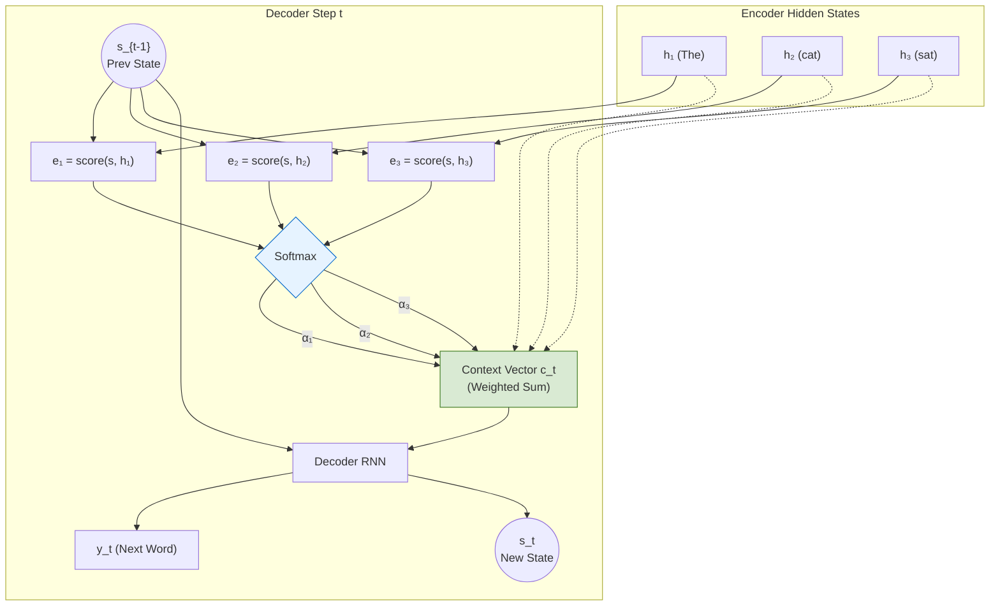

# The RNN Era and Why It Ended

Before Transformers, natural language was processed by Recurrent Neural Networks (RNNs) and Long Short-Term Memory networks (LSTMs). Understanding their limitations is crucial to understanding why the Transformer was invented.

## What RNNs do

An RNN processes a sequence one token at a time, passing a hidden state $h_t$ forward.

For sequence-to-sequence tasks like translation, an **encoder RNN** reads the source sentence and compresses it into a **single fixed vector** $h_T$ (the final hidden state). A **decoder RNN** then generates the target sentence from that vector.

> [!WARNING]
> **The Bottleneck Problem:** All information about a source sentence (whether it's 5 words or 500 words) must be crammed into one fixed-size vector ($h_T$). Long sentences inevitably lose early context because the network simply runs out of capacity to remember everything.

---

## Bahdanau Attention (2015) — Attention Before Transformers

To fix the bottleneck, Dzmitry Bahdanau proposed a radical idea: instead of passing only the final state $h_T$ to the decoder, let the decoder **look at all encoder hidden states** at each step, using a learned weighting mechanism.

This was the birth of **Attention**.

**The Math at Step $t$:**
1. **Compute score:**  $e_i = \text{score}(s_{t-1}, h_i)$   *(how relevant is encoder state $h_i$?)*
2. **Normalise:**      $\alpha_i = \text{softmax}(e_i)$
3. **Context vector:** $c_t = \sum \alpha_i h_i$            *(weighted sum of all encoder states)*
4. **Generate:**       $s_t = \text{RNN}(s_{t-1}, c_t)$

The model learns to **align**. When generating the French word "chat", the model learns to weight $h_2$ (the hidden state for the English word "cat") most heavily. 

**Attention Matrix (Learned Alignment):**

| Target Word \ Source | The ($h_1$) | cat ($h_2$) | sat ($h_3$) |
|---|---|---|---|
| **Le** | **0.90** | 0.10 | 0.00 |
| **chat** | 0.10 | **0.80** | 0.10 |
| **s'est** | 0.10 | 0.20 | **0.70** |

> [!NOTE]
> This is exactly the **cross-attention** mechanism used in the Transformer, but computed on top of RNN hidden states rather than projected Q/K/V vectors.

---

## Why Transformers Replaced RNNs

If Bahdanau Attention solved the bottleneck, why did we need the Transformer?

| Problem with RNNs | Transformer Solution |
|---|---|
| **Sequential Processing** Step $t$ needs $h_{t-1}$; cannot be parallelised across the sequence length. | **Parallel Processing** All tokens are processed simultaneously — fully parallel on GPU hardware. |
| **Vanishing Gradients** Gradient from position 1 passes through 100 multiplications to reach position 100. | **Direct Paths** Residual connections + attention provide a direct 1-step gradient path between *any* two positions. |
| **Bolted-on Attention** Bahdanau attention was an addition to a complex recurrent architecture. | **Attention Is All You Need** The architecture threw away the RNN completely and let attention do all the routing work. |

---

## Further Reading
- **Sequence to Sequence Learning with Neural Networks** *(Sutskever et al., 2014)* — The paper that defined the encoder-decoder RNN bottleneck. [[ArXiv]](https://arxiv.org/abs/1409.3215)
- **Neural Machine Translation by Jointly Learning to Align and Translate** *(Bahdanau et al., 2014)* — The invention of attention. [[ArXiv]](https://arxiv.org/abs/1409.0473)
- **Attention Is All You Need** *(Vaswani et al., 2017)* — The paper that discarded the RNN. [[ArXiv]](https://arxiv.org/abs/1706.03762)
