# The RNN Era and Why It Ended

Before Transformers, sequences were processed by **Recurrent Neural Networks (RNNs)**, and later by **LSTMs** and **GRUs** — all designed to handle variable-length sequences by maintaining a "memory" of what came before. This file builds up from first principles: how does an RNN work, what breaks it, how did LSTM/GRU fix those breaks, and why even fixed variants weren't enough.

---

## §1 — The Vanilla RNN: How It Actually Works

### The Core Idea

At every timestep $t$, an RNN takes two inputs:
1. **The current token** $x_t$ (a word embedding vector)
2. **The previous hidden state** $h_{t-1}$ (a summary of everything seen so far)

And it produces one output:
- **A new hidden state** $h_t$ — an updated summary

That's it. The "recurrence" is just this loop, unrolled across the sequence.

### The Equation

$$h_t = \tanh(W_{hh} \cdot h_{t-1} + W_{xh} \cdot x_t + b)$$

| Symbol | Shape | What it is |
|---|---|---|
| $x_t$ | `[embed_dim]` | Current token embedding |
| $h_{t-1}$ | `[hidden_dim]` | Previous hidden state |
| $W_{xh}$ | `[hidden_dim, embed_dim]` | Weight matrix: input → hidden |
| $W_{hh}$ | `[hidden_dim, hidden_dim]` | Weight matrix: hidden → hidden |
| $b$ | `[hidden_dim]` | Bias |
| $h_t$ | `[hidden_dim]` | New hidden state |
| $\tanh$ | — | Squashes values to $[-1, 1]$ |

> [!NOTE]
> **Parameters are shared across all timesteps:** The weight matrices $W_{xh}$, $W_{hh}$, and bias vector $b$ are initialized once at model creation and reused identically for every token in the sequence. The bias $b$ is *not* re-randomized per word. This weight sharing is why the network can process sequences of arbitrary length without growing its parameter count.

### Step-by-Step: Processing "The cat sat"

Let's trace the RNN processing three words. $h_0 = \mathbf{0}$ (zero vector to start).

```
Timestep 1:  x₁ = embed("The")
             h₁ = tanh(W_hh · h₀  +  W_xh · x₁  + b)
                       ↑ zeros        ↑ "The"
             h₁ encodes: "I've seen 'The'"

Timestep 2:  x₂ = embed("cat")
             h₂ = tanh(W_hh · h₁  +  W_xh · x₂  + b)
                       ↑ memory of "The"  ↑ "cat"
             h₂ encodes: "I've seen 'The cat'"

Timestep 3:  x₃ = embed("sat")
             h₃ = tanh(W_hh · h₂  +  W_xh · x₃  + b)
                       ↑ memory of "The cat"  ↑ "sat"
             h₃ encodes: "I've seen 'The cat sat'"
```

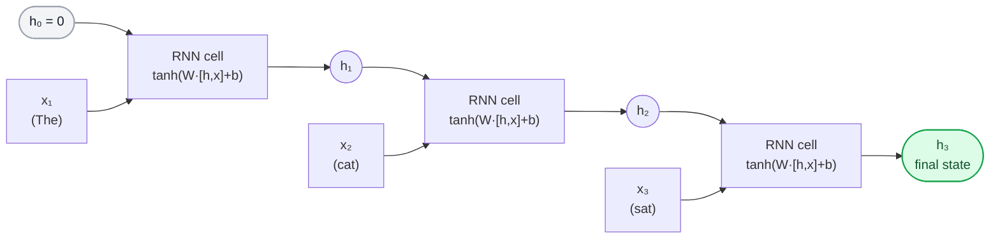

### Unrolled View — The Same Cell, Three Times

A key mental model: there is **one RNN cell** with one set of weights. The diagram above shows it *unrolled* — three copies of the same computation, chained together. In code, it's literally a for loop:

```python
h = torch.zeros(hidden_dim)
for x_t in sequence:
    h = torch.tanh(W_hh @ h + W_xh @ x_t + b)
```

### What the Hidden State Actually Looks Like as It Changes

The diagram below shows what happens to the hidden state's "composition" as the sentence moves forward. At t=1, the state is entirely shaped by "The". By t=3, "The" has been diluted to a small sliver — sat and cat dominate.


> [!NOTE]
> This is a pedagogical illustration — real hidden states don't decompose into clean per-word percentages. The actual `tanh(W·[h,x])` entangles everything into a dense vector. But the *effect* is real: each nonlinear update progressively overwrites older signal with newer, which is exactly what the vanishing gradient math below quantifies.

### Full Input-to-Output Wiring

Every timestep simultaneously (a) sends its hidden state forward as the next cell's recurrent input and (b) passes it into an output head to predict the next token. These are not separate — it's the same $h_t$ doing both jobs.


### Output Heads

Depending on the task, you read off different things:

| Task | What you use |
|---|---|
| Sequence classification (sentiment) | Final $h_T$ only → linear classifier |
| Language modelling (next word) | Every $h_t$ → linear layer → softmax over vocab |
| Sequence-to-sequence (translation) | All $h_t$ as encoder memory → decoder RNN |

### Training: Backpropagation Through Time (BPTT)

How often are weights updated? **Not word-by-word.** Training follows three distinct phases:

1. **Full Forward Pass:** The model processes the whole sequence $x_1 \to x_T$, keeping intermediate activations $\{h_1, \dots, h_T\}$ in memory and calculating the sequence loss $\mathcal{L}$.
2. **Backward Pass (Unrolling in Reverse):** Gradients flow backward through time from token $T \to 1$.
3. **Gradient Accumulation & Optimizer Step:** Because $W_{hh}, W_{xh}$, and $b$ are reused at every step, their total gradient is the **sum** of contributions across all timesteps:
   $$\frac{\partial \mathcal{L}}{\partial W_{hh}} = \sum_{t=1}^{T} \frac{\partial \mathcal{L}_t}{\partial W_{hh}}$$
   The optimizer (e.g. Adam or SGD) updates parameters **once per sequence or batch**, after all timesteps have contributed their gradients.

---

## §2 — The Problems with Vanilla RNNs

Even before we get to long sequences, the vanilla RNN has three fundamental failure modes.

### Problem 1: Vanishing Gradients

Training a neural network requires backpropagation. For an RNN unrolled over $T$ steps, the gradient of the loss with respect to an early parameter must travel backwards through every timestep.

At each step, the gradient is multiplied by $W_{hh}$ and the derivative of $\tanh$:

$$\frac{\partial h_t}{\partial h_{t-1}} = W_{hh} \cdot \text{diag}(\tanh'(\cdot))$$

For a sequence of length $T$, the gradient from step $T$ back to step $1$ involves $T$ such multiplications:

$$\frac{\partial \mathcal{L}}{\partial h_1} \propto (W_{hh})^T$$

- If the largest eigenvalue of $W_{hh} < 1$: gradients **shrink exponentially** → early steps receive near-zero gradient → model can't learn long-range dependencies.
- If the largest eigenvalue of $W_{hh} > 1$: gradients **explode exponentially** → NaN weights → training crashes.

```
Gradient flow (backwards through time):

Loss
 │
 ▼
h₁₀₀ →× W_hh → h₉₉ →× W_hh → h₉₈ → ... →× W_hh → h₁
                                                         ↑
                               gradient is (W_hh)^99 × something
                               If ||W_hh|| < 1: this → 0 (vanish)
                               If ||W_hh|| > 1: this → ∞ (explode)
```

The chart below makes this arithmetic concrete. With eigenvalue 0.9, the gradient at step 20 is already ~12% of its original magnitude; by step 40 it's under 2%. With eigenvalue 1.15, it explodes past 200× in the same span. The stable line at eigenvalue 1.0 is a knife-edge — essentially impossible to hit in practice.

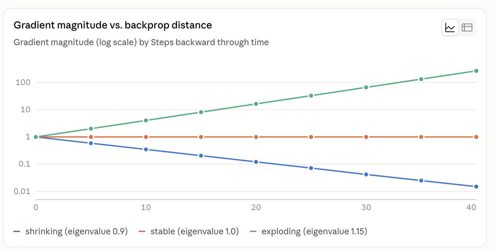

**Consequence:** Vanilla RNNs can only reliably learn dependencies spanning ~10-20 tokens. Everything earlier is effectively forgotten — not as a rule of thumb, but because $0.9^{20} \approx 0.12$.

### Problem 2: The Bottleneck (in Seq2Seq)

For sequence-to-sequence tasks (translation, summarisation), the encoder reads the entire source and compresses it into **one fixed-size vector** $h_T$. The decoder must reconstruct the output from this single vector alone.

A 5-word sentence and a 500-word document both produce the same size $h_T$. At 500 words, critical early information has been overwritten.

```
"The quick brown fox jumps over the lazy dog near the fence"
                         ↓
                    h_T [512 dims]    ← everything must fit in here
                         ↓
            Decoder tries to translate...
            "The" and "quick" from 12 words ago? Largely gone.
```

### Problem 3: Sequential Processing — No Parallelism

The recurrence is a **hard dependency chain**: you cannot compute $h_t$ until $h_{t-1}$ is finished.

```
Step 1 → Step 2 → Step 3 → ... → Step N     (must be serial)
```

On a GPU with thousands of cores, you are using **one core at a time** for each sequence:
- **Can we optimize this?** We can parallelize across the *batch dimension* (processing many sentences simultaneously), but *within* any given sentence, token $t$ is strictly blocked on token $t-1$. No compiler or GPU kernel can bypass this hard serial dependency.
- Training on long sequences is brutally slow. This is the killer problem at scale — even if vanishing gradients were fixed, the sequential nature makes RNNs unscalable.

---

## §3 — LSTM: Learning What to Remember and Forget

The Long Short-Term Memory network (Hochreiter & Schmidhuber, 1997) was designed specifically to solve the vanishing gradient problem. The key idea: instead of one hidden state, use **two separate streams**:

- **$h_t$** — the "working memory" (same as before, short-range)
- **$c_t$** — the "cell state" (long-range memory highway)

The cell state $c_t$ flows through time with only **additive updates** — no repeated multiplication by $W_{hh}$, so gradients can flow back without vanishing.

### The Four Gates

An LSTM cell has four learned gates. Each gate is a sigmoid (outputs 0–1) or tanh (outputs -1 to 1):

| Gate | Symbol | Formula | Purpose |
|---|---|---|---|
| **Forget gate** | $f_t$ | $\sigma(W_f \cdot [h_{t-1}, x_t] + b_f)$ | What fraction of the old cell state to keep? |
| **Input gate** | $i_t$ | $\sigma(W_i \cdot [h_{t-1}, x_t] + b_i)$ | How much of the new candidate to write? |
| **Candidate** | $\tilde{c}_t$ | $\tanh(W_c \cdot [h_{t-1}, x_t] + b_c)$ | What new content to potentially write |
| **Output gate** | $o_t$ | $\sigma(W_o \cdot [h_{t-1}, x_t] + b_o)$ | What part of the cell state to expose as $h_t$? |

> [!NOTE]
> $[h_{t-1}, x_t]$ means concatenation: the 512-dim hidden state and the 300-dim embedding stacked into a 812-dim vector, then multiplied by a learned matrix.

### The Update Equations

$$c_t = f_t \odot c_{t-1} + i_t \odot \tilde{c}_t$$

$$h_t = o_t \odot \tanh(c_t)$$

where $\odot$ is element-wise multiplication.

Read this as:
1. **Decide what to forget:** multiply old cell state $c_{t-1}$ by forget gate $f_t$ (0 = erase, 1 = keep)
2. **Decide what to write:** add $i_t \odot \tilde{c}_t$ (how much of the new candidate to write)
3. **Expose as output:** apply output gate to filtered cell state → becomes $h_t$

### LSTM — Cell State as a Highway + Full Input-to-Output

The diagram below shows the cell state (teal highway, top) flowing across all three timesteps largely unchanged, while the hidden state (bottom) is recomputed fresh each step. The contrast with the RNN memory decay diagram is the whole point of LSTM's design: there are now two lanes, and only the bottom one decays.


The second diagram shows the full end-to-end wiring — same structure as the RNN (hidden state drops into an output head at every step), but the recurrent cell now has access to the protected $c_t$ highway:


### LSTM Cell Internals

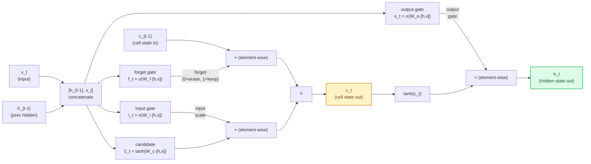

### Why the Cell State Fixes Vanishing Gradients

The cell state update is **additive**:

$$c_t = f_t \odot c_{t-1} + \text{(new info)}$$

Gradient of $c_t$ with respect to $c_{t-1}$ is just $f_t$ — not a matrix multiplication through a tanh. The gradient highway through $c$ avoids the repeated matrix power that causes vanishing. Information written into the cell state at step 5 can survive intact to step 100.

### Intuition: The Carry-On Bag Analogy

Think of $c_t$ as a carry-on bag you carry through a long trip:
- **Forget gate:** At each city, you decide what to throw out of the bag
- **Input gate + candidate:** You decide what new things to pack in
- **Output gate:** At each city, you decide what to take out of the bag to use right now ($h_t$)

The bag ($c_t$) can carry critical information across many steps without it being "overwritten" at every step.

---

## §4 — GRU: Simpler Gating, Same Fix

The Gated Recurrent Unit (Cho et al., 2014) is a streamlined version of LSTM. It merges the cell state and hidden state into one ($h_t$ only) and uses just two gates instead of four.

| Component | LSTM | GRU |
|---|---|---|
| States | $h_t$ and $c_t$ (two vectors) | $h_t$ only (one vector) |
| Gates | forget, input, output, candidate (4) | reset, update (2) |
| Parameters | ~4× hidden_dim² | ~3× hidden_dim² |
| Performance | Marginally better on very long sequences | Comparable, trains faster |

### GRU Equations

| Gate | Formula | Purpose |
|---|---|---|
| **Reset gate** | $r_t = \sigma(W_r \cdot [h_{t-1}, x_t])$ | How much of the past to "reset" when computing new candidate |
| **Update gate** | $z_t = \sigma(W_z \cdot [h_{t-1}, x_t])$ | How much to keep old state vs new candidate (like forget+input merged) |
| **Candidate** | $\tilde{h}_t = \tanh(W \cdot [r_t \odot h_{t-1}, x_t])$ | New candidate content |
| **New state** | $h_t = (1 - z_t) \odot h_{t-1} + z_t \odot \tilde{h}_t$ | Interpolation: old vs new |

The key insight: the update gate $z_t$ **interpolates** between old and new. When $z_t \approx 0$, the hidden state barely changes (preserving memory). When $z_t \approx 1$, the hidden state is replaced with new content.

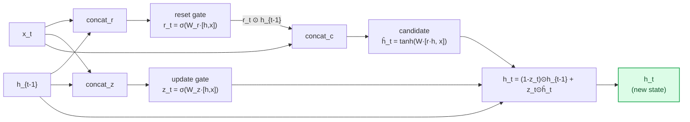

### GRU vs LSTM — When to Use Which

In practice: **GRU is a good default** for most sequence tasks. LSTM is worth trying when sequences are very long (>500 tokens) or when you have the compute budget to tune a larger model. For most NLP tasks circa 2018, performance was nearly identical.

---

## §5 — Side-by-Side: Vanilla RNN vs LSTM vs GRU

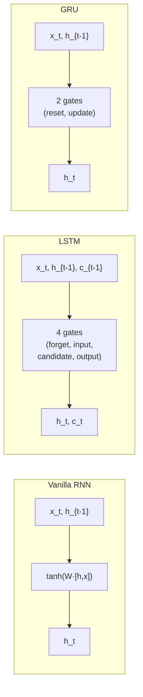

| Property | Vanilla RNN | LSTM | GRU |
|---|---|---|---|
| Memory stream | Single $h_t$ | $h_t$ + $c_t$ (cell highway) | Single $h_t$ with gating |
| Vanishing gradient | Severe — tanh repeated T times | Fixed — additive cell state | Fixed — interpolation update |
| Parameters | Fewest | Most (~4×) | Middle (~3×) |
| Long-range memory | Poor (10-20 tokens) | Good | Good |
| Training speed | Fast | Slowest | Faster than LSTM |
| Sequential constraint | Yes | Yes | Yes |

---

## §6 — Seq2Seq: The Encoder-Decoder Architecture

For tasks that map one sequence to another (translation, summarisation, Q&A), both encoder and decoder are RNNs (or LSTMs).

The **encoder** reads the source sequence and produces hidden states. The **decoder** generates the target sequence.

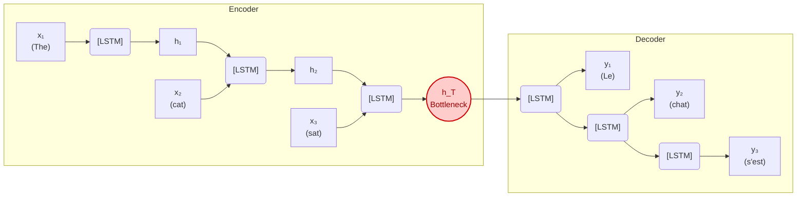

The disproportion is the argument: a 5-word sentence and a 500-word document both compress into the same 512-number bottle. The visual below makes that squeeze literal:


> [!WARNING]
> **The Bottleneck Problem:** All information about a source sentence (whether it's 5 words or 500 words) must be crammed into one fixed-size vector $h_T$. Long sentences inevitably lose early context — the network simply runs out of capacity.

---

## §7 — Bahdanau Attention (2015): Fixing the Bottleneck

To fix the bottleneck, Dzmitry Bahdanau proposed: instead of passing only the final state $h_T$ to the decoder, let the decoder **look at all encoder hidden states** at each step, using a learned weighting.

This was the birth of **attention**.

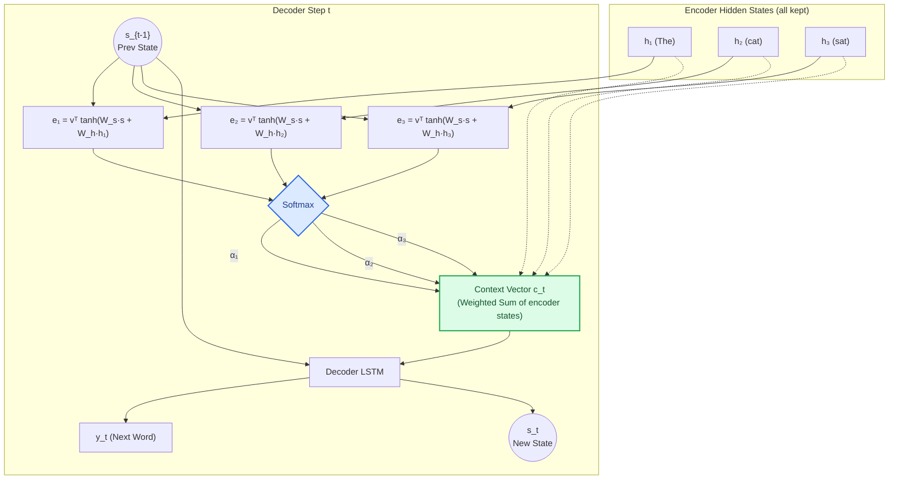

**The Math at Step $t$:**

1. **Score (Bahdanau):** $e_i = v^\top \tanh(W_s \cdot s_{t-1} + W_h \cdot h_i)$ — a small feedforward network asks "how relevant is encoder state $h_i$ to decoder state $s_{t-1}$?"
2. **Normalise:** $\alpha_i = \text{softmax}(e_i)$ — turn scores into a probability distribution
3. **Context vector:** $c_t = \sum_i \alpha_i h_i$ — weighted sum of all encoder states
4. **Generate:** $s_t = \text{LSTM}(s_{t-1}, c_t)$ — decoder uses context to produce next token

> [!NOTE]
> **Luong Attention (2015)** simplified the score function to a dot product: $e_i = s_{t-1}^\top h_i$. This is essentially the dot-product attention that appears in Transformers.

**The model learns alignment.** When generating "chat" (French for "cat"), it learns to weight $h_2$ most heavily. Seeing it as a heatmap rather than a table makes the diagonal — and what it means — immediately obvious:

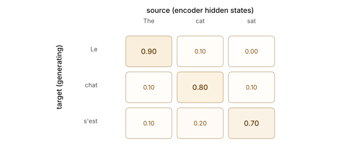

| Target Word | The ($h_1$) | cat ($h_2$) | sat ($h_3$) |
|---|---|---|---|
| **Le** | **0.90** | 0.10 | 0.00 |
| **chat** | 0.10 | **0.80** | 0.10 |
| **s'est** | 0.10 | 0.20 | **0.70** |

> [!NOTE]
> This is exactly the **cross-attention** mechanism used in Transformers — but here it's bolted onto LSTM hidden states rather than built from clean Q/K/V projections.

---

## §8 — Why Even LSTM + Attention Wasn't Enough

Bahdanau attention solved the bottleneck. LSTM solved vanishing gradients. So why did we need Transformers?

**The fatal remaining problem: sequential processing.**

Even with LSTM + attention, the encoder still processes one token at a time. You cannot compute $h_t$ until $h_{t-1}$ is done. The computation is a serial chain.

```
Serial RNN (unavoidable):
Token 1 → Token 2 → Token 3 → ... → Token 512
   ↑ must finish before next starts

Parallel Transformer:
Token 1 ┐
Token 2 ├── All processed simultaneously on GPU
Token 3 │
...     ┘
Token 512
```

At scale (GPT-size models, millions of training examples, sequences of 1024+ tokens), this serial constraint makes LSTM training orders of magnitude slower than Transformer training on the same hardware.

The Transformer's radical move: **throw away the RNN entirely**. Instead of building up a hidden state sequentially, compute attention directly between every pair of tokens in one parallel operation.

| Problem | Vanilla RNN | LSTM | GRU | Transformer |
|---|---|---|---|---|
| Vanishing gradients | Severe | Fixed | Fixed | Not applicable |
| Long-range memory | Poor | Good | Good | Excellent (direct paths) |
| Bottleneck (seq2seq) | Yes | Yes (without attn) | Yes (without attn) | No — full attention by design |
| Parallel training | No | No | No | **Yes — fully parallel** |
| Scales to billions of params | No | Barely | Barely | **Yes** |

> [!NOTE]
> LSTM + Bahdanau attention was the state of the art for NMT in 2015-2017. The Transformer (2017) replaced it not by being cleverer on any one axis, but by solving the parallelism problem while maintaining or exceeding quality — which meant you could train 10× faster and therefore train on 10× more data.

One thing the table above slightly underplays: the Transformer's contribution wasn't just speed. Bahdanau attention already showed that **attention was the good idea** — it let the decoder look directly at any encoder state. The Transformer's radical move was noticing you could apply that *same mechanism within a single sequence* (self-attention), not just across two sequences (encoder→decoder). Once you do that, the RNN isn't needed at all — attention handles both routing and memory, and you can run the whole thing in parallel. The throughline is: **attention solved quality by 2015; Transformers made it cheap enough to scale.**

---

## Further Reading

- **Learning Long-Term Dependencies with Gradient Descent is Difficult** *(Bengio et al., 1994)* — Mathematical analysis of the vanishing gradient problem. [[PDF]](http://www.iro.umontreal.ca/~lisa/pointeurs/ieeetrnn94.pdf)
- **Long Short-Term Memory** *(Hochreiter & Schmidhuber, 1997)* — The original LSTM paper. [[PDF]](https://www.bioinf.jku.at/publications/older/2604.pdf)
- **Learning Phrase Representations using RNN Encoder–Decoder for SMT** *(Cho et al., 2014)* — Introduced GRU and the encoder-decoder framework. [[ArXiv]](https://arxiv.org/abs/1406.1078)
- **Sequence to Sequence Learning with Neural Networks** *(Sutskever et al., 2014)* — Defined the encoder-decoder bottleneck problem at scale. [[ArXiv]](https://arxiv.org/abs/1409.3215)
- **Neural Machine Translation by Jointly Learning to Align and Translate** *(Bahdanau et al., 2014)* — The invention of attention. [[ArXiv]](https://arxiv.org/abs/1409.0473)
- **Effective Approaches to Attention-based NMT** *(Luong et al., 2015)* — Simplified dot-product attention, direct precursor to Transformer attention. [[ArXiv]](https://arxiv.org/abs/1508.04025)
- **Attention Is All You Need** *(Vaswani et al., 2017)* — The paper that discarded the RNN. [[ArXiv]](https://arxiv.org/abs/1706.03762)
