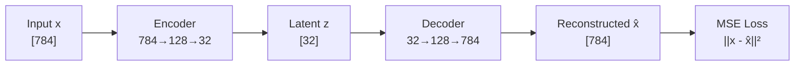
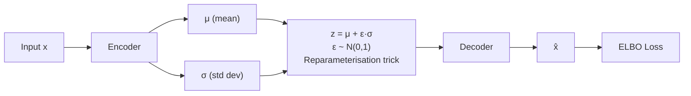

# Reconstruction Family — Learning by Rebuilding

**Core idea across all variants:** train a model to reconstruct its input (or a clean version of it). The bottleneck forces the model to learn a compressed, useful representation.

```
  Input x  ──►  Encoder  ──►  Bottleneck z  ──►  Decoder  ──►  x̂  ──►  Loss(x, x̂)
```

---

## Vanilla Autoencoder

The simplest form. Compress input to a lower-dimensional latent code $z$, then reconstruct.



$$L = \|x - \hat{x}\|^2$$

**Why this works:** to reconstruct well, $z$ must capture the most important structure of $x$. Random noise, redundant pixels — these can't be encoded in 32 dims and get discarded. What survives is signal.

**What $z$ learns:**
- For faces: $z$ dimensions capture things like "face angle", "lighting", "smile intensity" — not explicitly, but as emergent structure needed for reconstruction
- Similar inputs end up near each other in $z$-space

**Limitations:**
- $z$-space is not structured — there are gaps between clusters; sampling a random $z$ often produces garbage
- No way to generate new examples (not generative)

---

## Denoising Autoencoder

Corrupt the input, train the model to reconstruct the **clean original**:

```
  Clean x  ──► corrupt  ──►  x̃  ──►  Encoder  ──►  z  ──►  Decoder  ──►  x̂

  Corruption types:
    - Gaussian noise:  x̃ = x + ε,   ε ~ N(0, σ²)
    - Masking:         x̃ = x with 30% of values set to 0
    - Salt & pepper:   x̃ = x with random pixels set to 0 or 1

  Loss:  ||x - x̂||²   (against the CLEAN x, not the corrupted x̃)
```

**Why this is better:** predicting the clean image from a corrupt one forces the model to understand the underlying data distribution — not just memorise. The model must learn what a "face" looks like to fill in masked pixels correctly. This is the conceptual parent of MAE and BERT's MLM.

---

## Variational Autoencoder (VAE)

The key upgrade: instead of encoding $x$ to a **point** $z$, encode it to a **distribution** $q(z|x) = \mathcal{N}(\mu, \sigma^2)$.



**The reparameterisation trick:** sampling is not differentiable — you can't backprop through a random draw. The trick rewrites the sample as:

$$z = \mu + \varepsilon \cdot \sigma \qquad \varepsilon \sim \mathcal{N}(0, 1)$$

Now $\varepsilon$ is the random part (no gradient needed through it), and $\mu, \sigma$ are deterministic outputs of the encoder — fully differentiable.

**Loss — ELBO (Evidence Lower BOund):**

$$\mathcal{L} = \underbrace{\mathbb{E}[\log p(x|z)]}_{\text{reconstruction term}} - \underbrace{D_{KL}(q(z|x) \| p(z))}_{\text{regularisation term}}$$

| Term | What it does |
|---|---|
| Reconstruction $\mathbb{E}[\log p(x\|z)]$ | Decoder must reconstruct $x$ from $z$ — same as AE |
| KL divergence $D_{KL}$ | Forces $q(z\|x)$ to stay close to $\mathcal{N}(0,1)$ — regularises latent space |

**What KL regularisation gives you:**
```
  Vanilla AE latent space:      VAE latent space:
  ●●        ●●●                 ·  ·  ·  ·  ·  ·
      gap                       ·  ●  ●  ·  ●  ·
  ●●●●   ●●                    ·  ●  ●  ·  ●  ·
                                ·  ·  ·  ·  ·  ·

  Gaps → sampling breaks        Smooth, continuous → sampling works
```

Because the latent space is regularised to $\mathcal{N}(0,1)$, you can **sample a random $z \sim \mathcal{N}(0,1)$, run the decoder, and get a plausible new example** — the VAE becomes a generative model.

---

## Masked Autoencoder (MAE)

Denoising AE applied to image patches. Mask 75% of patches (the "corruption"), reconstruct the missing pixel values.

```
  Input image (196 patches):
  ┌────┬────┬────┬────┐
  │ p₁ │ ██ │ p₃ │ ██ │   ← ██ = masked (75% of patches)
  ├────┼────┼────┼────┤
  │ ██ │ p₆ │ ██ │ p₈ │
  └────┴────┴────┴────┘

  ViT encoder sees only the 25% visible patches.
  Lightweight decoder reconstructs masked patches' pixel values.
  Loss: MSE on masked patches only.
```

75% masking is intentionally high — with 25% visible, the model cannot just copy local context. It must understand the global image structure (what a dog's leg typically looks like given its body). This forces rich semantic representations.

---
