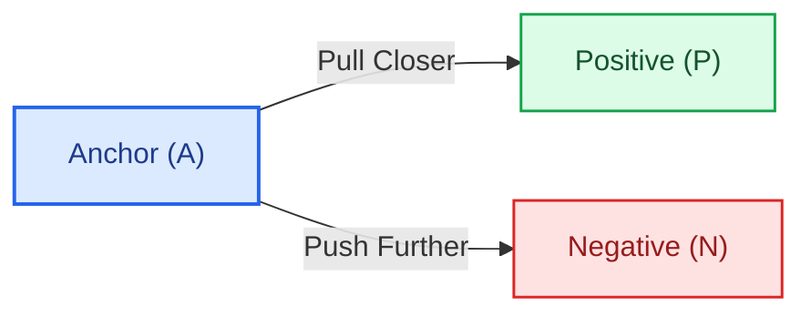
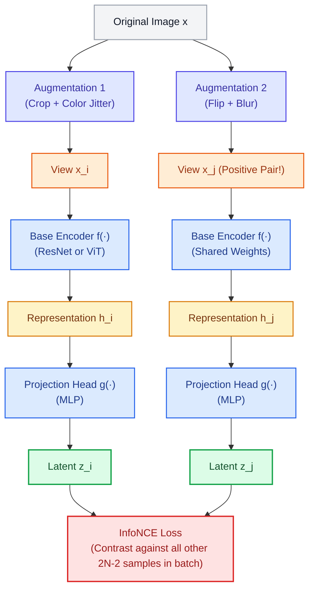
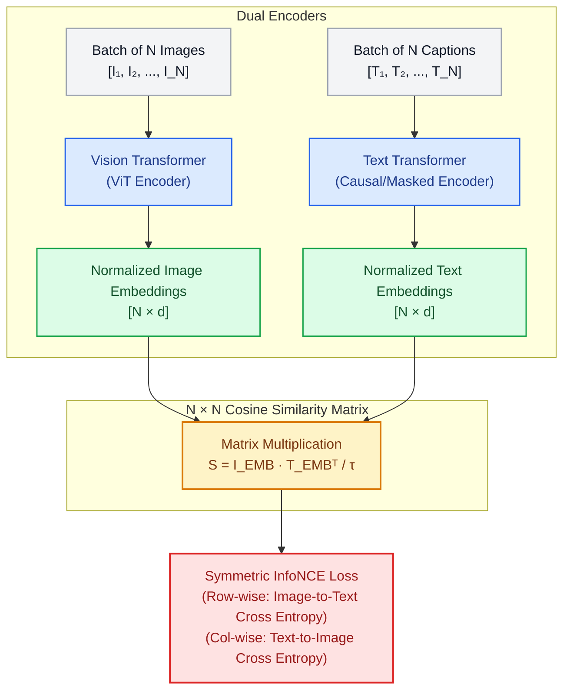

# Contrastive Family — Learning by Comparing

In the **Reconstruction Family**, models learn representations by rebuilding raw inputs ($x \to x$). 

The **Contrastive Family** takes the opposite approach: **no reconstruction**. Instead of predicting pixels or words, the model learns an embedding space where **semantically similar items are pulled close together** and **dissimilar items are pushed far apart**.

```
    Contrastive Representation Principle:
    
    Anchor (A) ──────── Pull together ────────► Positive (P)  [Cosine distance → 0]
        │
        └─────────────── Push apart ───────────► Negative (N)  [Cosine distance → large]
```

---

## The Big Picture: Why Contrastive Learning Matters for LLMs & AI

If your focus is LLMs, contrastive learning is one of the most important tools in your stack:

1. **Text Embeddings & Vector Databases (RAG):** Modern text embedding models (OpenAI `text-embedding-3`, BGE, E5, Voyage) are trained **entirely on contrastive loss**. When you retrieve relevant documents for an LLM via RAG, a contrastively trained embedding model powers that search.
2. **Vision-Language Alignment (VLMs):** Models like **CLIP** and **SigLIP** are the "eyes" of multimodal LLMs. They align visual tokens directly with the LLM's text space, allowing models like LLaVA, Gemini, and GPT-4V to understand images.
3. **Unsupervised Pretraining without Labels:** Contrastive learning allows models to learn representations from trillions of uncurated web images and text snippets without requiring any human labels.

---

## §1 — Word2Vec (2013): The Grandfather of Contrastive Learning

Word2Vec (Mikolov et al., 2013) introduced the earliest mainstream contrastive framework: **Skip-gram with Negative Sampling (SGNS)**.

**The Task:** Given a target center word, predict which context words naturally appear nearby in a sliding window, while distinguishing them from random words drawn from the vocabulary.

```
  Sentence: "The quick brown fox jumps over the lazy dog"
  Target Word: "fox" (Window size = 2)

  Positive Pairs (co-occur):  ("fox", "quick"), ("fox", "brown"), ("fox", "jumps")
  Negative Pairs (random):    ("fox", "banana"), ("fox", "quantum"), ("fox", "submarine")
```

### The Objective Function
Instead of calculating a massive, expensive softmax over the entire 1,000,000-word vocabulary, Word2Vec treats each word pair as an independent binary classification:

$$\mathcal{L}_{\text{SGNS}} = -\log \sigma(v_{\text{target}} \cdot v_{\text{positive}}) - \sum_{k=1}^{K} \log \sigma(-v_{\text{target}} \cdot v_{\text{neg}_k})$$

Where:
* $\sigma$ is the sigmoid function.
* The first term **maximizes probability** for true co-occurring words (pulls them together).
* The second term **minimizes probability** for $K$ randomly sampled negative words (pushes them away).

**The Result:** Words with similar meanings end up close together in vector space. Geometric relationships emerge naturally:
$$\vec{v}_{\text{King}} - \vec{v}_{\text{Man}} + \vec{v}_{\text{Woman}} \approx \vec{v}_{\text{Queen}}$$

---

## §2 — Triplet Loss (2015): Explicit Pull-and-Push Geometry

Popularized by **FaceNet** (Schroff et al., 2015) for facial recognition, Triplet Loss defines learning over triplets of samples:
* **Anchor ($A$):** A photo of Person 1.
* **Positive ($P$):** A different photo of Person 1 (different angle or lighting).
* **Negative ($N$):** A photo of Person 2.



### The Triplet Loss Formula
We want the distance between the anchor and the positive to be smaller than the distance between the anchor and the negative by at least a safety **margin** $\alpha$:

$$\mathcal{L}_{\text{Triplet}} = \max\Big(0, \; d(A, P) - d(A, N) + \alpha\Big)$$

Where $d(x, y) = \|f(x) - f(y)\|^2$ is the Euclidean distance in embedding space.

```
  Before Training:                   After Training:
  
     A · · · · · N                     A  P ──────── margin α ────────► N
         P                             
  (Random positions)                   (Positive pulled tight, Negative pushed past margin)
```

> [!WARNING]
> **The Hard Negative Mining Problem:**
> If you pick negative samples randomly, most negatives are so obviously different from the anchor that $d(A, N)$ is already huge, meaning $d(A, P) - d(A, N) + \alpha \le 0$. The loss becomes 0, and the network stops learning! Triplet training requires complex **hard negative mining** algorithms to find negatives that are deceptively close to the anchor.

---

## §3 — InfoNCE & SimCLR (2020): Batch-Level Multi-Negative Contrast

Instead of comparing an anchor against a single negative, **InfoNCE** (van den Oord et al., 2018; Chen et al., 2020) compares each positive pair against an **entire mini-batch of hundreds or thousands of negatives simultaneously**.

### SimCLR Pipeline (Self-Supervised Vision)



### The InfoNCE Loss Formula
For a positive pair $(z_i, z_j)$ in a batch of size $N$ (yielding $2N$ augmented views):

$$\mathcal{L}_{i,j} = -\log \frac{\exp\left(\text{sim}(z_i, z_j) / \tau\right)}{\sum_{k=1}^{2N} \mathbb{I}_{[k \ne i]} \exp\left(\text{sim}(z_i, z_k) / \tau\right)}$$

Where:
* $\text{sim}(u, v) = \frac{u^\top v}{\|u\| \|v\|}$ is cosine similarity.
* $\tau$ is the **temperature hyperparameter** (controls how sharply hard negatives are penalized; typically $\tau \approx 0.07$ to $0.1$).
* The denominator treats the other **$2N - 2$ images in the batch as negative examples**.

> [!NOTE]
> **Why Large Batch Size is Critical:**
> The larger your batch size $N$, the more negative samples the model is forced to differentiate against in the denominator. SimCLR required huge batch sizes ($N = 4096$) to achieve state-of-the-art representations.

---

## §4 — CLIP: Aligning Vision and Language

Published by OpenAI (Radford et al., 2021), **CLIP (Contrastive Language-Image Pretraining)** applied InfoNCE across **multimodal pairs**.

Instead of augmenting images, CLIP trains on **400 million (image, caption) pairs** scraped from the internet:
* **Positive Pair:** An image and its actual matching text caption: $(I_i, T_i)$.
* **Negative Pairs:** That image paired with every other text caption in the mini-batch: $(I_i, T_j)$ where $j \ne i$.



### Symmetric InfoNCE Loss
The model optimizes both directions simultaneously:
$$\mathcal{L}_{\text{CLIP}} = \frac{1}{2}\left(\mathcal{L}_{\text{Image} \to \text{Text}} + \mathcal{L}_{\text{Text} \to \text{Image}}\right)$$

$$\mathcal{L}_{\text{Image} \to \text{Text}} = -\frac{1}{N} \sum_{i=1}^{N} \log \frac{\exp(I_i \cdot T_i / \tau)}{\sum_{j=1}^{N} \exp(I_i \cdot T_j / \tau)}$$

### CLIP's Superpower: Zero-Shot Classification
Because images and text share a unified geometric space, you can classify images into novel classes without any training examples:
1. Turn class labels into text prompts: `"a photo of a {dog}"`, `"a photo of a {cat}"`, `"a photo of a {car}"`.
2. Compute embeddings for each text prompt.
3. Compute the image embedding.
4. Predict the class with the highest cosine similarity!

---

## §5 — SigLIP: Removing the Batch Size Dependency

Published by Google (Zhai et al., 2023), **SigLIP (Sigmoid Loss for Language-Image Pretraining)** addresses the biggest architectural headache of CLIP: **the Softmax denominator**.

In standard CLIP, the Softmax denominator normalizes across all items in the batch. This means:
* You **must gather all representations across all GPUs** before computing the loss (a costly all-gather communication barrier).
* Small batches degrade representation quality because there aren't enough negative samples.

### The SigLIP Upgrade: Pairwise Binary Cross-Entropy
SigLIP replaces the batch-level Softmax with **independent binary classification** for every cell in the $N \times N$ similarity matrix:

$$\mathcal{L}_{\text{SigLIP}} = -\frac{1}{N} \sum_{i=1}^{N} \sum_{j=1}^{N} \log \sigma\left(y_{ij} \cdot (I_i \cdot T_j \cdot t + b)\right)$$

Where $y_{ij} = 1$ if $i = j$ (matching positive pair) and $y_{ij} = -1$ if $i \ne j$ (negative pair).

| Feature | Standard CLIP (InfoNCE) | SigLIP (Sigmoid Loss) |
| :--- | :--- | :--- |
| **Loss Function** | Categorical Softmax Cross-Entropy | Pairwise Sigmoid Binary Cross-Entropy |
| **Cross-Device Communication** | Requires expensive All-Gather of embeddings across GPUs | Decoupled; can be computed asynchronously |
| **Small Batch Performance** | Struggles significantly with small batches | Highly robust at small batch sizes |
| **Memory Efficiency** | High memory overhead | Lower memory footprint; scales to massive batches |
| **Modern Adoption** | Foundation of early VLMs (LLaVA-1.5) | Adopted by Google **PaliGemma** and modern VLMs |

---

## §6 — Contrastive Text Embeddings for RAG (SBERT, BGE, E5)

Contrastive learning is not just for multimodal images; it is the exact engine behind modern **Retrieval-Augmented Generation (RAG)**.

When an LLM answers questions using external knowledge:
1. A **Bi-Encoder** (like BGE, E5, or OpenAI `text-embedding-3`) independently embeds the user's **Query** $q$ and millions of stored **Documents** $d$.
2. The model is trained contrastively:
   $$\mathcal{L}_{\text{RAG}} = -\log \frac{\exp(\text{sim}(q, d^+) / \tau)}{\exp(\text{sim}(q, d^+) / \tau) + \sum_{k} \exp(\text{sim}(q, d_k^-) / \tau)}$$
3. At inference time, vector databases (like FAISS or Pinecone) perform fast Approximate Nearest Neighbor (ANN) search to find the closest document vectors in milliseconds.

---

## §7 — Summary: The Complete Contrastive Family

| Method | Anchor | Positives | Negatives | Objective Function | Key Impact |
| :--- | :--- | :--- | :--- | :--- | :--- |
| **Word2Vec (SGNS)** | Center word | Surrounding context words | Random vocabulary words | Binary Sigmoid Cross-Entropy | Semantic vector math ($\text{King} - \text{Man} \approx \text{Queen}$) |
| **Triplet Loss** | Single image | Same identity / class | Different identity | Max-Margin Ranking Loss | FaceNet, image verification |
| **SimCLR** | Image view | Another augmented view of same image | Other images in the mini-batch | Multi-class InfoNCE Softmax | Unsupervised computer vision pretraining |
| **CLIP** | Image | Matching natural language caption | Mismatched captions in mini-batch | Dual Symmetric InfoNCE | Zero-shot classification, eyes of modern VLMs |
| **SigLIP** | Image | Matching natural language caption | Mismatched captions in mini-batch | Pairwise Sigmoid BCE | Scalable, efficient multimodal alignment |
| **Dense Embeddings (BGE/E5)** | Search Query | Ground-truth relevant document | Irrelevant / mined hard negative documents | InfoNCE with hard negative mining | Powering modern RAG and semantic vector search |

---

## Landmark Papers to Know

1. **Word2Vec:** [Mikolov et al. (2013) — *Distributed Representations of Words and Phrases and their Compositionality*](https://arxiv.org/abs/1310.4546)
2. **FaceNet & Triplet Loss:** [Schroff, Kalenichenko, & Philbin (2015) — *FaceNet: A Unified Embedding for Face Recognition and Clustering*](https://arxiv.org/abs/1503.03832)
3. **Representation Learning with Contrastive Predictive Coding (InfoNCE):** [van den Oord, Li, & Vinyals (2018) — *CPC & InfoNCE*](https://arxiv.org/abs/1807.03748)
4. **SimCLR:** [Chen et al. (2020) — *A Simple Framework for Contrastive Learning of Visual Representations*](https://arxiv.org/abs/2002.05709)
5. **CLIP:** [Radford et al. (2021) — *Learning Transferable Visual Models From Natural Language Supervision*](https://arxiv.org/abs/2103.00020)
6. **SigLIP:** [Zhai et al. (2023) — *Sigmoid Loss for Language Image Pre-Training*](https://arxiv.org/abs/2303.15343)
7. **Sentence-BERT:** [Reimers & Gurevych (2019) — *Sentence-BERT: Sentence Embeddings using Siamese BERT-Networks*](https://arxiv.org/abs/1908.10084)
