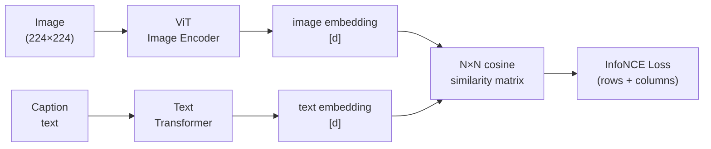

# Contrastive Family — Learning by Comparing

**Core idea across all variants:** no reconstruction. Instead, learn embeddings where **similar things are nearby** and **dissimilar things are far apart** in vector space.

```
  Contrastive loss:
  Pull together:  d(anchor, positive) → small
  Push apart:     d(anchor, negative) → large

  No labels needed — "similar" = same image under different augmentation,
                                  same image-caption pair, same word context, etc.
```

---

## Word2Vec — The Original Contrastive Idea

Word2Vec (2013) learns word embeddings by predicting context. The **Skip-gram with Negative Sampling** variant is the clearest ancestor of modern contrastive learning.

**Task:** given a centre word, predict surrounding words (and distinguish them from random words).

```
  Sentence: "The cat sat on the mat"
  Centre word: "sat"   Window size: 2

  Positive pairs (co-occur):    ("sat", "cat"), ("sat", "on")
  Negative pairs (random):      ("sat", "banana"), ("sat", "Europe")

  Objective: score(sat, cat) >> score(sat, banana)
```

$$L = -\log \sigma(v_{\text{sat}} \cdot v_{\text{cat}}) - \sum_{k} \log \sigma(-v_{\text{sat}} \cdot v_{n_k})$$

- $\sigma$ = sigmoid
- First term: pull "sat" and "cat" together
- Second term: push "sat" away from $k$ random negatives

After training: similar words cluster together. "king" − "man" + "woman" ≈ "queen" — the famous analogy test — emerges from this objective, not from any explicit supervision.

**Why this matters:** negative sampling is the first mainstream use of the pull/push contrastive structure. Every contrastive method that follows is a generalisation of this.

---

## Triplet Loss

Makes the pull/push explicit with three items: an **anchor**, a **positive** (similar to anchor), and a **negative** (dissimilar).

```
  Anchor (A):    photo of a golden retriever
  Positive (P):  different photo of the same dog
  Negative (N):  photo of a cat

  Goal: d(A, P) + margin < d(A, N)
  i.e. the positive must be closer than the negative by at least a margin
```

$$L = \max\!\left(0,\; d(A, P) - d(A, N) + \text{margin}\right)$$

```
  Before training:          After training:
  A · · N                   A P
      P                         · · · N
  (random positions)        (P pulled to A, N pushed away)
```

- $d$ is usually Euclidean distance or $1 - \cos(\text{similarity})$
- **Margin** prevents collapse (if A=P=N, loss=0 trivially without margin)
- Used in: FaceNet (face recognition), image retrieval

**Problem:** requires carefully mined hard negatives — random negatives are often too easy and give zero gradient once the model is slightly trained. Picking negatives that are "almost but not quite positive" is a whole sub-problem.

---

## InfoNCE / SimCLR

The key upgrade over triplet loss: instead of one negative at a time, use an **entire batch of negatives simultaneously**.

**SimCLR setup:**

```
  Batch of N images: [img₁, img₂, ..., imgN]

  For each image, create 2 augmented views:
  img₁ → [aug_1a, aug_1b]    ← positive pair (same image, different crop/colour)
  img₂ → [aug_2a, aug_2b]
  ...

  Positive pairs:  (aug_ia, aug_ib)  — same source image
  Negative pairs:  (aug_ia, aug_jb)  for all j ≠ i  — different images
```

**InfoNCE loss** (for one anchor $aug_{1a}$, with $aug_{1b}$ as its positive):

$$L = -\log \frac{\exp(\text{sim}(z_{1a}, z_{1b}) / \tau)}{\sum_{j=1}^{2N} \exp(\text{sim}(z_{1a}, z_j) / \tau)}$$

- $\tau$ = temperature (controls sharpness of the distribution)
- Numerator: similarity to positive (want this large)
- Denominator: similarity to all $2N-1$ other views in the batch (want these small)

```
  N×N similarity matrix for a batch of 4 images (8 views):

          1a    1b    2a    2b    3a    3b    4a    4b
  1a    [  ✓    ✓     ✗     ✗     ✗     ✗     ✗     ✗  ]   ← want diagonal block high
  1b    [  ✓    ✓     ✗     ✗     ✗     ✗     ✗     ✗  ]
  2a    [  ✗    ✗     ✓     ✓     ✗     ✗     ✗     ✗  ]
  ...

  ✓ = positive pair (pull together)
  ✗ = negative pair (push apart)
```

**Temperature $\tau$:**
```
  Low τ:   softmax very peaked → sharp discrimination, but unstable with bad negatives
  High τ:  softmax flat → all negatives treated equally, slow learning
  Typical: τ = 0.07 (CLIP) or τ = 0.1 (SimCLR)
```

**Why batch size matters:** more images in the batch = more negatives per anchor = harder task = better representations. SimCLR used batch sizes of 4096–8192.

---

## CLIP

CLIP applies InfoNCE to **image-text pairs** instead of augmented views of the same image.

```
  Batch of N (image, caption) pairs scraped from the web:

  img₁: [photo of a dog]     cap₁: "a golden retriever playing fetch"
  img₂: [photo of a city]    cap₂: "New York skyline at night"
  ...

  Positive:  (imgᵢ, capᵢ)   — matching pair
  Negative:  (imgᵢ, capⱼ)   for j ≠ i  — mismatched pair
```

Two separate encoders:



$$L = \frac{1}{2}\left(L_{\text{image→text}} + L_{\text{text→image}}\right)$$

Both directions: each image should match its caption (row-wise), and each caption should match its image (column-wise).

**What CLIP learns:** a **shared embedding space** where images and their descriptions end up at the same point. The ViT image encoder from CLIP is exactly what gets used in VLMs (LLaVA, InstructBLIP, etc.) because its representations are already language-aligned.

**Zero-shot classification** (CLIP's party trick):
```
  "a photo of a {cat}"  →  text embedding
  "a photo of a {dog}"  →  text embedding
  "a photo of a {car}"  →  text embedding
       ↑
  Run image through ViT → image embedding
  → pick the class whose text embedding is most similar
  → no task-specific training needed
```

---

## SigLIP

SigLIP replaces CLIP's softmax (InfoNCE) with a **sigmoid binary cross-entropy** applied to each pair independently:

| | CLIP (InfoNCE) | SigLIP (sigmoid) |
|---|---|---|
| Loss type | Softmax over all negatives in batch | Per-pair sigmoid (independent) |
| Batch dependency | Yes — each anchor competes against all others | No — each pair scored alone |
| Batch size sensitivity | High — large batches needed for good negatives | Lower |
| Stability | Unstable at small batch | More stable |

$$L_{\text{SigLIP}} = -\frac{1}{N^2}\sum_{i,j} \left[y_{ij} \log \sigma(s_{ij}) + (1-y_{ij}) \log (1 - \sigma(s_{ij}))\right]$$

where $y_{ij} = 1$ if pair $(i,j)$ is a match, 0 otherwise, and $s_{ij}$ is the dot product similarity.

Each pair is treated as an independent binary classification: "do these match?" The N×N matrix with N positives and $N^2-N$ negatives is scored entry by entry.

---

## Contrastive Family Summary

| Method | Positives | Negatives | Loss | Key idea |
|---|---|---|---|---|
| Word2Vec | Co-occurring words | Random vocabulary words | Sigmoid binary | Pull context words together |
| Triplet loss | Same class / identity | Different class | Max-margin | Explicit anchor/pos/neg triplet |
| InfoNCE / SimCLR | Two augmented views of same image | Other images in batch | Softmax cross-entropy | Batch = pool of negatives |
| CLIP | Matching image-caption pair | All other pairs in batch | InfoNCE (both directions) | Shared image-text embedding space |
| SigLIP | Matching image-caption pair | All other pairs in batch | Per-pair sigmoid BCE | No batch-level normalisation |
