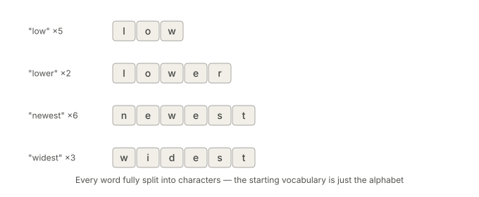
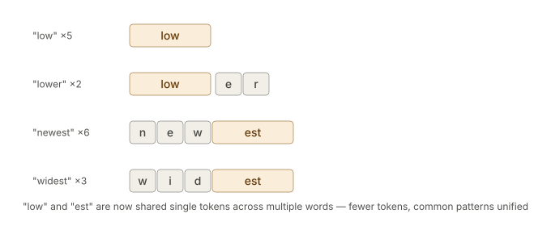
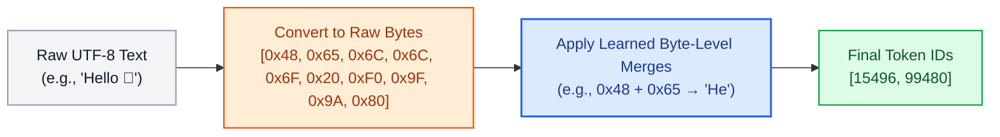
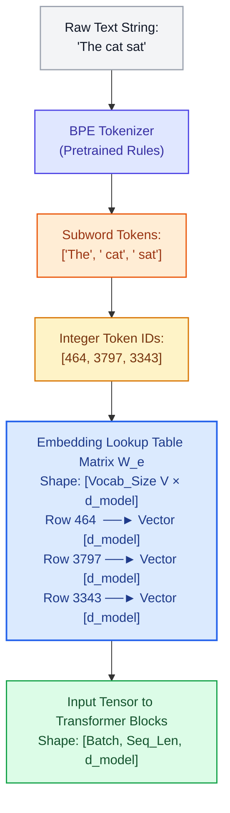

# Tokenization and Byte-Pair Encoding (BPE)

Before a single matrix multiplication occurs, before attention scores are computed, and before embeddings are looked up, raw human text must be converted into discrete numbers. That translation layer is **Tokenization**.

Tokenization sits **entirely outside the Transformer neural network**. It is a deterministic, rule-based preprocessing algorithm that predates Transformers by years (BPE was adapted for NLP by Sennrich et al. in 2015 from Gage's 1994 data compression algorithm). Yet, it is arguably the most impactful engineering layer in modern LLMs: it determines your model's vocabulary size, memory consumption, context window efficiency, multilingual proficiency, and ability to handle typos, code, and math.

---

## §1 — The Granularity Tradeoff: Words vs. Characters vs. Subwords

To turn continuous text strings into discrete integers, where should we cut the string?

This is the exact same granularity tradeoff found in Computer Vision (balancing large vs. small ViT patch sizes):

| Feature | Coarse (Words) | The Goldilocks Zone (Subwords / BPE) | Fine (Characters) |
| :--- | :--- | :--- | :--- |
| **Vocab Size** | 500,000+ words | 32,000 to 100,000 tokens | ~256 chars |
| **Sequence Length**| Short | Balanced | Huge (4-5× longer) |
| **OOV Problem** | Fatal | Zero (falls back to chars/bytes) | None |
| **Morphology** | Ignored | Naturally captured | No semantic units |

### 1. Word-Level Tokenization (Too Coarse)
Split on whitespace and punctuation: `"The foxes are running!"` $\to$ `["The", "foxes", "are", "running", "!"]`.
* **The Fatal Flaws:** 
  * **Infinite Vocabulary:** Every grammatical inflection (`run`, `running`, `ran`), every typo (`teh`), and every technical jargon term needs its own unique entry in the vocabulary.
  * **Out-of-Vocabulary (OOV) Catastrophe:** If the training set never saw the word `"unhappiness"`, it maps to a useless unknown token: `<UNK>`.
  * **Zero Parameter Sharing:** The model cannot share knowledge between `"fox"` and `"foxes"` or `"run"` and `"running"` — they are completely distinct, independent indices in the embedding table, even though they share the exact same root meaning.

### 2. Character-Level Tokenization (Too Fine)
Split into individual letters: `"cat"` $\to$ `["c", "a", "t"]`.
* **The Fatal Flaws:**
  * **Exploding Sequence Lengths:** A 1,000-word essay becomes 6,000 character tokens. Because Transformer self-attention compute and memory scale quadratically ($O(N^2)$), a 6× longer sequence requires **36× more compute and memory**!
  * **Loss of Semantic Density:** Individual characters carry almost no standalone semantic meaning. The model must spend dozens of self-attention layers just assembling letters into words before it can even begin reasoning.

### 3. Subword Tokenization (BPE): The Modern Solution
Start at the character level, and iteratively **merge the most frequently co-occurring adjacent pairs** into new single tokens.
* **Common words** become single whole tokens: `"the"` $\to$ `["the"]`.
* **Rare or complex words** split into meaningful morphological sub-units: `"unhappiness"` $\to$ `["un", "happi", "ness"]`.
* **Unseen words or typos** gracefully fall back to individual characters or bytes: `"gigaaaantic"` $\to$ `["giga", "aa", "an", "tic"]`.
* **No `<UNK>` tokens ever.**

---

## §2 — The BPE Algorithm: Worked Step-by-Step Example

Let's walk through the exact toy example from the foundational paper by Sennrich et al. (2015).

Suppose our training corpus consists of just four words with the following frequencies:
* `"low"` appears **5 times**
* `"lower"` appears **2 times**
* `"newest"` appears **6 times**
* `"widest"` appears **3 times**

### Step 0: The Initial Character Split
Every word begins decomposed into individual characters:



* **Starting Vocabulary (the alphabet):** `{ d, e, i, l, n, o, r, s, t, w }` (size = 10)
* Current representations in our corpus:
  * `"l o w"` : 5
  * `"l o w e r"` : 2
  * `"n e w e s t"` : 6
  * `"w i d e s t"` : 3

---

### Step 1: Count Adjacent Pairs & Greedily Merge

We count all adjacent symbol pairs across all words, but we must remember to **multiply by how many times the word itself appears in our dataset**. 

> [!NOTE]
> **How is this computed in code?**
> We do NOT generate a massive combination of all possible letters (e.g. $10 \choose 2$). We only care about characters that actually sit next to each other.
>
> 1. We loop through each unique word in the corpus.
> 2. For a word of length $L$, we extract its $L-1$ adjacent pairs by sliding a window of size 2.
> 3. We add those pairs to a Hash Map, tallying up the word's corpus frequency.
>
> ```python
> pair_frequencies = {}
> 
> for word, count in corpus.items():
>     # Example: word = ["n", "e", "w", "e", "s", "t"], count = 6
>     # Extract L-1 adjacent pairs:
>     for i in range(len(word) - 1):
>         pair = (word[i], word[i+1])
>         
>         if pair not in pair_frequencies:
>             pair_frequencies[pair] = 0
>         # Add the word's total corpus count to the pair's tally
>         pair_frequencies[pair] += count
> 
> # Finally, just find the pair with the maximum value in the hash map!
> ``` 
>
> [!WARNING]
> **Why do we only merge ONE pair at a time?**
> Even if multiple pairs have a high frequency (like `(e, s)` and `(s, t)` both having 9), we **cannot** merge them all at once. BPE is strictly a greedy algorithm. Merging changes the underlying text! If we tried to merge `(e, s)` and `(s, t)` simultaneously, they would overlap on the letter `s`. We must pick the single highest pair, merge it, update our entire corpus with the new token, and *then* recount the frequencies from scratch for the next iteration.

#### Iteration 1:
* The pair `(e, s)` appears once inside the word `"newest"`. Since `"newest"` appears **6 times** in our corpus, that's 6 occurrences of `(e, s)`.
* The pair `(e, s)` also appears once inside `"widest"`. Since `"widest"` appears **3 times** in our corpus, that's 3 occurrences of `(e, s)`.
* **Total corpus frequency** = 6 + 3 = **9 occurrences** (This is the highest of any pair!).
* *Action:* Greedily pick the most frequent pair `(e, s)` and create a new token **`es`**.
* **Vocabulary updated:** `{ d, e, i, l, n, o, r, s, t, w, es }`
* Corpus updated:
  * `"l o w"` : 5
  * `"l o w e r"` : 2
  * `"n e w es t"` : 6
  * `"w i d es t"` : 3

#### Iteration 2:
* **Starting fresh:** BPE has no memory of the previous step. It slides its window over the *newly updated* corpus. It sees the block `es` sitting next to `t` as just another pair.
* Now pair `(es, t)` appears in `"newest"` (6) and `"widest"` (3) $\implies$ **Total frequency = 9** (Most frequent!).
* *Action:* Merge `(es, t)` into **`est`**.
* **Vocabulary updated:** `{ ..., es, est }`
* Corpus updated:
  * `"l o w"` : 5
  * `"l o w e r"` : 2
  * `"n e w est"` : 6
  * `"w i d est"` : 3

> [!NOTE]
> **Sequential Greed:** Notice that `es` $\to$ `est` occurred as two separate, sequential merges. Once `es` becomes a recognized token, it acts as a single indivisible building block in all subsequent pair-counting rounds!

#### Iteration 3:
* Pair `(l, o)` appears in `"low"` (5) and `"lower"` (2) $\implies$ **Total frequency = 7**.
* *Action:* Merge `(l, o)` into **`lo`**.
* **Vocabulary updated:** `{ ..., est, lo }`
* Corpus updated:
  * `"lo w"` : 5
  * `"lo w e r"` : 2
  * `"n e w est"` : 6
  * `"w i d est"` : 3

#### Iteration 4:
* Pair `(lo, w)` appears in `"low"` (5) and `"lower"` (2) $\implies$ **Total frequency = 7**.
* *Action:* Merge `(lo, w)` into **`low`**.
* **Vocabulary updated:** `{ ..., lo, low }`
* Corpus updated:
  * `"low"` : 5
  * `"low e r"` : 2
  * `"n e w est"` : 6
  * `"w i d est"` : 3

---

### The Result After 4 Merges



Look at what emerged without any human grammar rules:
1. **Compression:** `"low"` shrunk from 3 tokens (`l`, `o`, `w`) to **1 single token** (`low`).
2. **Subword Sharing & Generalization:** `"lower"` became `[low, e, r]`. It shares its root representation directly with `"low"`. If the model learns something about the concept of `low`, that knowledge automatically informs `lower`!
3. **Morphological Regularity:** `"newest"` (`[n, e, w, est]`) and `"widest"` (`[w, i, d, est]`) now share the exact same superlative suffix token `est`. The model represents the grammatical concept of *"the most extreme"* identically across completely unrelated root adjectives.

In real LLM training (GPT-2, GPT-4, LLaMA), this greedy loop runs for **32,000 to 100,000 iterations** until the desired vocabulary size is reached. Frequent English prefixes and suffixes (`-ing`, `-tion`, `un-`, `pre-`) and common multi-word coding patterns (` def `, ` self.`, `return `) naturally crystallize into single dedicated tokens.

---

## §3 — Inference: How BPE Tokenizes Brand-New, Unseen Words

Training produces two artifacts:
1. **The Vocabulary:** A set of tokens (initial characters + all learned merges).
2. **The Merge Table:** An ordered priority list of learned merges:
   ```
   Priority 1: (e, s)  ──► es
   Priority 2: (es, t) ──► est
   Priority 3: (l, o)  ──► lo
   Priority 4: (lo, w) ──► low
   ```

### Tokenizing an Unseen Word: `"slowest"`
Suppose the trained model encounters the word `"slowest"`, which **never appeared in the training set**.

Does the model fail or output `<UNK>`? **No.** It applies the learned merge rules deterministically:

```
Step 0: Split to characters:
        ['s',  'l',  'o',  'w',  'e',  's',  't']

Step 1: Check Merge Table for any matching adjacent pairs.
        Rule 1 matches: (e, s) ──► es
        Result: ['s',  'l',  'o',  'w',  'es',  't']

Step 2: Check Merge Table again.
        Rule 2 matches: (es, t) ──► est
        Result: ['s',  'l',  'o',  'w',  'est']

Step 3: Check Merge Table again.
        Rule 3 matches: (l, o) ──► lo
        Result: ['s',  'lo',  'w',  'est']

Step 4: Check Merge Table again.
        Rule 4 matches: (lo, w) ──► low
        Result: ['s',  'low',  'est']

Final Tokens: [ 's',  'low',  'est' ]
```

The model seamlessly tokenizes an unseen word into `s` + `low` + `est`. This is why BPE **natively eliminates the out-of-vocabulary problem**.

---

## §4 — The Byte-Level Upgrade: Byte-Pair Encoding (BBPE)

Original BPE started with unicode characters as base tokens. But Unicode contains over **150,000 characters** (including Japanese Kanji, Arabic, Cyrillic, math symbols, and thousands of emojis like 🚀). If your base vocabulary needs 150,000 characters before learning a single merge, your embedding table becomes gigantic.

OpenAI introduced the solution in GPT-2 (Radford et al., 2019): **Byte-Level BPE (BBPE)**.



### Why Byte-Level BPE is Universal:
1. **Base Vocabulary of Exactly 256:** Any piece of digital information — English text, Python code, Chinese characters, emojis, or binary bytes — is represented by bytes with values from `0x00` to `0xFF` (0 to 255).
2. **True 100% Coverage:** No character or symbol on Earth can ever be out-of-vocabulary. If a user inputs a brand new emoji created yesterday, the model simply tokenizes it into its underlying 4 UTF-8 bytes!
3. **Standard in Modern LLMs:** GPT-2, GPT-4 (tiktoken), LLaMA 1/2/3, Mistral, and DeepSeek all use **Byte-Level BPE**.

---

## §5 — Connecting Tokenization to the Transformer Architecture

Tokenization is the bridge between human language and linear algebra. Here is how BPE directly connects to the concepts in [`01_Transformer_Core_Mechanics.md`](file:///Users/vusheshbabuadhikari/Learning/git/Building_LLM_from_scratch/transformers_basics/01_Transformer_Core_Mechanics.md):



### The Embedding Table Connection
* When BPE determines that `" cat"` is token number `3797`, it is assigning it **Row 3797 of the Embedding Matrix $W_e$**.
* When the LLM predicts the next token, the final linear head (`lm_head`) projects the hidden state to a vector of logits of size `[1, Vocab_Size]`.
* **Vocabulary Size ($V$) is a physical constraint:**
  * If $V = 32,000$ (LLaMA-1) and $d_{\text{model}} = 4096$, the embedding table contains $32,000 \times 4096 \approx \mathbf{131 \text{ million parameters}}$.
  * If $V = 128,256$ (LLaMA-3), the embedding layer alone holds **over 525 million parameters**!
  * Expanding $V$ allows the model to compress text into fewer tokens (shortening sequence length), but drastically increases parameter count and memory at the input and output heads.

---

## §6 — Extending the Vocabulary: Special Tokens & Robotics Action Bins

A tokenizer vocabulary is not static; it can be extended with **Special Tokens** that were never part of natural text.

### 1. Control & Chat Special Tokens
Chat models require structure to differentiate user input from assistant responses:
* `<|im_start|>user\nHello<|im_end|>`
* `<|begin_of_text|>`, `<|eot_id|>`, `[MASK]`, `[CLS]`

These are manually appended to the tokenizer vocabulary (indices $V_{\text{base}}, V_{\text{base}}+1, \dots$). They receive their own dedicated, trainable rows in the embedding lookup table.

### 2. Robotics & Vision-Language-Action (VLA) Action Bins
In physical AI and robotics (RT-2, OpenVLA, Octo), the robot must output 3D arm movements (e.g. $x, y, z$, roll, pitch, yaw, gripper open/close).

Instead of inventing a separate architecture, roboticists **quantize continuous physical movements into 256 discrete bins**:
$$\text{Position } x \in [-1.0, +1.0] \implies \text{Bin } 0 \text{ to } 255$$

The BPE vocabulary is extended with 256 special action tokens:
* `<bin_0>`, `<bin_1>`, ..., `<bin_255>`

The LLM generates robot motor commands **using the exact same autoregressive next-token prediction machinery** it uses to write English words:
```
User prompt:  "Pick up the red bowl"
LLM output:   "Thought: Locate bowl. Action: <bin_42> <bin_118> <bin_201> <bin_1>"
```

---

## §7 — Major Subword Algorithms Compared

| Algorithm | Model Lineage | How Merges are Decided | Space Handling | Key Advantage |
| :--- | :--- | :--- | :--- | :--- |
| **BPE (Byte-Level)** | GPT-2/3/4, LLaMA 1/2/3, Mistral | Bottom-up: Pure frequency of adjacent pairs | Preserves spaces as byte characters (e.g. `Ġ` or `_`) | Zero OOV; universal across code, text, math |
| **WordPiece** | BERT, DistilBERT | Bottom-up: Likelihood scoring $\frac{\text{freq}(AB)}{\text{freq}(A) \times \text{freq}(B)}$ | Explicit `##` prefix for inner subwords (`aff` + `##able`) | Favors merges with high mutual information |
| **Unigram (SentencePiece)** | T5, ALBERT, Gemma | Top-down: Starts with huge vocab and prunes least probable tokens | Treats whitespace natively as character `_` | Probabilistic sampling during training (regularization) |

---

## Landmark Papers & Tools to Know

1. **Original Byte-Pair Encoding Algorithm:** [Philip Gage (1994) — *A New Algorithm for Data Compression*](http://www.pennelynn.com/Documents/CUJ/HTML/9402/GAGE/GAGE.HTM)
2. **BPE for Subword NLP:** [Sennrich, Haddow, & Birch (2015) — *Neural Machine Translation of Rare Words with Subword Units*](https://arxiv.org/abs/1508.07909)
3. **Byte-Level BPE (GPT-2):** [Radford et al. (2019) — *Language Models are Unsupervised Multitask Learners*](https://cdn.openai.com/better-language-models/language_models_are_unsupervised_multitask_learners.pdf)
4. **SentencePiece Framework:** [Kudo & Richardson (2018) — *SentencePiece: A simple and language independent subword tokenizer and detokenizer for Neural Text Processing*](https://arxiv.org/abs/1808.06226)
5. **Modern Fast Tokenizers:** [OpenAI `tiktoken`](https://github.com/openai/tiktoken) and [Hugging Face `tokenizers`](https://github.com/huggingface/tokenizers) (written in Rust for multi-gigabyte-per-second throughput).
