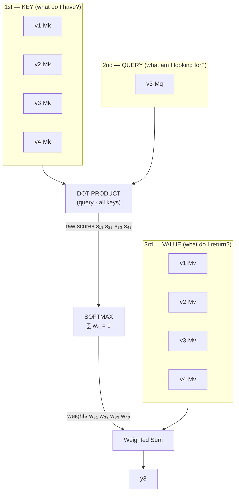
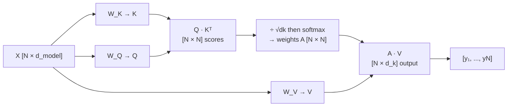
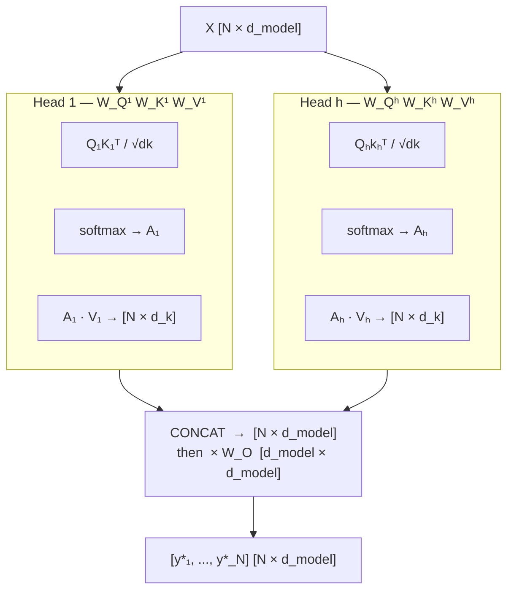
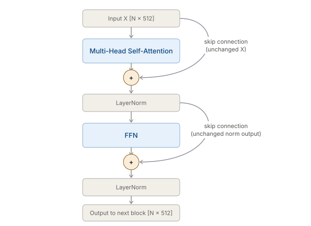

# Transformer Core Mechanics

> Sources: RASA Algorithm Whiteboard — YouTube | Stanford CME295 — Autumn 2025

---

## Table of Contents

**Phase 1 — Core Engine (Attention Mechanics)**
1. [Token Embeddings — The Input to Everything](#1-token-embeddings--the-input-to-everything)
2. [Attention Mechanism](#2-attention-mechanism)
3. [Why Scale by √dk?](#3-why-scale-by-dk)
4. [Self-Attention](#4-self-attention)
5. [Multi-Head Attention](#5-multi-head-attention)
6. [MHA Split Geometry — Concat + Dense](#6-mha-split-geometry--concat--dense)

**Phase 2 — Anatomy of a Single Block**
7. [Feed-Forward Networks & Activation Functions](#7-feed-forward-networks--activation-functions)
8. [Residual Skip Connections](#8-residual-skip-connections)
9. [Layer Normalisation](#9-layer-normalisation)

**Phase 3 — Sequence Awareness (Position)**
10. [Positional Embeddings](#10-positional-embeddings)
11. [RoPE — Rotary Positional Embeddings](#11-rope--rotary-positional-embeddings)

---

## 1. Token Embeddings — The Input to Everything

Before any attention can happen, raw text must become vectors. This is the very bottom of the stack.

### Tokens → integers

A tokenizer (e.g. WordPiece, BPE) maps each word or subword to an integer ID from a fixed vocabulary:

```
  "The cat sat"
      │
  Tokenizer (vocab size ~30K–100K)
      │
  [101, 2482, 4429, ...]    ← integer token IDs
```

### Integers → vectors (the embedding lookup)

An **embedding table** $E \in \mathbb{R}^{V \times d_{model}}$ holds one learned row per vocabulary entry. Looking up token $i$ is just retrieving row $i$:

```
  Embedding table  (V rows × d_model cols):
  ┌──────┬──────────────────────────────────┐
  │  ID  │  Embedding vector [d_model]       │
  ├──────┼──────────────────────────────────┤
  │    0 │  [0.12, -0.34,  0.87, ...]       │  ← <pad>
  │  101 │  [0.55,  0.21, -0.09, ...]       │  ← [CLS]
  │ 2482 │  [-0.18, 0.63,  0.44, ...]       │  ← "cat"
  │  ...                                    │
  └──────┴──────────────────────────────────┘

  Token ID 2482 → retrieve row 2482 → [-0.18, 0.63, 0.44, ...]
  No computation — just a memory read.
```

### What the embedding table contains at each stage

| Stage | What the rows contain |
|---|---|
| Randomly initialised (day 0) | Small random numbers — no meaning yet |
| After pre-training | Vectors that encode semantic similarity — "cat" and "dog" are nearby |
| Frozen at fine-tuning | Fixed; only task-specific heads update |

The embedding table is updated by backpropagation just like any weight matrix.

### Shape summary

```
  N tokens
      │
      ▼  E  [V × d_model]   (index into table)
      │
  [N × d_model]   ← this matrix is the input to all transformer blocks
```

This $[N \times d_{model}]$ matrix — one $d_{model}$-dimensional vector per token — is what flows into the attention mechanism. Every section from here onward assumes this as input.

---

## 2. Attention Mechanism

> Vectors are used **3 times**: as Keys $K$, Queries $Q$, and Values $V$.

Each input vector $v_i$ is linearly projected through three separate learned weight matrices $M_K, M_Q, M_V$:

$$v_i \cdot M = [\;] \quad (1 \times d_k) = (1 \times d_{model}) \cdot (d_{model} \times d_k)$$

### How attention computes output $y_3$



**Scores (raw):** $s_{13}, s_{23}, s_{33}, s_{43}$

**Weights (normalised):** $w_{31}, w_{32}, w_{33}, w_{43}$ where $\displaystyle\sum_j w_{3j} = 1$

**Output:**
$$y_3 = w_{31}(v_1 M_V) + w_{32}(v_2 M_V) + w_{33}(v_3 M_V) + w_{43}(v_4 M_V)$$

The output for token 3 is a weighted mix of all value vectors — the weights are determined entirely by how relevant each other token is to token 3's query. No external weights flow in; the attention weights are computed internally from Q and K.

---

## 3. Why Scale by √dk?

Before writing out the full self-attention formula, we need to understand why the raw scores are divided by $\sqrt{d_k}$.

### The problem — dot products grow with dimension

Each raw score is a dot product of a query and a key:

$$q \cdot k = \sum_{i=1}^{d_k} q_i k_i$$

If each component is drawn from a distribution with mean 0 and variance 1:

$$\text{Var}(q \cdot k) = d_k$$

The variance of the dot product **scales linearly with $d_k$**. For $d_k = 64$, the typical dot product magnitude is around $\sqrt{64} = 8$.

### What this does to softmax

Softmax is exponential — it amplifies differences:

$$\text{softmax}(x_i) = \frac{e^{x_i}}{\sum_j e^{x_j}}$$

When scores are large (e.g. $[8, -2, 0, 1]$), softmax becomes nearly one-hot — almost all weight goes to the largest score, gradients for all other positions approach zero, and training stalls.

```
  d_k = 64, raw scores ≈ [8.0, -2.0, 0.0, 1.0]
  softmax → [0.9997, 0.0000, 0.0001, 0.0002]   ← near one-hot, dead gradients

  After ÷ √64 = 8 → scaled scores ≈ [1.0, -0.25, 0.0, 0.125]
  softmax → [0.47, 0.18, 0.23, 0.26]            ← smooth distribution ✓
```

### The fix

$$S_{\text{scaled}} = \frac{QK^\top}{\sqrt{d_k}} \qquad \Rightarrow \quad \text{Var}(S_{\text{scaled}}) = 1$$

Dividing by $\sqrt{d_k}$ brings variance back to 1 regardless of dimension. The formula that appears in every transformer paper:

$$\text{Attention}(Q, K, V) = \text{softmax}\!\left(\frac{QK^\top}{\sqrt{d_k}}\right)V$$

---

## 4. Self-Attention

Self-attention applies the attention mechanism across an entire sequence — every token queries every other token simultaneously.



### Step-by-step formula

**Step 1 — Project inputs into Q, K, V**

Stack all token vectors as rows of matrix $X \in \mathbb{R}^{N \times d_{model}}$:

$$K = X W_K \qquad Q = X W_Q \qquad V = X W_V$$

where $W_K, W_Q, W_V \in \mathbb{R}^{d_{model} \times d_k}$.

**Step 2 — Raw scores**

$$S = Q K^\top \qquad S \in \mathbb{R}^{N \times N}$$

Entry $S_{ij}$ = how much token $i$ (query) wants to attend to token $j$ (key).

**Step 3 — Scale and softmax** (see §3 for why)

$$A = \text{softmax}\!\left(\frac{Q K^\top}{\sqrt{d_k}}\right) \qquad A \in \mathbb{R}^{N \times N}$$

Row $i$ of $A$ sums to 1 and gives the attention distribution for token $i$.

**Step 4 — Weighted sum of values**

$$\text{Output} = A V \qquad \text{Output} \in \mathbb{R}^{N \times d_k}$$

**Full formula:**

$$\boxed{\text{Attention}(Q, K, V) = \text{softmax}\!\left(\frac{Q K^\top}{\sqrt{d_k}}\right) V}$$

### Numerical walkthrough — $N=3$ tokens, $d_k=2$

```
  Q = [[1, 0],    K = [[1, 0],    V = [[0.1, 0.2],
       [0, 1],         [0, 1],         [0.3, 0.4],
       [1, 1]]         [1, 1]]         [0.5, 0.6]]

  Step 2 — S = Q·Kᵀ:
  [ 1   0   1 ]
  [ 0   1   1 ]
  [ 1   1   2 ]

  Step 3 — divide by √2 ≈ 1.41, then softmax (row 1):
  scaled row 1 = [0.71, 0.00, 0.71]
  exp          = [2.03, 1.00, 2.03]  →  weights = [0.40, 0.20, 0.40]

  Step 4 — Output row 1:
  0.40·[0.1,0.2] + 0.20·[0.3,0.4] + 0.40·[0.5,0.6] = [0.30, 0.40]
```

Token 1 attends equally to tokens 1 and 3 (score 0.71 each) and less to token 2 (score 0).

### Key property — attention is permutation-invariant

If you shuffle the input tokens, the output rows shuffle in the same way — the mechanism has no built-in notion of order. This is why positional encoding (§10) is added before the blocks.

---

## 5. Multi-Head Attention

Running a single attention head limits the model to one type of relationship per layer. Multi-head attention runs $h$ independent attention operations in parallel, each able to specialise.



**h → heads** (number of parallel attention operations)

Each head receives the full input $X$ but projects it through its **own separate** weight matrices $W_Q^{(i)}, W_K^{(i)}, W_V^{(i)}$ — these are different for every head. Head 1 might learn to track coreference ("he" → "John"), head 2 might learn syntactic dependencies, etc.

The outputs of all heads are concatenated and passed through one final linear layer $W_O$ — this is the "Concat + Dense" step. Full geometry is in §6.

---

## 6. MHA Split Geometry — Concat + Dense

Each head operates on a $d_k$-dimensional **projection** of the full input, not a slice.

```
  Input X  [N × 512]
       │
       ├─────────────────────────────────────────────────┐
       │  W_Q¹,W_K¹,W_V¹  [512→64]   W_Qʰ,W_Kʰ,W_Vʰ  [512→64]
  ┌──────────┐                                    ┌──────────┐
  │  Head 1  │  softmax(Q₁K₁ᵀ/√64)·V₁           │  Head 8  │
  │  [N×64]  │                                    │  [N×64]  │
  └────┬─────┘                                    └────┬─────┘
       │                                               │
       └───────────────── CONCAT ────────────────────┘
                              │
                       [N × 512]   (64 × 8 = 512)
                              │
                       × W_O  [512 × 512]   ← Dense
                              │
                       Output [N × 512]
```

**Why W_O matters:** Without it, head 1's 64-dim output and head 2's 64-dim output would sit in permanently isolated subspaces — they'd never interact. $W_O$ is the only step where information flows across heads.



### Parameter count (d_model=512, h=8, d_k=64)

| Weight | Shape | Parameters |
|---|---|---|
| $W_Q^{(i)}, W_K^{(i)}, W_V^{(i)}$ per head | 512 × 64 each | 32,768 × 3 = 98,304 |
| All 8 heads | — | 8 × 98,304 = **786,432** |
| $W_O$ output projection | 512 × 512 | **262,144** |
| **Total MHA** | | **~1.05 M** |

This is the same parameter count as a single-head attention with full 512-dim Q, K, V. Multi-head doesn't add parameters — it redistributes them across specialised subspaces.

---

## 7. Feed-Forward Networks & Activation Functions

Every transformer block applies a Feed-Forward Network (FFN) independently to each token position after attention:

$$\text{FFN}(x) = W_2 \cdot \sigma(W_1 x + b_1) + b_2$$

The FFN expands the representation to a wider hidden dimension (typically $4 \times d_{model}$) and projects back down. The activation function $\sigma$ is the only source of non-linearity in the block.

### ReLU — Original Transformer (2017)

$$\text{ReLU}(x) = \max(0, x)$$

```
        │        /
        │       /
   ─────┼─────/─────  x
        │
```

Simple and fast. Problem: **dying ReLU** — neurons whose pre-activation is negative output zero and receive zero gradient, so their weights stop updating. A large fraction of the network can permanently die during training.

### GELU — BERT, GPT-2, GPT-3

$$\text{GELU}(x) = x \cdot \Phi(x)$$

where $\Phi(x)$ is the Gaussian CDF. Approximated as:

$$\text{GELU}(x) \approx 0.5x\!\left(1 + \tanh\!\left(\sqrt{\tfrac{2}{\pi}}\,(x + 0.044715x^3)\right)\right)$$

```
        │          /
        │         /
   ─────┼────────/──────  x
        │    ___/
        │   /       ← slightly negative for small negative x (smooth, not hard-zero)
```

GELU doesn't hard-zero negative inputs — it down-weights them smoothly. Better gradient flow than ReLU.

### SwiGLU — LLaMA, Mistral, Gemma, PaLM (modern default)

SwiGLU changes the FFN structure, not just the activation. It adds a **gating mechanism**:

$$\text{SwiGLU}(x) = \text{Swish}(W_1 x) \odot (W_3 x) \qquad \text{where} \quad \text{Swish}(x) = x \cdot \sigma(x)$$

```
  Standard FFN (GELU):
  x ──► Linear (W₁) ──► GELU ──► Linear (W₂) ──► output

  SwiGLU FFN:
  x ──► Linear (W₁) ──► Swish ──┐
                                  ├── ⊙ ──► Linear (W₂) ──► output
  x ──► Linear (W₃) ─────────────┘
              ↑
        element-wise multiply (the "gate")
```

- $W_1 x$ through Swish: activated features
- $W_3 x$: the gate — learns to suppress or amplify individual dimensions
- Multiplied element-wise: adaptive, input-dependent non-linearity

Adds a third weight matrix $W_3$ but FFN width is typically reduced to keep total FLOPs constant. Empirically outperforms GELU across the board.

### Summary

| Activation | Used in | Key property |
|---|---|---|
| ReLU | Original Transformer (2017) | Simple; dying neuron problem |
| GELU | BERT, GPT-2, GPT-3 | Smooth; no hard zero |
| SwiGLU | LLaMA, Mistral, PaLM | Gated; adaptive; modern default |

---

## 8. Residual Skip Connections

Every sublayer (attention or FFN) has a **bypass wire** that carries the input around it completely untouched. The output is the sublayer's result added back to that original input:

$$\text{block output} = \text{LayerNorm}(X + \text{Sublayer}(X))$$

The $X$ in that formula traveled around `Sublayer` unchanged — that is the skip connection.



### What "Add & Norm" means in diagrams

You'll see "Add & Norm" in every transformer diagram. It means exactly:
1. **Add**: element-wise add the sublayer output to the original input ($X + \text{Sublayer}(X)$)
2. **Norm**: apply Layer Normalisation to the sum

### Why residuals are essential for training

During backpropagation, the `+` operation passes gradients **directly through unchanged** — no multiplication, no squashing. Even if the sublayer has near-zero or saturated gradients, the skip gives gradients a clean path all the way back to the embedding layer.

```
  Without residuals (depth 96):
  Gradient at layer 1 ≈ (small number)^96 ≈ 0   ← vanished

  With residuals:
  Gradient at layer 1 = (gradient from layer 2) + (direct skip gradient)
                      ≈ anything + something ≠ 0   ← training works
```

**Early training intuition:** At initialisation, sublayer weights are near-random. Without residuals, the signal degrades through depth. With residuals, the model starts as a near-identity function — each sublayer adds a small learned correction on top of a clean signal — and gradually refines it.

---

## 9. Layer Normalisation

Layer Norm rescales each token's representation to have zero mean and unit variance, then applies learned scale $\delta$ and shift $\beta$:

$$LN(x) = \delta \cdot \hat{x} + \beta \qquad \hat{x} = \frac{x - \mu}{\sqrt{\sigma^2 + \epsilon}}$$

$$\mu = \frac{1}{d}\sum_{i=1}^{d} x_i \qquad \sigma^2 = \frac{1}{d}\sum_{i=1}^{d}(x_i - \mu)^2$$

- $\delta, \beta$ — learned parameters (scale and shift)
- $\epsilon$ — small constant (e.g. $10^{-5}$) to prevent division by zero

> **Biased vs unbiased variance:** The formula divides by $d$ (biased). PyTorch's `torch.var()` defaults to Bessel's correction ($d-1$), but `nn.LayerNorm` correctly uses biased variance to match the paper. At $d_{model}=768$ the difference is $768/767 \approx 0.13\%$ — negligible in practice.

### Worked example — token [1.0, 2.0, 3.0, 4.0]

$$\mu = 2.5 \qquad \sigma^2 = 1.25 \qquad \sqrt{\sigma^2} \approx 1.118$$

$$\hat{x} = \left[\frac{-1.5}{1.118},\ \frac{-0.5}{1.118},\ \frac{0.5}{1.118},\ \frac{1.5}{1.118}\right] = [-1.34,\ -0.45,\ 0.45,\ 1.34]$$

> **Key property:** Layer Norm operates on **each token row independently** — it never looks at other tokens in the sequence. This makes it stable for variable-length inputs, unlike Batch Normalisation.

### What is a SubLayer?

**SubLayer** = one of the two main operations inside a transformer block — either Multi-Head Attention or FFN. Each block has two sublayers, each wrapped with residual + norm:

```
  Transformer block:
  ┌──────────────────────────────────────────┐
  │  Sublayer 1: Multi-Head (Self-)Attention │
  │     wrapped with: residual + LayerNorm   │
  │                                          │
  │  Sublayer 2: Feed-Forward Network        │
  │     wrapped with: residual + LayerNorm   │
  └──────────────────────────────────────────┘
```

### Pre-Norm vs Post-Norm

| Variant | Formula | Era |
|---|---|---|
| **Post-Norm** | $\text{Output} = \text{LayerNorm}(x + \text{SubLayer}(x))$ | Original 2017 paper |
| **Pre-Norm** | $\text{Output} = x + \text{SubLayer}(\text{LayerNorm}(x))$ | Modern standard |

```
  Post-Norm:                         Pre-Norm:
  x ─────────────────────────┐       x ──► LayerNorm ──► SubLayer ──┐
  x ──► SubLayer ──► Add ──► LN      x ─────────────────────── Add ──► output
                                          ↑
                                    residual carries clean unnormalised x
```

**Why Pre-Norm won:** In Post-Norm, the residual is added before normalising — at the start of training this sum can be large and noisy. In Pre-Norm, the unnormalised $x$ flows through the residual path always, keeping gradients well-behaved without warmup tricks. Essential at GPT-3+ scale.

### Who uses what

| Model | Norm type | Placement |
|---|---|---|
| Original Transformer (2017) | Layer Norm | Post-Norm |
| BERT | Layer Norm | Post-Norm |
| GPT-2 / GPT-3 | Layer Norm | Pre-Norm |
| LLaMA 1/2/3, Mistral, Gemma, T5 | **RMS Norm** | Pre-Norm |

### RMS Norm

$$\text{RMSNorm}(x) = \delta \cdot \frac{x}{\text{RMS}(x)} \qquad \text{RMS}(x) = \sqrt{\frac{1}{d}\sum_{i=1}^{d} x_i^2}$$

Drops the mean-subtraction step entirely — faster to compute, no measurable quality loss. Modern default alongside Pre-Norm.

---

## 10. Positional Embeddings

### Why needed?

Self-attention is **permutation-invariant** (shown in §4). Feed it tokens in any order and it returns the same outputs, just reordered. It has no built-in sense of which token came first. Positional embeddings inject order information.

$$v_i^* = v_i + p_i$$

The positional vector $p_i$ is added to each token embedding before the first block. After that addition, the model can distinguish tokens by position.

### Sinusoidal — Original Transformer (2017)

$$PE_{m,2i} = \sin\!\left(\frac{m}{10000^{\,2i/d_{model}}}\right) \qquad PE_{m,2i+1} = \cos\!\left(\frac{m}{10000^{\,2i/d_{model}}}\right)$$

- $m$ → position of token in sequence
- $i$ → dimension index within the embedding (out of $d_{model}/2$ pairs)

Each position $m$ gets a unique vector of alternating sin/cos values at different frequencies $\omega_i = 10000^{-2i/d_{model}}$.

### Why sin AND cos — not just sin

The dot product between two positional encodings $\langle PE_m, PE_n \rangle$ should depend only on **relative distance** $(m-n)$, not on absolute positions. Sin alone fails this:

**Sin only:**
$$\langle PE_m, PE_n \rangle = \sum_i \sin(\omega_i m)\sin(\omega_i n) = \tfrac{1}{2}\sum_i\left[\cos(\omega_i(m-n)) - \cos(\omega_i(m+n))\right]$$

- First term $\cos(\omega_i(m-n))$: depends only on relative distance ✓
- Second term $\cos(\omega_i(m+n))$: depends on **absolute positions** ✗

**Sin + cos pair:**
$$\sin(\omega_i m)\sin(\omega_i n) + \cos(\omega_i m)\cos(\omega_i n) = \cos(\omega_i(m-n))$$

The absolute-position term cancels perfectly. The full dot product becomes:

$$\langle PE_m, PE_n \rangle = \sum_i \cos(\omega_i(m-n)) = f(m-n) \quad \checkmark$$

Sin and cos are the **conjugate pair** required for the cancellation — not an arbitrary choice.

### ALiBi — Attention with Linear Biases

Instead of adding positional encoding to embeddings, ALiBi adds a **bias directly to the attention scores** before softmax:

$$\text{softmax}\!\left(\frac{QK^\top}{\sqrt{d_k}} + \mathbf{B}\right)$$

where $B_{ij} = -m \cdot |i - j|$ — a linear penalty that grows with token distance.

The slopes $m$ are **not learned** — they are hardcoded as a geometric sequence across heads:

$$m_1 = \tfrac{1}{2^1},\quad m_2 = \tfrac{1}{2^2},\quad \ldots,\quad m_h = \tfrac{1}{2^h}$$

This was a deliberate design choice: no extra parameters, no extra training cost. The fixed decay pattern is what gives ALiBi its extrapolation capability — because slopes are hardcoded rather than learned, they generalise to sequence lengths far beyond what was seen during training.

### No absolute positional embeddings

ALiBi adds **nothing** to the token embeddings. The input vector is purely:

```
  token vector = embedding_table[token_id]   ← no + p_i anywhere
```

Instead, for every $(m, n)$ pair in the $N \times N$ attention score matrix, a bias is subtracted before softmax:

$$\text{score}_{mn} = \frac{q_m \cdot k_n}{\sqrt{d_k}} - s \cdot |m - n|$$

Visualising the full score matrix (head slope $s = \tfrac{1}{2}$):

```
  Raw QKᵀ/√dk:          ALiBi bias:              Biased scores:

  [ s₁₁  s₁₂  s₁₃ ]   [ -0   -½   -1  ]   [ s₁₁      s₁₂-½   s₁₃-1  ]
  [ s₂₁  s₂₂  s₂₃ ] + [ -½   -0   -½  ] = [ s₂₁-½    s₂₂     s₂₃-½  ]
  [ s₃₁  s₃₂  s₃₃ ]   [ -1   -½   -0  ]   [ s₃₁-1    s₃₂-½   s₃₃    ]

  diagonal (same position) → bias 0
  off-diagonal grows with distance → bias increasingly negative
```

Tokens far away are structurally penalised before softmax runs. Each head decays at a different rate — head 1 ($s=\tfrac{1}{2}$) drops off fast, head $h$ ($s=\tfrac{1}{2^h}$) is almost flat, letting different heads specialise in local vs long-range context.

### Extrapolation — why no absolute encoding helps

Because position information is never baked into the embeddings, the model can handle sequences **longer than it was trained on** at inference — the bias pattern just extends naturally to new $(m, n)$ distances. Learned absolute embeddings break at unseen positions; ALiBi does not.

### Which models use ALiBi

| Model | Notes |
|---|---|
| **BLOOM** (176B, BigScience) | One of the first large-scale LLMs to use ALiBi |
| **MPT-7B / MPT-30B** (MosaicML) | ALiBi for long-context efficiency |
| **BloomZ** | Instruction-tuned variant of BLOOM |

ALiBi never became the dominant choice for modern LLMs — RoPE won out, partly because RoPE integrates better with long-context extensions (YaRN, LongRoPE). LLaMA, Mistral, Gemma, and most post-2023 models all use RoPE.

---

## 11. RoPE — Rotary Positional Embeddings

> **Default choice in modern LLMs:** LLaMA, Mistral, Gemma, GPT-NeoX

**Core idea:** Instead of adding a position vector to token embeddings, RoPE **rotates** the Q and K vectors inside the attention layer by an angle proportional to the token's position. The token embedding itself is never touched — only the queries and keys used in the dot product are rotated.

```
  Sinusoidal / learned PE:   token_vec = embedding + position_vec   ← modifies embedding
  RoPE:                      q̃ = R(mθ) · q   ,   k̃ = R(nθ) · k   ← only inside attention
```

---

### Step 1 — Rotate, don't add (one 2D pair)

RoPE operates on **pairs of dimensions** at a time. For a single 2D pair $(x, y)$ belonging to a query or key at position $m$, it applies a rotation matrix:

$$R(m\theta) = \begin{pmatrix} \cos(m\theta) & -\sin(m\theta) \\ \sin(m\theta) & \cos(m\theta) \end{pmatrix}$$

- Position 0 → rotate by $0$ (no change)
- Position 1 → rotate by $\theta$
- Position 2 → rotate by $2\theta$
- Position $m$ → rotate by $m\theta$

The vector's **magnitude never changes** — only its direction shifts. This matters: rotation preserves the token's content signal, it only stamps "where."



> Each coloured arrow is the **same vector**, just spun by a larger angle. Position is encoded as direction, not added noise.

---

### Step 2 — Full embedding: many pairs, many frequencies

A real embedding (e.g. $d=128$) is split into **64 separate 2D pairs**. Each pair gets its own rotation frequency $\theta_i$:

$$\theta_i = \text{base}^{-2i/d} \qquad \text{base} = 10{,}000$$

| Pair index $i$ | $\theta_i$ | Rotation speed | Analogy |
|---|---|---|---|
| 0 (dims 0–1) | large | very fast | seconds hand |
| 15 (dims 30–31) | medium | moderate | minute hand |
| 31 (dims 62–63) | tiny | extremely slow | hour hand |



**Why multiple frequencies?**

- **Fast pairs** (low $i$): rotate a lot even between neighbouring tokens — sensitive to fine local position differences
- **Slow pairs** (high $i$): barely move even across thousands of tokens — encode coarse, long-range position without aliasing

This is the same idea as sinusoidal PE's multi-frequency design, but applied as rotation inside attention rather than addition to embeddings.

```
  For d = 128, at position m = 1000:

  Pair 0:   rotates by  1000 × θ₀  ≈  many full turns   ← fine-grained
  Pair 31:  rotates by  1000 × θ₃₁ ≈  tiny fraction     ← coarse
```

---

### Step 3 — Relative position falls out for free

This is the key payoff. When attention computes $\tilde{q}_m \cdot \tilde{k}_n$, the rotation matrices combine:

$$\tilde{q}_m \cdot \tilde{k}_n^\top = q_m \cdot R(\theta m)^\top R(\theta n) \cdot k_n^\top = q_m \cdot R\!\left(\theta(n-m)\right) \cdot k_n^\top$$

The absolute positions $m$ and $n$ cancel — only the **relative distance** $(n-m)$ survives in the dot product.



Both pairs in the diagram (positions 3 & 7, and positions 0 & 4) have offset 4 and both produce $\Delta = 80°$ between their rotated vectors. Different absolute positions, identical relative signal — the model can never tell whether it's looking at tokens (0, 4) or (3, 7), only that they are 4 apart.

**Why this matters for generalisation:** the model never memorises "position 50,000 means X." It only learns "tokens $k$ apart interact like this" — a relationship baked directly into the rotation math. This is what allows RoPE-based models to extrapolate to longer sequences than seen during training (with appropriate scaling tricks like YaRN, LongRoPE).

### Summary — RoPE vs the alternatives

| | Sinusoidal | Learned absolute | ALiBi | RoPE |
|---|---|---|---|---|
| Added to embedding? | Yes | Yes | No | No |
| Where applied | Input | Input | Attention scores | Q, K inside attention |
| Relative position? | Partial (sin+cos trick) | No | Yes (linear bias) | Yes (exact) |
| Extrapolates? | Poorly | No | Yes | Yes (with scaling) |
| Used in | Original Transformer | GPT-2/3, BERT | BLOOM, MPT | LLaMA, Mistral, Gemma |

---
