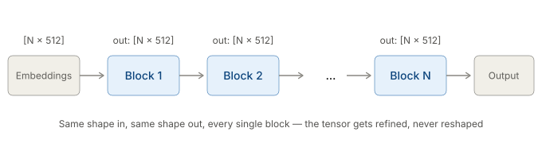
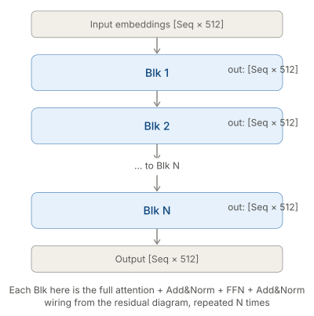
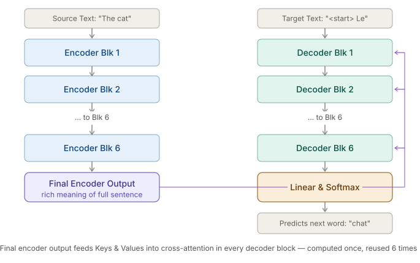
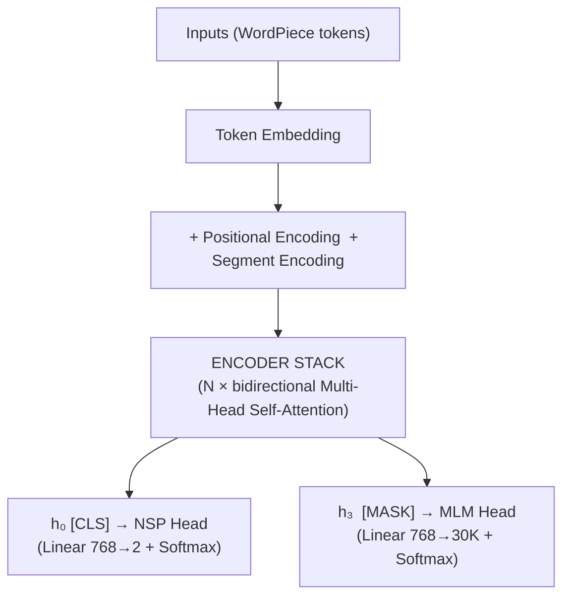
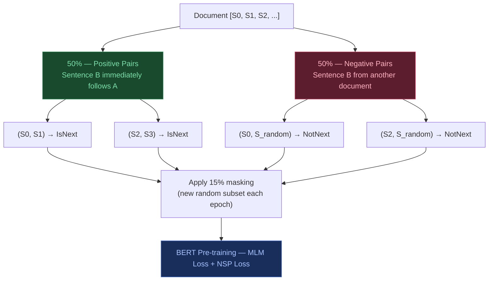
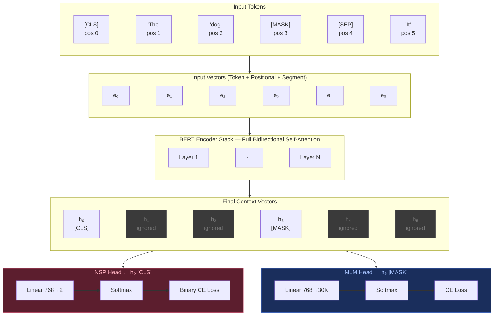

# Architecture and Model Families

> Sources: RASA Algorithm Whiteboard — YouTube | Stanford CME295 — Autumn 2025

---

## Table of Contents

**Phase 1 — Network Architecture (Stacking & Routing)**
1. [How Blocks Stack — Shape-Preserving Property](#1-how-blocks-stack--shape-preserving-property)
2. [The Original Transformer Architecture](#2-the-original-transformer-architecture)
3. [Full Encoder-Decoder Macro Flow](#3-full-encoder-decoder-macro-flow)
4. [Decoder-Only LLMs vs Encoder-Decoder](#4-decoder-only-llms-vs-encoder-decoder)

**Phase 2 — Applied Implementation (BERT)**
5. [BERT & Encoder-Only Models](#5-bert--encoder-only-models)
6. [Segment Embeddings](#6-segment-embeddings)
7. [BERT Token-by-Token Routing](#7-bert-token-by-token-routing)
8. [BERT Loss & Word Embeddings](#8-bert-loss--word-embeddings)

---

## 1. How Blocks Stack — Shape-Preserving Property

The entire reason you can stack $N$ identical blocks is that every block is **shape-preserving**:

$$[N_{seq} \times d_{model}] \xrightarrow{\text{Block}} [N_{seq} \times d_{model}]$$

Same shape in, same shape out. Block 2 cannot tell whether its input came from raw embeddings or from 50 prior blocks — it just sees a matrix of the right shape and refines it.



```
  Embeddings  [Seq × 512]
       │
  Block 1     [Seq × 512] → [Seq × 512]   ← same shape in and out
       │
  Block 2     [Seq × 512] → [Seq × 512]
       │
      ...
       │
  Block N     [Seq × 512] → [Seq × 512]
       │
  Output      [Seq × 512]
```



The tensor gets **refined**, never reshaped. Empirically: early blocks capture local patterns and syntax; later blocks capture long-range semantics and reasoning. The architecture doesn't enforce this — it emerges from training.

---

## 2. The Original Transformer Architecture

The 2017 "Attention is All You Need" model consists of two separate stacks — an Encoder and a Decoder — each containing $N=6$ identical blocks.

| Component | Encoder | Decoder |
|---|---|---|
| Input | Token embedding + Positional encoding | Output embedding + Positional encoding (shifted right) |
| Attention | Multi-Head **Self**-Attention (bidirectional) | Masked Multi-Head Self-Attention + **Cross**-Attention |
| Other | Add & Norm, FFN | Add & Norm, FFN |
| Output | Contextual representations | Token probabilities via Linear + Softmax |
| Repeated | N times (N=6) | N times (same N) |

### Cross-Attention

Cross-attention is where **Q comes from one sequence and K, V come from another**:

```
  Self-attention:
  Q = X · W_Q  ┐
  K = X · W_K  ├── all from the same input X
  V = X · W_V  ┘

  Cross-attention (inside each decoder block):
  Q = X_decoder · W_Q   ← from the decoder  ("what am I looking for?")
  K = X_encoder · W_K   ← from the encoder  ("what do I have?")
  V = X_encoder · W_V   ← from the encoder  ("what do I return?")
```

### Translation example

```
  Translating "The cat sat" → "Le chat s'est assis"

  Encoder processes: "The cat sat" → hidden states [h₁, h₂, h₃]

  Decoder generating "chat":
    Q = embedding("Le") · W_Q      ← decoder's current query
    K = [h₁, h₂, h₃] · W_K       ← full encoder output
    V = [h₁, h₂, h₃] · W_V
    → attention peaks at h₂ ("cat") ← alignment learned automatically
```

| | Self-Attention | Cross-Attention |
|---|---|---|
| Q source | Same sequence | Decoder |
| K, V source | Same sequence | Encoder |
| Purpose | Attend within one sequence | Attend across two sequences |
| Used in | All transformers | Encoder-decoder only |

---

## 3. Full Encoder-Decoder Macro Flow



The purple bus line in the diagram is the detail most often missed: the final encoder output is **computed once** after all encoder blocks finish, then **broadcast identically** to the cross-attention sublayer of every decoder block.

```
  ENCODER STACK (left)           DECODER STACK (right)

  Source: "The cat"              Target: "<start> Le"
       │                               │
  Enc Blk 1                      Dec Blk 1 ◄───────────────────────┐
       │                               │                            │
  Enc Blk 2                      Dec Blk 2 ◄──────────────────┐    │
       │                               │                       │    │
      ...                             ...                      │    │
       │                               │                       │    │
  Enc Blk 6                      Dec Blk 6 ◄──────┐            │    │
       │                               │           │            │    │
  ┌────▼───────────────────────────────┘           │            │    │
  │  Final Encoder Output (K, V)   ────────────────┴────────────┴────┘
  └────────────────────────────────────────────────────────────────────
       computed ONCE — reused 6 times, one per decoder block
```

Decoder block 6's cross-attention reads the **exact same** K, V as decoder block 1's — neither has "more processed" access to the source sentence. The decoder self-attention stack gets progressively deeper representations of the target sequence; the encoder output it attends to never changes.

---

## 4. Decoder-Only LLMs vs Encoder-Decoder

When you read "GPT", "LLaMA", "Mistral", "Claude" — there is **no encoder stack** and **no cross-attention sublayer** anywhere. Each block has 2 sublayers, not 3.



| | Original decoder block | LLM decoder-only block |
|---|---|---|
| Sublayer 1 | Masked self-attention | Masked self-attention |
| Sublayer 2 | **Cross-attention** (needs encoder K, V) | ✗ removed entirely |
| Sublayer 3 | FFN | **FFN** (now sublayer 2) |
| Requires encoder? | Yes | No — encoder doesn't exist |
| Used in | Original Transformer, T5, BART | GPT, LLaMA, Mistral, Claude |

**What "N transformer blocks" means in an LLM paper:** $N$ copies of masked self-attention + Add&Norm + FFN + Add&Norm. That's the entire model, plus embedding lookup at the input and linear+softmax at the output.

```
  LLM block (repeated N times):

  Input from previous block
       │
  Masked Self-Attention   ← causal mask (can't see future tokens)
       │
  Add & Norm
       │
  FFN
       │
  Add & Norm
       │
  Output to next block
```

---

## 5. BERT & Encoder-Only Models

**Core idea:** keep only the encoder stack. Discard the decoder entirely. Train the encoder to produce rich contextual representations via two proxy tasks, then fine-tune for downstream tasks.



Special tokens:
- `[CLS]` — prepended to every input; its final hidden state is used for classification tasks
- `[SEP]` — separates Sentence A from Sentence B
- `[MASK]` — replaces tokens selected for masked prediction

### Pre-training objectives

**MLM (Masked Language Model):** predict the original token at each masked position.

**NSP (Next Sentence Prediction):** given two segments A and B, predict whether B follows A in the original document (binary classification via `[CLS]`).

### WordPiece tokenization

- Vocabulary size ~30,000
- Splits unknown words into known subword pieces: "playing" → `play` + `##ing`

### Sequence construction

- Add `[CLS]` at the beginning
- Separate segments with `[SEP]`, terminate with `[SEP]`
- Mask 15% of **WordPiece token positions** (subword level, not whole words)

**Sequence length:** hard limit of 512 tokens. Training schedule: 90% of steps at length 128, final 10% at length 512.

---

### The 15% Masking Rule

The 15% masking applies across the entire input (both Sentence A and B combined):

> In a 100-token sequence, ~15 tokens are selected at random.

**Important — subword granularity:** The 15% is applied at the **WordPiece token level**, not the word level. If "jumping" is tokenised as `jump` + `##ing`, the model might randomly select only `##ing` while leaving `jump` visible — making that position trivial to predict. This motivated **Whole Word Masking (WWM)**, introduced later, which forces all subword pieces of a selected word to be masked together.

For each selected token position:

| Probability | Action |
|---|---|
| 80% | Replaced with `[MASK]` token |
| 10% | Replaced with a random vocabulary word |
| 10% | Kept unchanged |

> **Dynamic masking:** Each training epoch samples a fresh random 15% subset — the model never memorises a fixed masking pattern.

### Dataset pair construction



---

## 6. Segment Embeddings

BERT needs to distinguish Sentence A from Sentence B within a single input sequence. It does this by adding a learned **segment embedding** to each token:

$$\text{Final input vector} = \text{Token embedding} + \text{Positional encoding} + \text{Segment encoding}$$

Two trainable vectors are learned during pre-training: $E_A$ (segment A) and $E_B$ (segment B).

### Example: "I love cats" + "They are fluffy"

Tokenized: `[CLS] I love cats [SEP] They are fluffy [SEP]`

| Position | Token | Segment | Embedding added |
|---|---|---|---|
| 0 | [CLS] | A | $E_A$ |
| 1 | I | A | $E_A$ |
| 2 | love | A | $E_A$ |
| 3 | cats | A | $E_A$ |
| 4 | [SEP] (middle) | A | $E_A$ |
| 5 | They | B | $E_B$ |
| 6 | are | B | $E_B$ |
| 7 | fluffy | B | $E_B$ |
| 8 | [SEP] (final) | B | $E_B$ |

> Everything from `[CLS]` through the middle `[SEP]` = Segment A. Everything from the first token of Sentence B through the final `[SEP]` = Segment B.

In PyTorch/HuggingFace: Segment A = token_type_id `0`, Segment B = `1`.

---

## 7. BERT Token-by-Token Routing



**Key points:**
- Every token participates fully in bidirectional self-attention — context mixes across the entire sequence, left and right
- Only position 0 (`[CLS]`) feeds the NSP head; only masked positions feed the MLM head; all other positions are ignored at loss computation

---

## 8. BERT Loss & Word Embeddings

$$L_{\text{total}} = L_{\text{MLM}} + L_{\text{NSP}}$$

**NSP Loss (position 0 only):**

$$L_{\text{NSP}} = -\log P(\text{IsNext} \mid h_{\text{CLS}})$$

**MLM Loss (masked positions only):**

$$L_{\text{MLM}} = -\log P(\text{true token} \mid h_{\text{mask}})$$

**Concrete example:**

$$L_{\text{NSP}} = -\log(0.85) \approx 0.16 \qquad L_{\text{MLM}} = -\log(0.70) \approx 0.36$$

$$L_{\text{total}} \approx 0.52$$

A single `L_total.backward()` computes all gradients in one pass.

### Are word embeddings learned or pre-set?

**Before pre-training:** the embedding table is **randomly initialised** — no Word2Vec, no prior embeddings, nothing.

**During pre-training:** the embedding table rows are updated by backpropagation exactly like any weight matrix. By the end of pre-training, semantically similar words sit close together in embedding space.

$$e_0, e_1, \ldots, e_n \quad \text{(input token embeddings)} \quad \xrightarrow{\text{N encoder layers}} \quad h_0, h_1, \ldots, h_n \quad \text{(contextual representations)}$$

---
