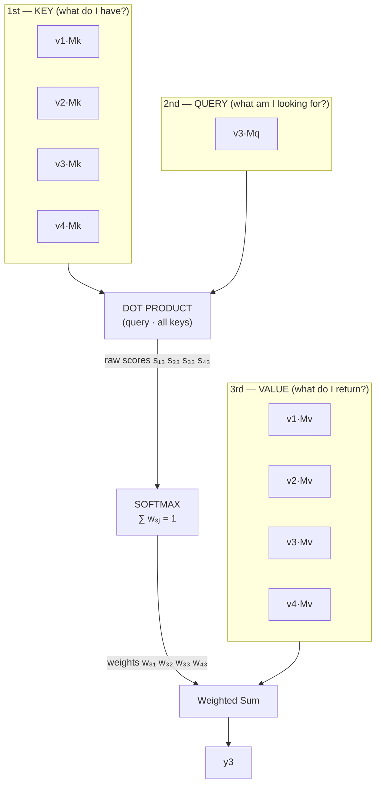

## 2. Attention Mechanism

> Vectors are used **3 times**: as Keys $K$, Queries $Q$, and Values $V$.

Each input vector $v_i$ is linearly projected through three separate learned weight matrices $M_K, M_Q, M_V$:

$$v_i \cdot M = [\;] \quad (1 \times d_k) = (1 \times d_{model}) \cdot (d_{model} \times d_k)$$

### How attention computes output $y_3$

**Scores (raw):** $s_{13}, s_{23}, s_{33}, s_{43}$

**Weights (normalised):** $w_{31}, w_{32}, w_{33}, w_{43}$ where $\displaystyle\sum_j w_{3j} = 1$

**Output:**
$$y_3 = w_{31}(v_1 M_V) + w_{32}(v_2 M_V) + w_{33}(v_3 M_V) + w_{43}(v_4 M_V)$$

The output for token 3 is a weighted mix of all value vectors — the weights are determined entirely by how relevant each other token is to token 3's query. No external weights flow in; the attention weights are computed internally from Q and K.

---
