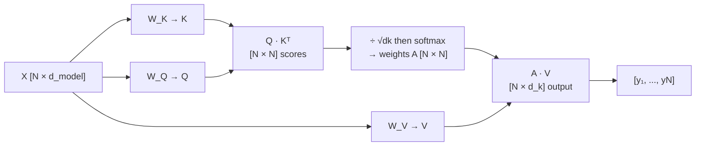

## 4. Self-Attention

Self-attention applies the attention mechanism across an entire sequence — every token queries every other token simultaneously.



### Step-by-step formula

**Step 1 — Project inputs into Q, K, V**

Stack all token vectors as rows of matrix $X \in \mathbb{R}^{N \times d_{model}}$:

$$K = X W_K \qquad Q = X W_Q \qquad V = X W_V$$

where $W_K, W_Q, W_V \in \mathbb{R}^{d_{model} \times d_k}$.

**Step 2 — Raw scores**

$$S = Q K^\top \qquad S \in \mathbb{R}^{N \times N}$$

Entry $S_{ij}$ = how much token $i$ (query) wants to attend to token $j$ (key).

**Step 3 — Scale and softmax** (see §3 for why)

$$A = \text{softmax}\!\left(\frac{Q K^\top}{\sqrt{d_k}}\right) \qquad A \in \mathbb{R}^{N \times N}$$

Row $i$ of $A$ sums to 1 and gives the attention distribution for token $i$.

**Step 4 — Weighted sum of values**

$$\text{Output} = A V \qquad \text{Output} \in \mathbb{R}^{N \times d_k}$$

**Full formula:**

$$\boxed{\text{Attention}(Q, K, V) = \text{softmax}\!\left(\frac{Q K^\top}{\sqrt{d_k}}\right) V}$$

### Numerical walkthrough — $N=3$ tokens, $d_k=2$

```
  Q = [[1, 0],    K = [[1, 0],    V = [[0.1, 0.2],
       [0, 1],         [0, 1],         [0.3, 0.4],
       [1, 1]]         [1, 1]]         [0.5, 0.6]]

  Step 2 — S = Q·Kᵀ:
  [ 1   0   1 ]
  [ 0   1   1 ]
  [ 1   1   2 ]

  Step 3 — divide by √2 ≈ 1.41, then softmax (row 1):
  scaled row 1 = [0.71, 0.00, 0.71]
  exp          = [2.03, 1.00, 2.03]  →  weights = [0.40, 0.20, 0.40]

  Step 4 — Output row 1:
  0.40·[0.1,0.2] + 0.20·[0.3,0.4] + 0.40·[0.5,0.6] = [0.30, 0.40]
```

Token 1 attends equally to tokens 1 and 3 (score 0.71 each) and less to token 2 (score 0).

### Key property — attention is permutation-invariant

If you shuffle the input tokens, the output rows shuffle in the same way — the mechanism has no built-in notion of order. This is why positional encoding (§10) is added before the blocks.

---
