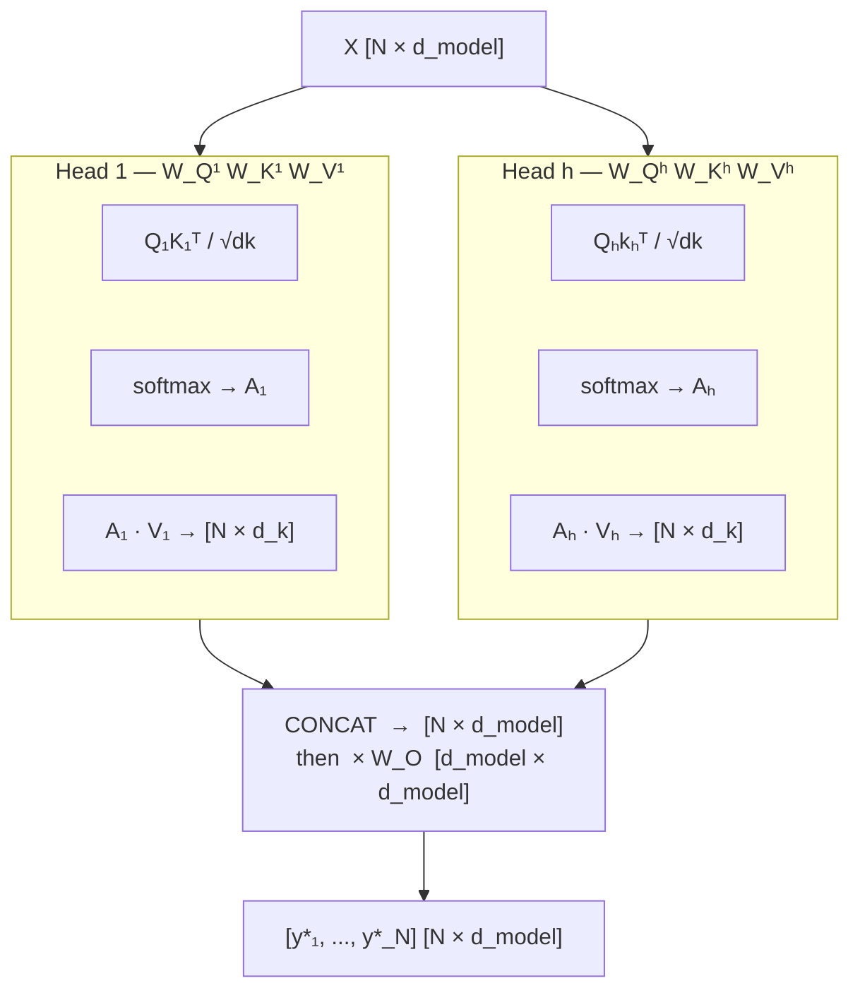

## 5. Multi-Head Attention

Running a single attention head limits the model to one type of relationship per layer. Multi-head attention runs $h$ independent attention operations in parallel, each able to specialise.

**h → heads** (number of parallel attention operations)

Each head receives the full input $X$ but projects it through its **own separate** weight matrices $W_Q^{(i)}, W_K^{(i)}, W_V^{(i)}$ — these are different for every head. Head 1 might learn to track coreference ("he" → "John"), head 2 might learn syntactic dependencies, etc.

The outputs of all heads are concatenated and passed through one final linear layer $W_O$ — this is the "Concat + Dense" step. Full geometry is in §6.

---
