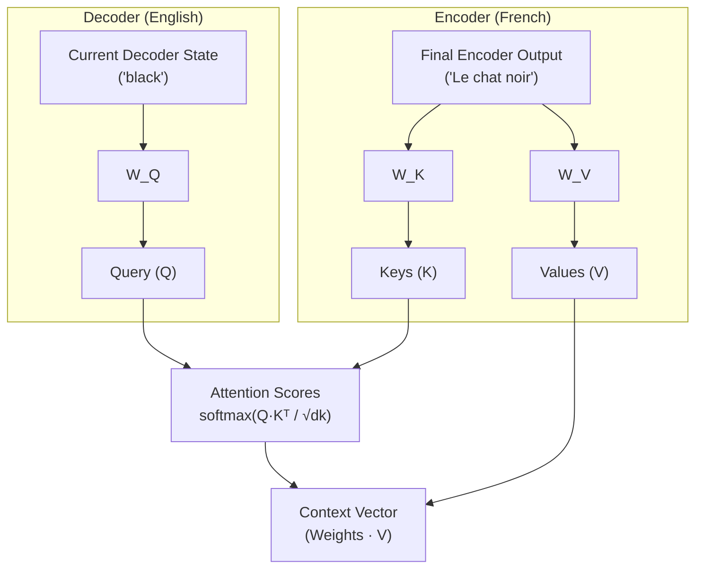

## 8. Cross-Attention (Encoder-Decoder Attention)

We have extensively covered **Self-Attention**, where the Queries, Keys, and Values all come from the *same* sequence.

However, the original 2017 Transformer was an **Encoder-Decoder** model built for language translation. To translate French to English, the model uses a second type of attention called **Cross-Attention**.

### The Setup
Imagine we are translating "Le chat noir" to "The black cat".
1. The **Encoder** processes the French sentence "Le chat noir" using standard Self-Attention. It outputs a set of rich, context-aware vectors representing the French meaning.
2. The **Decoder** is currently generating the English translation. It has generated "The black", and is trying to generate the next word.

How does the English Decoder know what the French Encoder saw? 

### The Routing
In Cross-Attention, the Q, K, and V matrices do not all come from the same place:
- **The Query ($Q$)** comes from the **Decoder** (the current English word we are processing). It is asking: *"I am the English word 'black', what French word is most relevant to me right now?"*
- **The Keys ($K$) and Values ($V$)** come from the **Encoder's final output** (the fully processed French sentence). The Keys are the "labels" of the French words, and the Values are their actual semantic payloads.

### The Math is Exactly the Same
The beautiful part about Cross-Attention is that the math doesn't change at all:
$$\text{Attention}(Q, K_{enc}, V_{enc}) = \text{softmax}\!\left(\frac{Q K_{enc}^\top}{\sqrt{d_k}}\right) V_{enc}$$

The only difference is the *source* of the inputs. 

### Does it use a Mask?
**No.** Unlike the Decoder's self-attention (which must be causally masked so it doesn't cheat by looking at future English words), Cross-Attention does not need a mask. 

The English Query is allowed (and encouraged!) to look at the *entire* French Encoder sequence at once to find the most relevant information for translation.

*(Note: Modern Decoder-only LLMs like GPT-4 completely remove the Encoder, and thus do not use Cross-Attention at all. They rely 100% on Masked Self-Attention!)*
