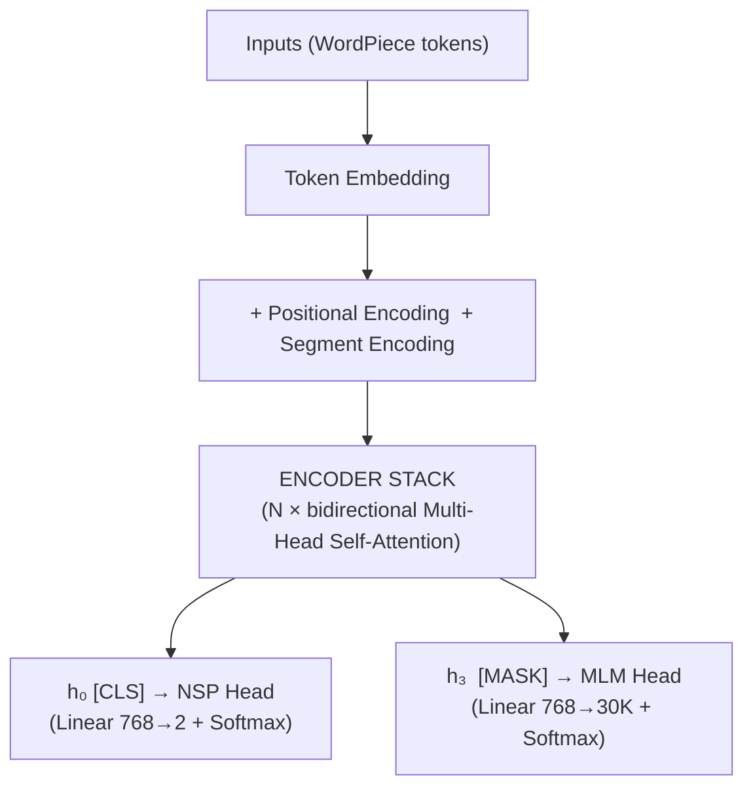
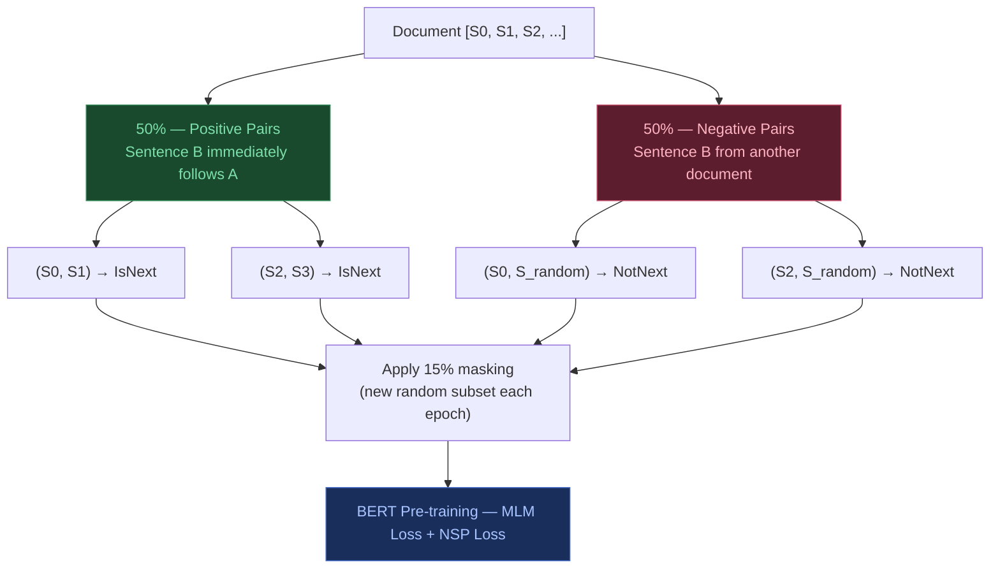

## 5. BERT & Encoder-Only Models

**Core idea:** keep only the encoder stack. Discard the decoder entirely. Train the encoder to produce rich contextual representations via two proxy tasks, then fine-tune for downstream tasks.

Special tokens:
- `[CLS]` — prepended to every input; its final hidden state is used for classification tasks
- `[SEP]` — separates Sentence A from Sentence B
- `[MASK]` — replaces tokens selected for masked prediction

### Pre-training objectives

**MLM (Masked Language Model):** predict the original token at each masked position.

**NSP (Next Sentence Prediction):** given two segments A and B, predict whether B follows A in the original document (binary classification via `[CLS]`).

### WordPiece tokenization

- Vocabulary size ~30,000
- Splits unknown words into known subword pieces: "playing" → `play` + `##ing`

### Sequence construction

- Add `[CLS]` at the beginning
- Separate segments with `[SEP]`, terminate with `[SEP]`
- Mask 15% of **WordPiece token positions** (subword level, not whole words)

**Sequence length:** hard limit of 512 tokens. Training schedule: 90% of steps at length 128, final 10% at length 512.

---

### The 15% Masking Rule

The 15% masking applies across the entire input (both Sentence A and B combined):

> In a 100-token sequence, ~15 tokens are selected at random.

**Important — subword granularity:** The 15% is applied at the **WordPiece token level**, not the word level. If "jumping" is tokenised as `jump` + `##ing`, the model might randomly select only `##ing` while leaving `jump` visible — making that position trivial to predict. This motivated **Whole Word Masking (WWM)**, introduced later, which forces all subword pieces of a selected word to be masked together.

For each selected token position:

| Probability | Action |
|---|---|
| 80% | Replaced with `[MASK]` token |
| 10% | Replaced with a random vocabulary word |
| 10% | Kept unchanged |

> **Dynamic masking:** Each training epoch samples a fresh random 15% subset — the model never memorises a fixed masking pattern.

### Dataset pair construction

---
