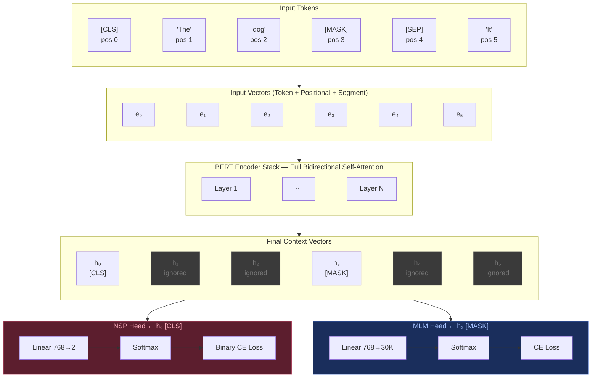

## 7. BERT Token-by-Token Routing

**Key points:**
- Every token participates fully in bidirectional self-attention — context mixes across the entire sequence, left and right
- Only position 0 (`[CLS]`) feeds the NSP head; only masked positions feed the MLM head; all other positions are ignored at loss computation

---
