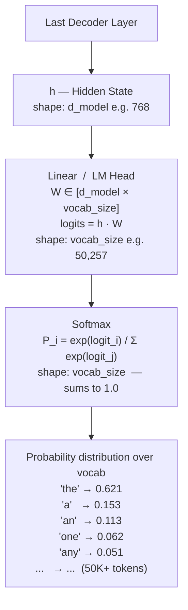
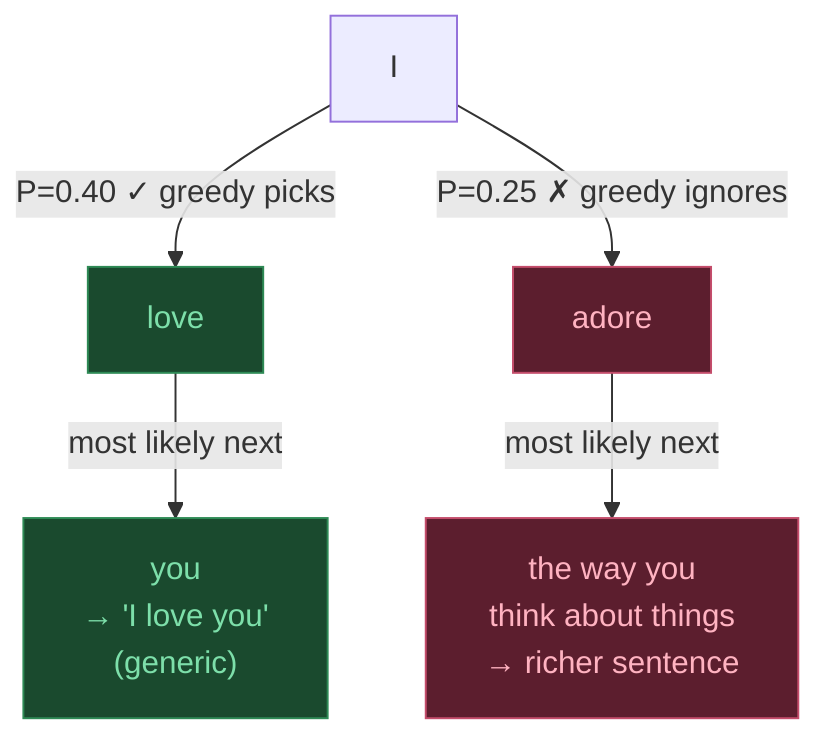
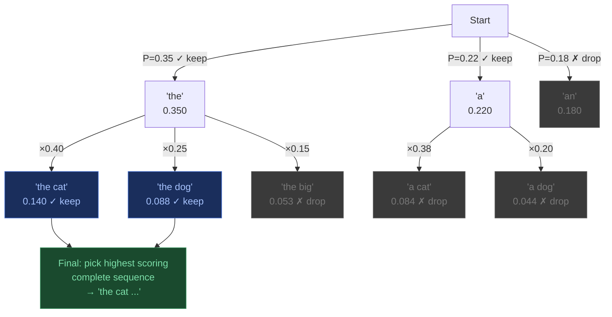
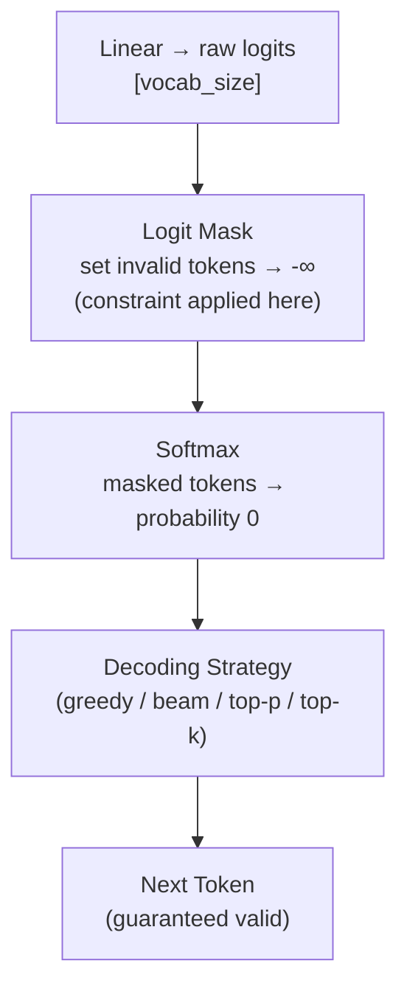

# Decoding & Output Generation

> Source: Stanford CME295 — Transformers & LLMs | Autumn 2025 | Lecture 3

---

## Table of Contents

1. [Output Head — From Hidden State to Probabilities](#1-output-head--from-hidden-state-to-probabilities)
2. [Temperature Scaling](#2-temperature-scaling)
3. [Greedy Decoding](#3-greedy-decoding)
4. [Beam Search](#4-beam-search)
5. [Sampling — Top-k](#5-sampling--top-k)
6. [Sampling — Top-p (Nucleus)](#6-sampling--top-p-nucleus)
7. [Comparison](#7-comparison)
8. [Temperature + Decoding Strategy — How They Connect](#8-temperature--decoding-strategy--how-they-connect)
9. [Constrained / Guided Decoding](#9-constrained--guided-decoding)

---

## 1. Output Head — From Hidden State to Probabilities

After the final decoder layer, each token position has a **context vector** $h \in \mathbb{R}^{d_{model}}$.
To generate the next token, two steps map this to a probability distribution over the vocabulary:



> **Note:** The Linear weight matrix $W$ is often **tied** to the input token embedding matrix — the same weights used to embed tokens at the input are transposed and reused here. This saves parameters and often improves performance.

---

## 2. Temperature Scaling

Before softmax, logits are divided by a **temperature** $T$:

$$P(token_i) = \frac{\exp(logit_i / T)}{\sum_j \exp(logit_j / T)}$$

Temperature controls **how peaked or flat** the distribution is.

### Starting Point — Raw Logits

The model outputs raw logits (unnormalised scores) for each vocabulary token. Let's use 5 tokens:

```
  Token    Logit
  ──────   ─────
  "the"     3.2
  "a"       1.8
  "an"      1.5
  "one"     0.9
  "any"     0.7
```

These logits get divided by $T$ before softmax. Watch what happens.

---

### T = 1.0 — Default (no scaling)

$$logit / T = logit / 1.0 = logit \quad \text{(unchanged)}$$

```
  Token    Logit    exp(logit)    P = exp / Σexp
  ──────   ─────    ──────────    ──────────────
  "the"     3.2       24.53          0.621   ██████████████████████████
  "a"       1.8        6.05          0.153   ██████
  "an"      1.5        4.48          0.113   ████
  "one"     0.9        2.46          0.062   ██
  "any"     0.7        2.01          0.051   ██
                    ────────       ──────
             Σ =    39.53          1.000
```

"the" dominates but the other tokens still have a real chance.

---

### T = 0.5 — Low Temperature (sharper)

$$logit / T = logit / 0.5 \quad \text{(scaled UP — gaps between logits grow)}$$

```
  Token    Logit    /T=0.5    exp(logit/T)    P = exp / Σexp
  ──────   ─────    ──────    ────────────    ──────────────
  "the"     3.2      6.40        601.85          0.900   ████████████████████████████████████
  "a"       1.8      3.60         36.60          0.055   ██
  "an"      1.5      3.00         20.09          0.030   █
  "one"     0.9      1.80          6.05          0.009   ░
  "any"     0.7      1.40          4.05          0.006   ░
                               ────────         ──────
                        Σ =    668.64           1.000
```

Low T amplifies differences — "the" goes from 62% → **90%**. The tail nearly vanishes.

---

### T = 2.0 — High Temperature (flatter)

$$logit / T = logit / 2.0 \quad \text{(scaled DOWN — gaps between logits shrink)}$$

```
  Token    Logit    /T=2.0    exp(logit/T)    P = exp / Σexp
  ──────   ─────    ──────    ────────────    ──────────────
  "the"     3.2      1.60         4.953          0.396   ████████████████
  "a"       1.8      0.90         2.460          0.197   ████████
  "an"      1.5      0.75         2.117          0.169   ███████
  "one"     0.9      0.45         1.568          0.125   █████
  "any"     0.7      0.35         1.419          0.113   █████
                               ────────         ──────
                        Σ =    12.517           1.000
```

High T compresses differences — "the" drops from 62% → **40%**. Other tokens become much more competitive.

---

### Side-by-side Summary

```
  Token      T=0.5    T=1.0    T=2.0
  ──────     ─────    ─────    ─────
  "the"      0.900    0.621    0.396   ← always most likely, but less dominant as T↑
  "a"        0.055    0.153    0.197
  "an"       0.030    0.113    0.169
  "one"      0.009    0.062    0.125
  "any"      0.006    0.051    0.113
             ─────    ─────    ─────
             1.000    1.000    1.000
```

> The raw **ranking never changes** — temperature doesn't reorder tokens, it only reshapes how much probability mass is concentrated at the top.

| Temperature | Effect | Use case |
|---|---|---|
| T → 0 | Argmax — always picks the top token | Deterministic / factual tasks |
| T = 1 | Default softmax | General use |
| T > 1 | Flatter distribution | Creative writing, diversity |
| T → ∞ | Uniform distribution | Pure random |

---

## 3. Greedy Decoding

At each step, pick the **single most probable token** and move on.

```
  Step 1:
  P = [0.35, 0.22, 0.18, 0.10, ...]
        "the"  "a"  "an" "one"
                │
                ▼  argmax
           → Pick "the"   ✓

  Step 2 (conditioned on "the"):
  P = [0.40, 0.25, 0.15, ...]
       "cat"  "dog" "big"
                │
                ▼  argmax
           → Pick "cat"   ✓

  Output: "the cat ..."
```

**Pros:** Fast, simple, deterministic.

**Cons:** Locally optimal ≠ globally optimal. Can get stuck in repetitive loops.



> Greedy picks the locally best token at every step. The green path wins step 1, but the red path (ignored) leads to a globally better sequence.


---

## 4. Beam Search

Instead of keeping 1 sequence, keep the **top-B sequences** (beams) at every step.



At each step, **all surviving beams expand** into their top candidates, then only the global top-B survive across all expansions.

**Pros:** Much better than greedy — explores multiple paths.

**Cons:** Still deterministic. Can produce generic/safe outputs. Expensive (B × compute per step).

---

## 5. Sampling — Top-k

Instead of argmax, **randomly sample** from the distribution — but only from the **top-k tokens**.

```
  Full distribution (vocab = 50K tokens):

  "the"  0.35  ┐
  "a"    0.22  ├── Top-3 (k=3) → keep these, renormalize
  "an"   0.18  ┘
  "one"  0.10  ← cut off
  "any"  0.08  ← cut off
   ...   ...   ← cut off (all ~50K others)

  Renormalized over top-3:
  "the"  0.35 / 0.75 = 0.467
  "a"    0.22 / 0.75 = 0.293
  "an"   0.18 / 0.75 = 0.240

  → Sample from {the: 0.467, a: 0.293, an: 0.240}
```

**Pros:** Introduces diversity; avoids the very long tail of garbage tokens.

**Cons:** k is fixed regardless of how peaked/flat the distribution is. With a very flat distribution, top-3 might be too restrictive. With a very peaked one, k=50 might include junk.

---

## 6. Sampling — Top-p (Nucleus)

Instead of fixing k tokens, fix a **cumulative probability threshold p** and sample from the smallest set of tokens whose cumulative probability ≥ p.

```
  p = 0.90

  Sort tokens by probability (descending):
  ┌────────┬──────┬────────────┐
  │ Token  │  P   │ Cumul. P   │
  ├────────┼──────┼────────────┤
  │ "the"  │ 0.35 │ 0.35       │
  │ "a"    │ 0.22 │ 0.57       │
  │ "an"   │ 0.18 │ 0.75       │
  │ "one"  │ 0.10 │ 0.85       │
  │ "any"  │ 0.08 │ 0.93  ◄── crosses 0.90 here
  ├────────┼──────┼────────────┤
  │ "big"  │ 0.03 │ 0.96       │ ← cut off
  │  ...   │ ...  │ ...        │ ← cut off
  └────────┴──────┴────────────┘

  Nucleus = {"the", "a", "an", "one", "any"}
  Renormalize and sample from these 5 tokens only.
```

### Why Top-p > Top-k

```
  Peaked distribution (model is confident):
  "the" → 0.92, rest tiny

    Top-k=50 would include 49 garbage tokens
    Top-p=0.90 → nucleus = {"the"} only  ✓

  Flat distribution (model is uncertain):
  20 tokens each ~0.05

    Top-k=3 would throw away most valid options
    Top-p=0.90 → nucleus = 18 tokens  ✓

  Top-p adapts to the shape of the distribution. Top-k does not.
```

---

## 7. Comparison

| Strategy | Deterministic | Diversity | Quality | Speed |
|---|---|---|---|---|
| Greedy | Yes | None | Low (local optima) | Fastest |
| Beam Search | Yes | Low | Better than greedy | Slow (B× cost) |
| Top-k Sampling | No | Medium | Good | Fast |
| Top-p Sampling | No | Adaptive | Best in practice | Fast |

**Common production default:** Top-p (nucleus) sampling with temperature, often combined:

$$\text{logits} \xrightarrow{÷ T} \text{scaled logits} \xrightarrow{\text{top-p filter}} \text{nucleus} \xrightarrow{\text{sample}} \text{next token}$$

---

## 8. Temperature + Decoding Strategy — How They Connect

Temperature and decoding strategy are **two separate knobs**, but they interact:

```
  Temperature reshapes the distribution.
  Decoding strategy decides how to pick from it.
```

### Temperature is a no-op with Greedy or Beam Search

Greedy and beam search are both **deterministic** — they always pick the highest-scoring token(s).
Temperature never reorders tokens (rank #1 stays rank #1 at any T), so the output is identical regardless of T.

```
  Logits:  "the"=3.2  "a"=1.8  "an"=1.5  ...

  T=0.5 → P: [0.900, 0.055, 0.030, ...]   argmax = "the"
  T=1.0 → P: [0.621, 0.153, 0.113, ...]   argmax = "the"
  T=2.0 → P: [0.396, 0.197, 0.169, ...]   argmax = "the"
                                            ↑ same every time
  → Setting temperature on greedy/beam is a no-op.
```

### Temperature only matters with Sampling

Sampling **draws** from the distribution — so the shape directly affects the outcome.

```
  T=0.5  → distribution very peaked  → almost always "the"   (safe, repetitive)
  T=1.0  → balanced                  → mostly "the", sometimes others
  T=2.0  → distribution flat         → "the", "a", "an" all competitive (creative, risky)
```

### Full Picture

```
  ┌──────────────┬───────────────────────────────────────────────────────┐
  │              │               Decoding Strategy                       │
  │              ├───────────────┬───────────────┬───────────────────────┤
  │              │    Greedy     │  Beam Search  │  Sampling (top-k/p)   │
  ├──────────────┼───────────────┼───────────────┼───────────────────────┤
  │ Temperature  │               │               │                       │
  │   T < 1      │   no effect   │   no effect   │  more deterministic   │
  │   T = 1      │   no effect   │   no effect   │  default behaviour    │
  │   T > 1      │   no effect   │   no effect   │  more diverse/random  │
  └──────────────┴───────────────┴───────────────┴───────────────────────┘
```

> **Bottom line:** Temperature is only meaningful when paired with a sampling strategy. Greedy and beam search ignore it entirely.

---

## 9. Constrained / Guided Decoding

All the strategies above let the model generate **any token** from the vocab. Constrained decoding restricts *which* tokens are even allowed at each step.

### Where the constraint is applied

It happens at the **logit level** — before softmax, invalid tokens are masked to $-\infty$ so they get probability 0 after softmax and can never be sampled.



### Common constraint types

| Type | What it enforces | Example |
|---|---|---|
| **Vocabulary filter** | Only allow a fixed set of tokens | Classification: only `["Yes", "No"]` |
| **Grammar / CFG** | Token sequence must match a formal grammar | Valid JSON, SQL, Python |
| **Regex** | Output must match a pattern | Phone number, date format |
| **Schema** | Structured output (keys, types) | Force `{"name": ..., "age": ...}` |

### How grammar-constrained decoding works

At each step, the constraint engine tracks which tokens are **valid continuations** given what has been generated so far, and masks everything else.

```
  Generating JSON:  { "name":

  Valid next tokens:  ['"']          ← only a string can follow
  Invalid:            everything else → masked to -∞

  After sampling '"name_value"':
  Valid next tokens:  [',', '}']     ← only comma or close brace
  Invalid:            everything else → masked to -∞
```

### Practical Example — Extract Info as JSON

A very common real-world use case: you want the model to extract structured information from text and return it in a specific JSON format.

**Prompt:**
```
Extract the person's details from the text below and return as JSON.
Text: "Alice is a 28-year-old software engineer from Berlin."
```

**Without constrained decoding** — model might return:
```
Sure! Here are the details:
{
  "name": "Alice",
  "age": 28,
  ...
```
The leading prose breaks JSON parsers. You'd need regex post-processing to fix it.

**With constrained decoding (schema enforced):**

```
Schema:  { "name": string, "age": integer, "occupation": string, "city": string }

Step 1:  force output to start with  {
Step 2:  force next token to be      "
Step 3:  allow any string for key    → "name"
Step 4:  force                       ":
Step 5:  allow any string value      → "Alice"
Step 6:  force                       ,
...and so on until } is generated.
```

Output is **guaranteed** to be:
```json
{"name": "Alice", "age": 28, "occupation": "software engineer", "city": "Berlin"}
```

No post-processing. No retries. Parseable every time.

> **Key point:** The model weights don't change — only which parts of the distribution are reachable. You get structured output without any fine-tuning.

### Libraries / tools

- **Outlines** — grammar + regex constrained generation (HuggingFace compatible)
- **Guidance** — interleave generation with hard constraints in a program
- **LMQL** — SQL-like query language for constrained prompting

---
