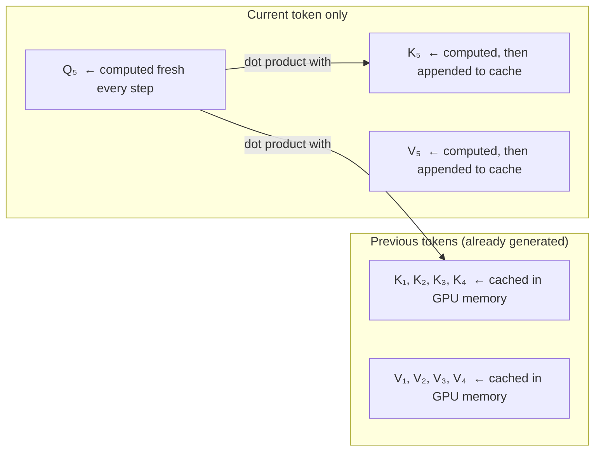
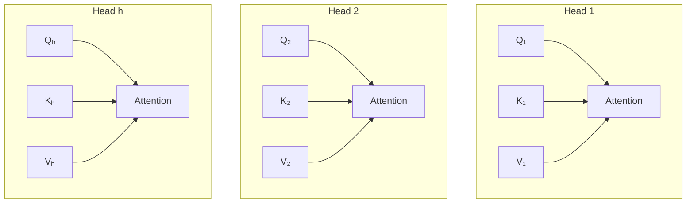
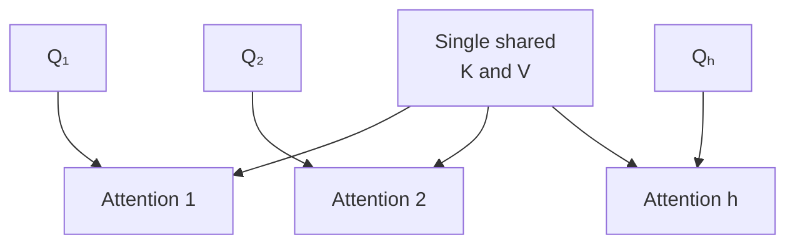
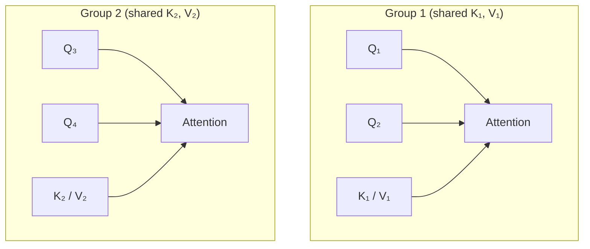
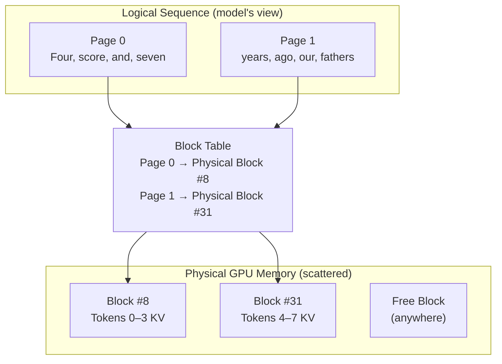
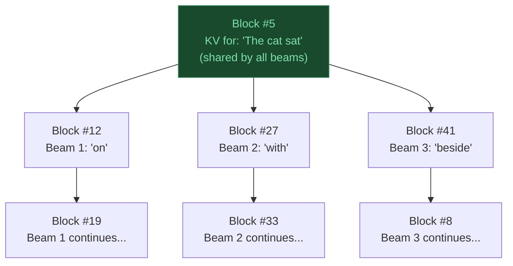

# Inference and Hardware Optimization

> Source: Stanford CME295 — Transformers & LLMs | Autumn 2025 | Lecture 3

---

## Table of Contents

1. [KV Cache — Why K and V, Not Q?](#1-kv-cache--why-k-and-v-not-q)
2. [The Contiguous Memory Problem](#2-the-contiguous-memory-problem)
3. [Sharing Attention Heads — MHA, GQA, MQA](#3-sharing-attention-heads--mha-gqa-mqa)
4. [PagedAttention — Managed Memory for KV Cache](#4-pagedattention--managed-memory-for-kv-cache)
5. [Sparse Attention & Sliding Window Attention](#5-sparse-attention--sliding-window-attention)

---

## 1. KV Cache — Why K and V, Not Q?

During autoregressive generation, the model generates one token at a time. At each step it needs to compute attention over **all previous tokens**.

### The problem without caching

```
  Generating token t=5 ("ago"):

  Attention needs:
    Q  for token 5  (current query)
    K  for tokens 1,2,3,4,5  (all keys so far)
    V  for tokens 1,2,3,4,5  (all values so far)

  Generating token t=6 ("our"):

  Attention needs:
    Q  for token 6
    K  for tokens 1,2,3,4,5,6   ← re-computed from scratch!
    V  for tokens 1,2,3,4,5,6   ← re-computed from scratch!
```

Every new token requires recomputing K and V for **all previous tokens** — quadratic cost.

### Why cache K and V but not Q?



**Q (Query)** — the current token asking "what do I need from the past?" It changes every step — you always need the query for the **new** token only. Nothing to cache.

**K (Key) and V (Value)** — these represent past tokens' information. Once computed, they **never change**. Caching them avoids recomputation.

| | Recompute each step? | Cache? |
|---|---|---|
| Q (Query) | Yes — only for the new token | No — only 1 token needed at a time |
| K (Key) | No — past keys are frozen | **Yes** |
| V (Value) | No — past values are frozen | **Yes** |

> **KV cache trades GPU memory for compute.** You use more RAM to store the cache, but reduce FLOPs from O(n²) to O(n) per step.

---

## 2. The Contiguous Memory Problem

> This is the missing link between "KV cache is great" and "why PagedAttention was needed."

### Training vs Inference — a fundamental difference

| | Training | Inference |
|---|---|---|
| Tokens processed | **All at once** (parallel) | **One at a time** (autoregressive) |
| KV cache needed? | No — full sequence known upfront | Yes — past KV must be stored and grown |
| Memory pattern | Fixed, predictable | Dynamic, grows token by token |

### Step-by-step: without KV cache

```
  Step 1:  Input ["The"]
           Compute Q₁, K₁, V₁  →  predict "cat"

  Step 2:  Input ["The", "cat"]
           Recompute Q₁, K₁, V₁  ← wasted
           Compute Q₂, K₂, V₂    →  predict "sat"

  Step 3:  Input ["The", "cat", "sat"]
           Recompute Q₁, K₁, V₁  ← wasted
           Recompute Q₂, K₂, V₂  ← wasted
           Compute Q₃, K₃, V₃    →  predict "down"
```

Cost: $O(N^2)$ — each new token re-processes all prior tokens from scratch.

### Step-by-step: with KV cache

```
  Step 1:  Input "The"
           Compute K₁, V₁  →  save to KV cache
           Predict "cat"

  Step 2:  Input "cat" only (new token)
           Compute Q₂ for "cat"
           Compute K₂, V₂  →  append to KV cache
           Attend over cached [K₁, K₂] and [V₁, V₂]
           Predict "sat"

  Step 3:  Input "sat" only
           Compute Q₃
           Compute K₃, V₃  →  append to KV cache
           Attend over cached [K₁, K₂, K₃] and [V₁, V₂, V₃]
           Predict "down"
```

Cost: $O(N)$ per step — only the new token is processed; past KV is reused.

### The mechanical problem: contiguous arrays in GPU memory

GPUs require tensors to be stored in **contiguous memory** (one unbroken strip of RAM addresses) to run matrix multiplication at hardware speed. This creates a painful dynamic growth problem:

```
  Prompt: "I like"  →  KV cache initialised (2 tokens)

  ┌──────────────────────────────────────────┐
  │  0x01: K₁,V₁ ("I")  │  0x02: K₂,V₂ ("like") │
  └──────────────────────────────────────────┘

  Token 3 generated: "dogs"
  → Need to extend array to size 3
  → 0x03 is occupied by other data — can't just append

  1. Allocate new contiguous block of size 3 elsewhere:
     [ 0x50: EMPTY │ 0x51: EMPTY │ 0x52: EMPTY ]

  2. Copy existing KV over:
     [ 0x50: K₁,V₁ │ 0x51: K₂,V₂ │ 0x52: EMPTY ]

  3. Write new token:
     [ 0x50: K₁,V₁ │ 0x51: K₂,V₂ │ 0x52: K₃,V₃ ]

  4. Free old block at 0x01–0x02  ← leaves a hole

  Token 4: repeat. Allocate size 4, copy 3 tokens, write, free size 3.
  Token 5: repeat. Allocate size 5, copy 4 tokens, write, free size 4.
  ...
```

Every single new token triggers: **allocate → copy everything → write → free**. This is massively wasteful and leaves memory looking like Swiss cheese.

### The "static pre-allocation" workaround — and why it's worse

To avoid allocating and copying at every step, serving engines pre-allocated the **maximum possible sequence length** upfront (e.g. 2048 tokens):

```
  Request arrives:
  Reserve 2048-slot contiguous block immediately

  ┌──────────────────────────────────────────────────────────┐
  │  K₁V₁ │ K₂V₂ │ K₃V₃ │ ░░░░░░░░░░░░ 2045 empty slots ░░│
  └──────────────────────────────────────────────────────────┘
                            ↑
                   LOCKED — no other request can use this memory
                   even though 99% of it is empty
```

Request finishes after 10 tokens → 2038 slots sat empty and locked the whole time. This is the **internal fragmentation** seen in the Stanford slide.

### Naive deep copy — the branching problem

When a model needs to fork into multiple paths (beam search, agent branching), each branch needs the full prompt history. Under contiguous memory, branches **cannot share** a single buffer because they will write different tokens into it:

```
  Prompt KV: [K₁V₁, K₂V₂, K₃V₃]   (shared history)

  Branch A needs to generate "left"  ─┐
  Branch B needs to generate "right" ─┤  both need the same past KV
                                       │  but different futures

  → Full deep copy of prompt KV for each branch
  → 3 beams = 3× memory just for the prompt portion
```

This is exactly what PagedAttention fixes with its block table + copy-on-write approach.

---

## 3. Sharing Attention Heads — MHA, GQA, MQA


The KV cache grows with sequence length. For long contexts (e.g. 128K tokens), it becomes the **dominant memory cost** at inference time. One solution: share K and V heads across multiple Q heads.

Introduce $G$ = number of KV head **groups**.

### Multi-Head Attention (MHA) — G = h

The original Transformer. Every head has its own independent Q, K, V.



- **KV cache size:** $h$ K heads + $h$ V heads
- Maximum expressiveness, maximum memory cost

---

### Multi-Query Attention (MQA) — G = 1

All $h$ query heads share a **single** K head and a **single** V head.



- **KV cache size:** 1 K head + 1 V head → **h× memory reduction**
- Fast inference, but quality can drop (K and V must serve all query perspectives)
- Used in: early Falcon models

---

### Grouped-Query Attention (GQA) — 1 < G < h

A middle ground. Q heads are divided into $G$ groups. Each group shares one K head and one V head.



- **KV cache size:** $G$ K heads + $G$ V heads → $h/G$ × memory reduction
- Quality close to MHA, memory close to MQA
- Used in: **LLaMA 2/3, Mistral, Gemma**

---

### Side-by-side summary (h = 8 query heads)

```
  G = 1  (MQA)        G = 4  (GQA)         G = 8  (MHA)
  ─────────────────   ─────────────────    ─────────────────
  Q₁ ──┐              Q₁ Q₂ ──┐           Q₁──K₁ V₁
  Q₂   ├── K  V        Q₃ Q₄ ──┼── K  V   Q₂──K₂ V₂
  Q₃   │               Q₅ Q₆ ──┤           Q₃──K₃ V₃
  Q₄   │               Q₇ Q₈ ──┘           Q₄──K₄ V₄
  Q₅   │                                   Q₅──K₅ V₅
  Q₆   │              4 KV heads            Q₆──K₆ V₆
  Q₇   │              4× smaller cache      Q₇──K₇ V₇
  Q₈ ──┘                                   Q₈──K₈ V₈

  1 KV head                                8 KV heads
  8× smaller cache                         full cache
```

> **Why never share Q?** Query is what's unique per head — each head attends to different things. Sharing Q would collapse all heads to the same attention pattern, defeating the purpose of multi-head attention entirely.

---

## 4. PagedAttention — Managed Memory for KV Cache

> Introduced by the **vLLM** project. Inspired directly by Virtual Memory & Paging in OS.

### The Problem — Contiguous Memory Allocation

Traditional LLM serving engines pre-allocate a **single contiguous block** of GPU RAM for each request, sized to the maximum possible sequence length (e.g. 2048 tokens).

```
  GPU Memory (traditional):

  ┌────────────────────────────────────────────────────────────────────┐
  │ Request A: "Four score and seven..." (generating, at token 9)      │
  │                                                                    │
  │ [Four][score][and][seven][years][ago][our][fathers][brought] ←used │
  │ [<resv>][<resv>]...............[<resv>]  ← 2038 slots LOCKED,     │
  │                                            never used              │
  ├────────────────────────────────────────────────────────────────────┤
  │ External fragmentation gap  ← too small for new request            │
  ├────────────────────────────────────────────────────────────────────┤
  │ Request B: "You only live once" (generating, at token 4)           │
  │ [You][only][live][once][<eos>] ← used                              │
  │ [<resv>]...........[<resv>]  ← 507 slots LOCKED, never used       │
  └────────────────────────────────────────────────────────────────────┘

  Wasted memory: 2038 + gap + 507 = 60–80% of GPU RAM gone.
```

Two types of waste (from screenshot):
- **Internal fragmentation** — reserved slots inside a request's block that are never used
- **External fragmentation** — gaps between requests too small to fit a new allocation

### The Solution — Break KV Cache into Pages

PagedAttention breaks the KV cache into fixed-size **blocks/pages** (e.g. 4 or 16 tokens per block). A **Block Table** (like an OS page table) maps logical token positions to wherever those physical blocks happen to live in GPU RAM.



The model sees a clean sequential view. Physically, blocks can be **anywhere** in GPU RAM.

### Concrete Example — Request A generating token by token

```
  Block size = 4 tokens

  Prompt arrives: "The cat sat on the mat"  (6 tokens)

  Block 1 → Physical Slot #42:  [The] [cat] [sat] [on]   ← full (4/4)
  Block 2 → Physical Slot #108: [the] [mat] [___] [___]  ← 2 used, 2 free

  Generate token 7 ("happily"):
    Block 2 has a free slot → write KV of "happily" into Slot #108
    Block 2: [the] [mat] [happily] [___]

  Generate token 8 ("and"), Block 2 fills up:
    Block 2: [the] [mat] [happily] [and]  ← full (4/4)

  Generate token 9 ("yesterday"):
    Block 2 is full → allocate new page anywhere in free GPU RAM
    Block 3 → Physical Slot #7:  [yesterday] [___] [___] [___]

  Block Table for Request A:  [#42 → #108 → #7]
```

### Memory Waste: Before vs After

```
  Traditional:  60–80% of GPU memory wasted
  PagedAttention: < 4% wasted  (only last page's trailing empty slots)

  Result: 2–4× larger batch sizes → 2–4× more throughput
```

### Bonus — Prefix Caching & Beam Search (free with paging)

Because KV blocks are referenced via a block table, multiple requests can **point to the same physical block** — no duplication needed.

```
  Shared system prompt:  "You are a helpful assistant. Answer concisely."

  User A request:  [system prompt blocks] → [user A blocks]
                         ↑ shared
  User B request:  [system prompt blocks] → [user B blocks]
                         ↑ same physical pages, zero extra memory
```

---

### Beam Search + PagedAttention — Do we duplicate KV for every beam?

This is the key question. Short answer: **no — shared blocks are reused, only diverged blocks are copied**.

#### First, clarify what KV cache actually stores

Model weights ($W_K$, $W_V$, etc.) **never change** during inference — they are frozen after training.

What the KV cache stores is the **computed output** of those projections for each token already seen:

```
  Token "cat" processed:
    K_cat = embedding("cat") · W_K   ← this result is cached
    V_cat = embedding("cat") · W_V   ← this result is cached

  Next step: W_K and W_V unchanged. K_cat and V_cat already in cache → skip recomputation.
```

The cache stores **intermediate activations**, not weights.

#### How beam search (k=3) works with PagedAttention

```
  Prompt: "The cat sat"  → KV computed, stored in Block #5

  All 3 beams start from identical state.
  Block Table for each beam:

  Beam 1:  [#5] ──────────────────────────── (prompt, shared)
  Beam 2:  [#5] ──────────────────────────── (prompt, shared)
  Beam 3:  [#5] ──────────────────────────── (prompt, shared)
           └──┘
           Same physical block, no copy

  Step 1: Each beam picks a different next token:
  Beam 1 → "on"     → new KV appended to Block #12 (Beam 1 only)
  Beam 2 → "with"   → new KV appended to Block #27 (Beam 2 only)
  Beam 3 → "beside" → new KV appended to Block #41 (Beam 3 only)

  Block Tables now:
  Beam 1:  [#5 → #12]
  Beam 2:  [#5 → #27]
  Beam 3:  [#5 → #41]

  Step 2: Each beam continues generating into its own blocks...
  Beam 1:  [#5 → #12 → #19]
  Beam 2:  [#5 → #27 → #33]
  Beam 3:  [#5 → #41 → #8]
```



#### Copy-on-Write — the one edge case

If a shared block is **not yet full** when beams diverge (e.g. prompt ended mid-block with 2 free slots), PagedAttention uses **copy-on-write**:

```
  Block #5 (shared, 2 slots free):  [The] [cat] [sat] [___]

  Beam 1 wants to write "on" into the free slot:
    → Can't write — block is shared with Beam 2 and 3
    → Copy Block #5 to a new Block #99 (Beam 1's private copy)
    → Write "on" into Block #99
    → Beam 2 and 3 still point to original Block #5

  Beam 2 then writes "with" into Block #5's free slot? No:
    → Block #5 still shared with Beam 3 → copy to Block #103
    → Write "with" into Block #103

  Beam 3 is last → it can write directly into Block #5 (no longer shared)
```

Only the **last partial block** at the divergence point ever needs copying. All fully-completed shared blocks are never touched.

#### Summary

| | Traditional beam search | PagedAttention beam search |
|---|---|---|
| Prompt KV | Duplicated per beam | **Shared** (same physical blocks) |
| Generated KV | Separate per beam | Separate per beam |
| Copy overhead | Full KV copy per beam | Only last partial block (CoW) |
| Memory with k=3 | ~3× full sequence | ~1× prompt + 3× generated |

> **Used in production by:** vLLM, TGI (Text Generation Inference), TensorRT-LLM

---

## 5. Sparse Attention & Sliding Window Attention

Standard self-attention is $O(N^2)$ in sequence length — every token attends to every other token. At $N = 100{,}000$ tokens this becomes computationally infeasible. Sparse attention variants limit which positions each token can attend to.

### Sliding Window Attention (SWA)

Each token only attends to a local window of $w$ surrounding tokens:

```
  Token at position i attends to: [i-w/2, ..., i, ..., i+w/2]
  All tokens outside the window: attention weight forced to zero
```

- Reduces per-layer cost from $O(N^2)$ to $O(N \cdot w)$
- Used in **Mistral 7B** — layers alternate between local SWA and global attention
- Trades global context for efficiency; works well because most relevant information is local

### Sparse Attention (general)

Mix of global tokens (attend everywhere) and local tokens (attend within a window):

- Typical window size: several thousand tokens
- Global tokens: special positions like `[CLS]` or summary tokens that attend and are attended to by all positions
- Used in Longformer, BigBird for document-length inputs
