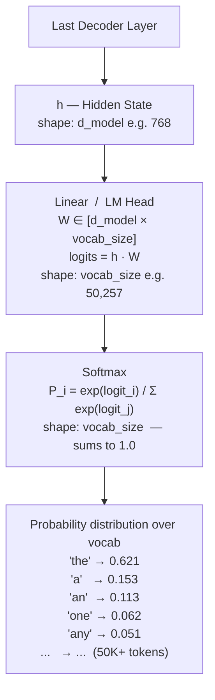

## 1. Output Head — From Hidden State to Probabilities

After the final decoder layer, each token position has a **context vector** $h \in \mathbb{R}^{d_{model}}$.
To generate the next token, two steps map this to a probability distribution over the vocabulary:

> **Note:** The Linear weight matrix $W$ is often **tied** to the input token embedding matrix — the same weights used to embed tokens at the input are transposed and reused here. This saves parameters and often improves performance.

---
