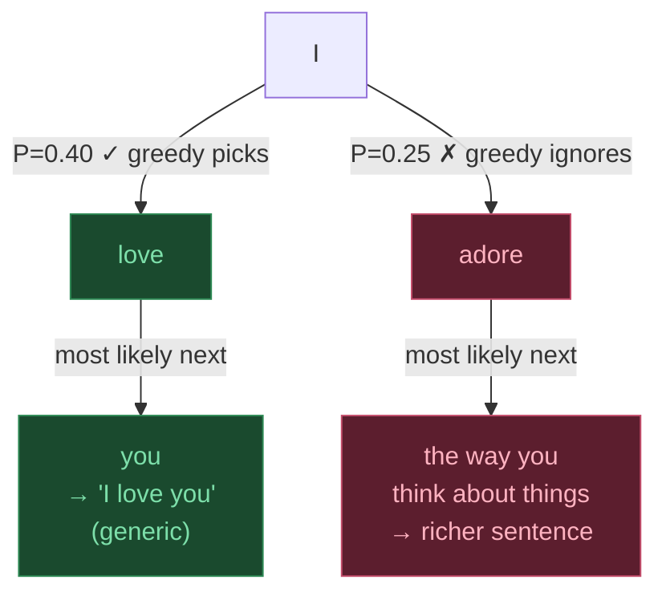

## 3. Greedy Decoding

At each step, pick the **single most probable token** and move on.

```
  Step 1:
  P = [0.35, 0.22, 0.18, 0.10, ...]
        "the"  "a"  "an" "one"
                │
                ▼  argmax
           → Pick "the"   ✓

  Step 2 (conditioned on "the"):
  P = [0.40, 0.25, 0.15, ...]
       "cat"  "dog" "big"
                │
                ▼  argmax
           → Pick "cat"   ✓

  Output: "the cat ..."
```

**Pros:** Fast, simple, deterministic.

**Cons:** Locally optimal ≠ globally optimal. Can get stuck in repetitive loops.



> Greedy picks the locally best token at every step. The green path wins step 1, but the red path (ignored) leads to a globally better sequence.


---
