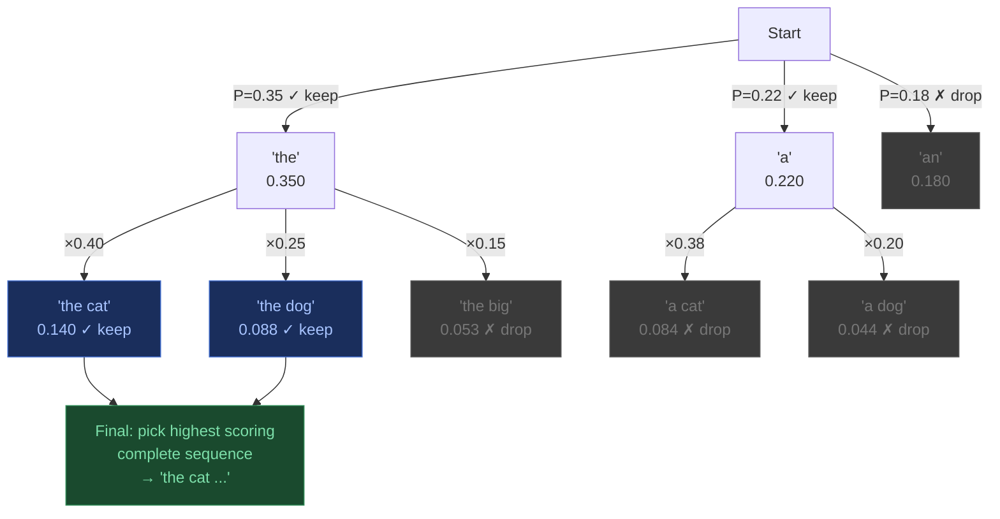

## 4. Beam Search

Instead of keeping 1 sequence, keep the **top-B sequences** (beams) at every step.

At each step, **all surviving beams expand** into their top candidates, then only the global top-B survive across all expansions.

**Pros:** Much better than greedy — explores multiple paths.

**Cons:** Still deterministic. Can produce generic/safe outputs. Expensive (B × compute per step).

---
