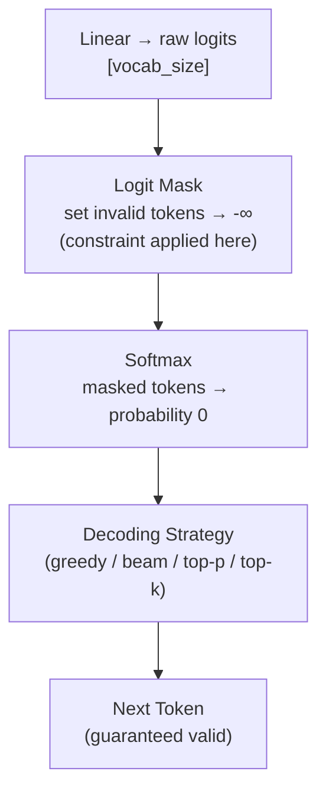

## 9. Constrained / Guided Decoding

All the strategies above let the model generate **any token** from the vocab. Constrained decoding restricts *which* tokens are even allowed at each step.

### Where the constraint is applied

It happens at the **logit level** — before softmax, invalid tokens are masked to $-\infty$ so they get probability 0 after softmax and can never be sampled.



### Common constraint types

| Type | What it enforces | Example |
|---|---|---|
| **Vocabulary filter** | Only allow a fixed set of tokens | Classification: only `["Yes", "No"]` |
| **Grammar / CFG** | Token sequence must match a formal grammar | Valid JSON, SQL, Python |
| **Regex** | Output must match a pattern | Phone number, date format |
| **Schema** | Structured output (keys, types) | Force `{"name": ..., "age": ...}` |

### How grammar-constrained decoding works

At each step, the constraint engine tracks which tokens are **valid continuations** given what has been generated so far, and masks everything else.

```
  Generating JSON:  { "name":

  Valid next tokens:  ['"']          ← only a string can follow
  Invalid:            everything else → masked to -∞

  After sampling '"name_value"':
  Valid next tokens:  [',', '}']     ← only comma or close brace
  Invalid:            everything else → masked to -∞
```

### Practical Example — Extract Info as JSON

A very common real-world use case: you want the model to extract structured information from text and return it in a specific JSON format.

**Prompt:**
```
Extract the person's details from the text below and return as JSON.
Text: "Alice is a 28-year-old software engineer from Berlin."
```

**Without constrained decoding** — model might return:
```
Sure! Here are the details:
{
  "name": "Alice",
  "age": 28,
  ...
```
The leading prose breaks JSON parsers. You'd need regex post-processing to fix it.

**With constrained decoding (schema enforced):**

```
Schema:  { "name": string, "age": integer, "occupation": string, "city": string }

Step 1:  force output to start with  {
Step 2:  force next token to be      "
Step 3:  allow any string for key    → "name"
Step 4:  force                       ":
Step 5:  allow any string value      → "Alice"
Step 6:  force                       ,
...and so on until } is generated.
```

Output is **guaranteed** to be:
```json
{"name": "Alice", "age": 28, "occupation": "software engineer", "city": "Berlin"}
```

No post-processing. No retries. Parseable every time.

> **Key point:** The model weights don't change — only which parts of the distribution are reachable. You get structured output without any fine-tuning.

### Libraries / tools

- **Outlines** — grammar + regex constrained generation (HuggingFace compatible)
- **Guidance** — interleave generation with hard constraints in a program
- **LMQL** — SQL-like query language for constrained prompting

---
