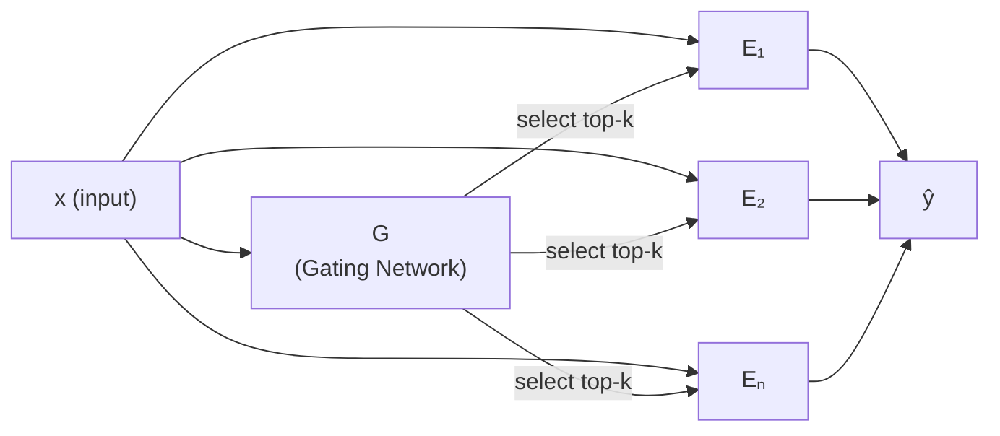

# Mixture of Experts (MoE)

> Source: Stanford CME295 — Transformers & LLMs | Autumn 2025 | Lecture 3

---

## Table of Contents

1. [Core Idea](#1-core-idea)
2. [MoE Architecture](#2-moe-architecture)
3. [Dense vs Sparse MoE](#3-dense-vs-sparse-moe)
4. [Where Do the Gates Live?](#4-where-do-the-gates-live)

---

## 1. Core Idea

> **Not all weights are useful in the forward pass.**

A standard dense model activates **all** its parameters for every input. MoE relaxes this — only a **subset** of the model is used per forward pass.

```
x  ──►  [ Subset of the huge model ]  ──►  ŷ
```

This means you can have a very large model (many total parameters) while keeping the **compute per token low** — only the active subset is used.

---

## 2. MoE Architecture

The key components are a **Gating network** and a set of **Experts**:



- **G (Gate):** takes input $x$, outputs a score for each expert → selects top-$k$ experts to activate
- **E₁ … Eₙ:** experts (typically FFN layers), only the selected ones run
- **ŷ:** weighted combination of active expert outputs

### Forward Pass (per token)

$$\hat{y} = \sum_{i \in \text{top-k}} G(x)_i \cdot E_i(x)$$

- Most experts get a ✗ (skipped — no compute)
- Only top-$k$ experts get a ✓ (activated)

---

## 3. Dense vs Sparse MoE

The key distinction is **how many experts run per token**.

| | Dense MoE | Sparse MoE |
|---|---|---|
| Experts activated | **All N** | **Top-k only** (e.g. k=2) |
| Gating output | Soft weights via Softmax | Hard selection via Top-k |
| Compute cost | High (all experts run) | Low (most experts skipped) |
| Output formula | $\sum_{i=1}^{N} G_i \cdot E_i(x)$ | $\sum_{i \in \text{top-k}} G_i \cdot E_i(x)$ |

---

### Dense MoE — Soft / Full Routing

Every expert runs on every token. The gate produces soft weights that sum to 1, and the output is a **weighted average of all expert outputs**.

```
                        [ Input Token: x ]
                                 │
           ┌─────────────────────┴─────────────────────┐
           ▼                                           ▼
  ┌─────────────────┐                       ┌───────────────────┐
  │  Gating Router  │                       │  Send x to ALL N  │
  │  Softmax(x·Wg)  │                       │      Experts      │
  └────────┬────────┘                       └─────────┬─────────┘
           │                                          │
   [0.40, 0.10, 0.35, 0.15]                           │
           │                                          │
           ├──────────┬──────────┬──────────┐         │
           ▼          ▼          ▼          ▼         │
     ┌──────────┐ ┌──────────┐ ┌──────────┐ ┌──────────┐
     │ Expert 1 │ │ Expert 2 │ │ Expert 3 │ │ Expert 4 │◄─┘
     │ (Active) │ │ (Active) │ │ (Active) │ │ (Active) │
     └────┬─────┘ └────┬─────┘ └────┬─────┘ └────┬─────┘
          │            │            │            │
       × 0.40       × 0.10       × 0.35       × 0.15
          │            │            │            │
          └────────────┴─────┬──────┴────────────┘
                             ▼
                  y = 0.40·E1 + 0.10·E2 + 0.35·E3 + 0.15·E4
```

---

### Sparse MoE — Top-k Hard Routing

The gate selects only the **top-k experts** (e.g. k=2). All other experts are **completely skipped** — zero FLOPs. The weights of the selected experts are renormalized before combining.

```
                        [ Input Token: x ]
                                 │
                                 ▼
                        ┌─────────────────┐
                        │  Gating Router  │
                        │    Top-k = 2    │
                        └────────┬────────┘
                                 │
                Top-2 Selected: Expert 1, Expert 3
                Renormalized weights: [0.55, 0.45]
                                 │
           ┌─────────────────────┴─────────────────────┐
           ▼                                           ▼
     ┌──────────┐  ╔══════════╗  ┌──────────┐  ╔══════════╗
     │ Expert 1 │  ║ Expert 2 ║  │ Expert 3 │  ║ Expert 4 ║
     │ (ACTIVE) │  ║ SKIPPED  ║  │ (ACTIVE) │  ║ SKIPPED  ║
     └────┬─────┘  ║ 0 FLOPs  ║  └────┬─────┘  ║ 0 FLOPs  ║
          │        ╚══════════╝        │        ╚══════════╝
       × 0.55                       × 0.45
          │                            │
          └──────────────┬─────────────┘
                         ▼
              y = 0.55·E1 + 0.45·E3
```

> **Key insight:** Sparse MoE decouples **parameter count** from **compute**. You can scale to trillions of parameters while keeping per-token FLOPs constant — only k experts fire per token regardless of total expert count.

---

## 4. Where Do the Gates Live?

### Why the FFN — Not the Attention Layer?

A standard Transformer block has two sub-layers:

```
  ┌────────────────────────────────────────┐
  │         Transformer Block              │
  │                                        │
  │  Input                                 │
  │    │                                   │
  │    ▼                                   │
  │  ┌──────────────────────┐              │
  │  │  Multi-Head Attention │  ← SHARED   │
  │  │  (same for all tokens)│    across   │
  │  └──────────┬───────────┘    tokens    │
  │             │                          │
  │    Add & Norm                          │
  │             │                          │
  │             ▼                          │
  │  ┌──────────────────────┐              │
  │  │   Feed-Forward (FFN) │  ← REPLACED  │
  │  │   Linear → ReLU      │    with MoE  │
  │  │   → Linear           │              │
  │  └──────────┬───────────┘              │
  │             │                          │
  │    Add & Norm                          │
  │             │                          │
  │           Output                       │
  └────────────────────────────────────────┘
```

MoE **replaces the FFN sub-layer** with a set of N expert FFNs + a gating network. Attention stays dense and shared.

### Why Not Replace Attention?

- **Attention is about relationships between tokens** — it needs to see the whole sequence to compute keys/queries/values. You can't easily route different tokens to different attention heads independently.
- **FFN is per-token and independent** — each token's FFN computation is completely separate from other tokens. This makes it trivially parallelizable and easy to route different tokens to different experts.

```
  Attention:  token i depends on tokens j, k, l ...   → hard to split
  FFN:        token i processed independently          → easy to split ✓
```

### Parameter Count

In a standard Transformer:
- Each FFN has shape: $[d_{model} \times d_{ff}]$ (e.g. $768 \times 3072$ = ~2.4M params per layer)

In MoE:
- You replace that 1 FFN with N expert FFNs, each the same size
- **Total parameters:** $N \times [d_{model} \times d_{ff}]$  (e.g. 8 experts → ~19M params per layer)
- **Active parameters per token:** still just $1 \times [d_{model} \times d_{ff}]$ (only top-k=1 or 2 fire)

```
  Dense FFN (1 expert):
  ┌────────────────────────────────────┐
  │  Linear [768 → 3072]               │  2.4M params, all used every token
  │  ReLU                              │
  │  Linear [3072 → 768]               │
  └────────────────────────────────────┘

  MoE FFN (8 experts, top-1):
  ┌──────────────┐  ┌──────────────┐       ┌──────────────┐
  │   Expert 1   │  │   Expert 2   │  ...  │   Expert 8   │
  │  [768→3072]  │  │  [768→3072]  │       │  [768→3072]  │
  └──────────────┘  └──────────────┘       └──────────────┘
  19.2M total params — but only 2.4M active per token (1 expert fires)

  Gate:  tiny Linear [768 → 8]  ~6K params (negligible)
```

> **The gate itself is tiny** — just a linear layer mapping the token's hidden state to N scores (one per expert). Its parameters are a rounding error compared to the experts.

### Real-World Example — Mixtral 8×7B

- 8 experts per FFN layer, top-2 routing (k=2)
- Total parameters: ~46B
- Active parameters per token: ~13B (only 2 of 8 experts fire)
- Compute per token ≈ a 13B dense model, but knowledge capacity ≈ a 46B model

---
