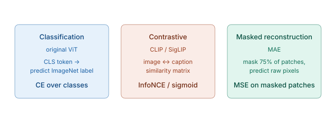
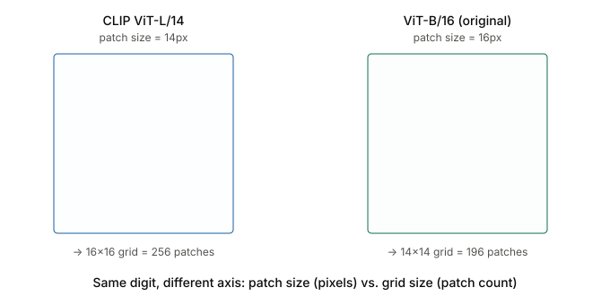
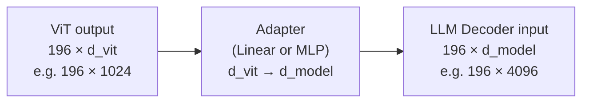
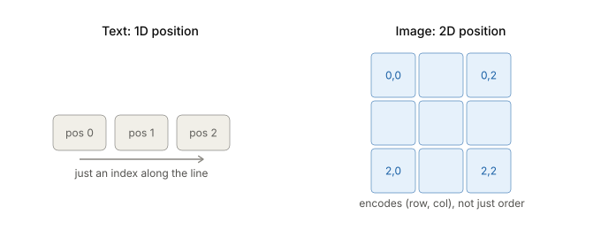
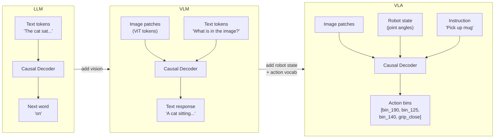
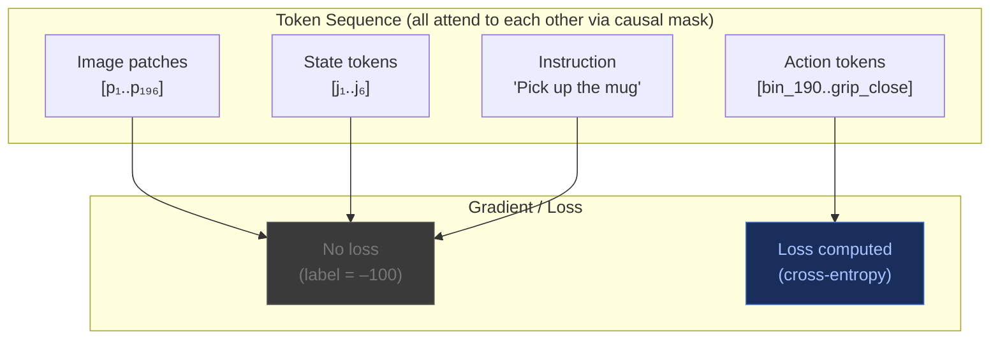

# Multimodality — VLMs and VLAs

> Source: Stanford CME295 — Transformers & LLMs | Autumn 2025 | Lecture 3

---

## Layer-by-Layer Overview

A VLM is a pretrained LLM with three components bolted onto the front. From input pixel to output word:

| Layer | What it does | Key detail |
|---|---|---|
| **Patch embedding** | Splits the image into fixed-size patches; each patch is flattened and linearly projected to a vector | Computation (matrix multiply), not a lookup |
| **Positional encoding (ViT)** | Adds a learned position vector to each patch embedding so the ViT knows where each patch is in the grid | Standard practice: 1D learned, not 2D |
| **ViT encoder** | N transformer encoder blocks with **bidirectional** (unmasked) self-attention — every patch attends to every other | Produces rich per-patch representations; also outputs a [CLS] token for global image summary |
| **Adapter / projection** | Maps ViT output dimension ($d_{vit}$) to LLM input dimension ($d_{model}$) | Linear, MLP, Q-Former, or Perceiver |
| **LLM decoder** | Standard causal transformer — image tokens prepended as a prefix, then text tokens follow | Unchanged from the base LLM |
| **Output head** | Linear + softmax over vocabulary | Identical to plain LLM; loss computed only on response tokens |

---

## Table of Contents

1. [ViT Pretraining Objectives](#1-vit-pretraining-objectives)
2. [What Changes, What Stays the Same](#2-what-changes-what-stays-the-same)
3. [Text Embedding vs Patch Embedding](#3-text-embedding-vs-patch-embedding)
4. [The Vision Encoder — Inside the ViT](#4-the-vision-encoder--inside-the-vit)
   - 4.1 [Why 16×16 Patches?](#41-why-1616-patches)
   - 4.2 [Patch Size vs Grid Size — The "14" Confusion](#42-patch-size-vs-grid-size--the-14-confusion)
5. [The Adapter / Projection Layer](#5-the-adapter--projection-layer)
6. [Two Attention Regimes in One Model](#6-two-attention-regimes-in-one-model)
7. [Positional Encoding — 1D Text vs 2D Image](#7-positional-encoding--1d-text-vs-2d-image)
8. [Loss Function — Same Formula, Different Mask](#8-loss-function--same-formula-different-mask)
9. [Full Pipeline End-to-End](#9-full-pipeline-end-to-end)
10. [The Big Picture — LLM → VLM → VLA](#10-the-big-picture--llm--vlm--vla)
11. [How a Continuous Number Becomes a Token](#11-how-a-continuous-number-becomes-a-token)
12. [Training Data — What a Training Example Looks Like](#12-training-data--what-a-training-example-looks-like)
13. [Loss Masking — What Actually Gets a Gradient](#13-loss-masking--what-actually-gets-a-gradient)
14. [The Compounding Error Problem at Inference](#14-the-compounding-error-problem-at-inference)

---

## 1. ViT Pretraining Objectives

Before a ViT is bolted into a VLM, it needs to be pretrained so that its patch representations are meaningful. Three major pretraining strategies exist — each uses a different loss function and different supervision signal.



### 1.1 Classification (original ViT)

```
  Supervision:  ImageNet labels  (1000 classes, human annotated)

  Mechanism:
  Image → ViT → [CLS] token vector → Linear head → logits over 1000 classes
                                                          ↓
                                              Cross-entropy vs true label

  Loss:  CE = -log P(correct class)
```

- Requires large annotated datasets (ImageNet-21k for larger ViTs)
- [CLS] token learns a global image summary
- Works well but label collection is expensive and class-centric (not general)

### 1.2 Contrastive (CLIP / SigLIP)

```
  Supervision:  (image, caption) pairs  — scraped from the web, no manual labels

  Mechanism:
  Image  → ViT image encoder  → image embedding  [d]
  Caption → Text encoder       → text embedding   [d]

  Build N×N similarity matrix for a batch of N pairs:
  ┌──────────────────────────────────────────┐
  │        cap₁   cap₂   cap₃  ...  capN    │
  │ img₁  [ ✓     ✗      ✗    ...   ✗  ]   │  ← diagonal = matching pairs
  │ img₂  [ ✗     ✓      ✗    ...   ✗  ]   │
  │ img₃  [ ✗     ✗      ✓    ...   ✗  ]   │
  │  ...                                    │
  │ imgN  [ ✗     ✗      ✗    ...   ✓  ]   │
  └──────────────────────────────────────────┘

  CLIP loss:  InfoNCE — pull matching pairs together, push non-matches apart
  SigLIP loss: Sigmoid binary CE — treats each (img, cap) pair independently
```

| | CLIP (InfoNCE) | SigLIP (sigmoid) |
|---|---|---|
| Loss type | Softmax over batch | Per-pair sigmoid |
| Batch dependency | All negatives in batch used | Independent per pair |
| Stability | Can be unstable at small batch | More stable |
| Label source | No labels needed | No labels needed |

- No human labels required — web-scale data (400M pairs for CLIP)
- Produces embeddings that align vision and language
- The ViT from CLIP is what gets used in most VLMs (LLaVA, InstructBLIP, etc.)

### 1.3 Masked Autoencoder (MAE)

```
  Supervision:  The image itself  — fully self-supervised, no labels at all

  Mechanism:
  1. Randomly mask 75% of patches (replace with [MASK] token)
  2. ViT encoder sees only the 25% visible patches
  3. Lightweight decoder reconstructs the masked patches' raw pixel values

  ┌────┬────┬────┬────┐       ┌────┬────┬────┬────┐
  │ p₁ │ ██ │ p₃ │ ██ │  →   │ p₁ │ p̂₂ │ p₃ │ p̂₄ │
  ├────┼────┼────┼────┤  ViT  ├────┼────┼────┼────┤
  │ ██ │ p₆ │ ██ │ p₈ │  +   │ p̂₅ │ p₆ │ p̂₇ │ p₈ │
  └────┴────┴────┴────┘ dec.  └────┴────┴────┴────┘
  Input (25% visible)          Reconstructed output

  Loss:  MSE = mean((predicted_pixels − true_pixels)²)
         computed only on masked patches (not the visible ones)
```

- 75% masking ratio is intentionally high — forces the model to understand global context, not just copy local patches
- No labels needed; can train on any unlabelled image collection
- MAE representations tend to be stronger for dense prediction tasks (segmentation, detection) than CLIP representations
- The ViT encoder in MAE is the part that gets used downstream; the decoder is discarded after pretraining

### 1.4 Comparison

| | Classification | Contrastive (CLIP) | Masked Autoencoder |
|---|---|---|---|
| Supervision | ImageNet labels | (image, caption) pairs | Raw pixels (self) |
| Loss | Cross-entropy | InfoNCE / sigmoid | MSE on masked patches |
| Labels needed | Yes (expensive) | No (web-scraped) | No |
| Output used | [CLS] token | Image/text embeddings | Patch token embeddings |
| Good for | Classification tasks | Zero-shot, VLMs | Dense tasks, fine-tuning |
| Key model | original ViT | CLIP, SigLIP | MAE |

> **For VLMs:** CLIP-pretrained ViTs are the most common choice because the contrastive objective already aligns vision representations with language — which is exactly what a VLM needs.

---

## 2. What Changes, What Stays the Same

The decoder is **untouched**. You take a pretrained LLM and bolt a vision encoder onto the front. From the decoder's point of view, image tokens are just more entries in the input sequence — it has no idea they came from pixels instead of a vocabulary lookup.

```
  LLM:
  [Text tokens] → Causal Decoder → Next word

  VLM:
  [Image patches] → ViT Encoder → Adapter → ┐
                                              ├→ Causal Decoder → Next word
  [Text tokens]  → Embedding lookup      → ┘
```

| Component | LLM | VLM |
|---|---|---|
| Causal decoder | ✓ | ✓ unchanged |
| Token embedding lookup | ✓ | ✓ unchanged |
| Causal attention mask | ✓ | ✓ unchanged |
| Cross-entropy loss | ✓ | ✓ same formula |
| Vision encoder (ViT) | ✗ | ✓ added |
| Adapter / projection | ✗ | ✓ added |
| 2D positional encoding | ✗ | ✓ added (inside ViT) |
| Loss masking on image tokens | ✗ | ✓ added |

The additions are all **prefix** — they produce a sequence of vectors that get prepended to the text token sequence. Everything downstream (attention, FFN, output head) is unchanged.

---

## 3. Text Embedding vs Patch Embedding

This is the first fundamental difference. How a token enters the model depends on whether it's a word or a pixel patch.

### Text tokens — embedding is retrieval

Text tokens are discrete integers (vocabulary IDs). Their embedding is a **lookup** — index into a table and retrieve a row.

```
  Vocabulary table (learned):
  ┌──────┬──────────────────────────────────────┐
  │  ID  │  Embedding vector [d_model]           │
  ├──────┼──────────────────────────────────────┤
  │    0 │  [0.12, -0.34, 0.87, ...]            │  ← <pad>
  │    1 │  [0.55,  0.21, -0.09, ...]           │  ← <eos>
  │  ...                                        │
  │ 2541 │  [-0.18, 0.63, 0.44, ...]            │  ← "cat"
  │  ...                                        │
  └──────┴──────────────────────────────────────┘

  Token "cat" (ID 2541) → retrieve row 2541 → [−0.18, 0.63, 0.44, ...]
  No computation needed. Just a memory read.
```

### Image patches — embedding is computation

Pixel patches have no discrete ID. A 14×14 RGB patch is 588 continuous float values. Their embedding is a **linear projection** — multiply the raw pixels by a learned weight matrix.

```
  Image patch  (14×14×3 = 588 pixel values):
  [0.91, 0.43, 0.12, 0.88, ..., 0.37]   ← 588 floats (raw pixels)
         │
         ▼  × W_patch  [588 × d_vit]
         │
  [0.24, -0.11, 0.67, ...]              ← d_vit dimensional patch embedding
  (learned linear layer, not a lookup)
```

| | Text tokens | Image patches |
|---|---|---|
| Input type | Discrete integer (token ID) | Continuous floats (pixel values) |
| Embedding method | Table lookup (retrieval) | Linear projection (computation) |
| Learned parameters | Embedding matrix rows | Weight matrix W_patch |
| Output | [d_model] vector | [d_vit] vector |

> **Key insight:** Text embedding is retrieval — it maps a symbol to a vector. Patch embedding is computation — it maps a signal to a vector. The rest of the pipeline doesn't care which it was.

---

## 4. The Vision Encoder — Inside the ViT

Before patch vectors reach the decoder, they go through a **Vision Transformer (ViT)** — a full transformer encoder that processes all patches together with bidirectional attention.

### Patch extraction

```
  Input image:  224×224×3

  Divide into 14×14 non-overlapping patches:
  ┌────┬────┬────┬────┐
  │ p₁ │ p₂ │ p₃ │ p₄ │
  ├────┼────┼────┼────┤
  │ p₅ │ p₆ │ p₇ │ p₈ │
  ├────┼────┼────┼────┤     → 196 patches (16×16 patch size → 14×14 grid)
  │ p₉ │p₁₀ │p₁₁ │p₁₂│
  ├────┼────┼────┼────┤
  │p₁₃ │p₁₄ │p₁₅ │p₁₆│
  └────┴────┴────┴────┘

  Each patch: 16×16×3 = 768 pixel values → projected to d_vit
```

### Attention inside the ViT is fully bidirectional

Unlike the causal decoder, the ViT uses **no mask** — every patch attends to every other patch in both directions. This lets the encoder build a global understanding of the image before anything reaches the language model.

```
  ViT attention matrix (196 patches, 196×196):

       p₁  p₂  p₃  ...  p₁₉₆
  p₁  [✓   ✓   ✓  ...   ✓  ]   ← p₁ can attend to all patches including future
  p₂  [✓   ✓   ✓  ...   ✓  ]
  p₃  [✓   ✓   ✓  ...   ✓  ]
  ...
  p₁₉₆[✓   ✓   ✓  ...   ✓  ]

  All green — no masking.
  p₁₉₆ can attend to p₁. p₁ can attend to p₁₉₆.
  Global context for every patch.
```

The ViT also prepends a special `[CLS]` token (same idea as BERT). Its output vector after all ViT layers is used as a global image representation for tasks that need a single image embedding (e.g. image classification).

### 4.1 Why 16×16 Patches?

The original ViT paper (Dosovitskiy et al., 2020) tried several patch sizes and measured the accuracy vs compute tradeoff:

| ViT variant | Patch size | Grid (224px input) | Sequence length | Notes |
|---|---|---|---|---|
| ViT-B/32 | 32×32 px | 7×7 | **49 tokens** | Fastest, lowest accuracy |
| ViT-B/16 | 16×16 px | 14×14 | **196 tokens** | Sweet spot — best accuracy/compute |
| ViT-L/14 | 14×14 px | 16×16 | **256 tokens** | Used in CLIP — higher resolution, more tokens |
| ViT-H/14 | 14×14 px | 16×16 | **256 tokens** | Largest ViT variant |

The tradeoff is straightforward:

```
  Smaller patch → more patches → longer sequence → more compute, more detail
  Larger patch  → fewer patches → shorter sequence → cheaper, coarser

  ViT-B/32:  49 patches   — fast, but misses fine detail (text, small objects)
  ViT-B/16: 196 patches   — the standard; 16px captures enough local texture
  ViT-L/14: 256 patches   — worth the cost for CLIP's image-text matching tasks
```

**Why 16px specifically?** There is no deep theoretical reason — it emerged from ablation. 16px patches contain enough local structure (edges, textures, colour gradients) that the subsequent transformer layers can meaningfully relate patches to each other. 32px patches lose too much local detail; 8px patches make the sequence prohibitively long.

**The resolution convention:** Most ViTs are trained at 224×224 pixels. This is inherited from ImageNet benchmarks where all images were resized to 224×224. At inference, different resolutions can be handled by interpolating the positional embeddings (see section 7).

### 4.2 Patch Size vs Grid Size — The "14" Confusion

The number **14** appears in two different ViT contexts with opposite meanings. This is a persistent source of confusion:

| Model name | What "14" means | Patch size | Grid size | Token count |
|---|---|---|---|---|
| CLIP **ViT-L/14** | **14 = patch size in pixels** | 14×14 px | 16×16 patches | 256 |
| **ViT-B/16** | 16 = patch size in pixels | 16×16 px | **14×14 patches** | 196 |

```
  CLIP ViT-L/14 (14px patch size):
  ┌──────────────────────────────────────┐
  │ 224px ÷ 14px = 16 patches per side  │
  │ → 16×16 grid → 256 patch tokens     │
  └──────────────────────────────────────┘

  ViT-B/16 (16px patch size):
  ┌──────────────────────────────────────┐
  │ 224px ÷ 16px = 14 patches per side  │
  │ → 14×14 grid → 196 patch tokens     │
  └──────────────────────────────────────┘
```

The naming convention `ViT-{size}/{patch_px}` names models by their **patch size in pixels**. The grid size (number of patches per side) is 224 ÷ patch_px — so smaller patch size means **larger** grid.



> **Rule of thumb:** The number after the slash in a ViT name is always the patch size in **pixels**. The grid size is always 224 ÷ that number (for standard 224px inputs).

---

## 5. The Adapter / Projection Layer

The ViT outputs vectors of dimension $d_{vit}$ (e.g. 1024). The LLM decoder expects vectors of dimension $d_{model}$ (e.g. 4096). These don't match — the adapter bridges them.



The adapter is typically one of:

| Adapter type | Architecture | Used in |
|---|---|---|
| Linear | Single weight matrix [d_vit × d_model] | CLIP-based models |
| MLP | Two linear layers + activation | LLaVA |
| Q-Former | Small transformer that queries visual features | BLIP-2 |
| Perceiver resampler | Attention-based, fixed output length | Flamingo |

The simpler the adapter, the more the burden falls on the decoder to learn to interpret visual tokens. The more complex, the more the adapter can compress and reformat visual information before the decoder sees it.

### What happens to the ViT weights?

During VLM training, different components are often frozen or unfrozen at different stages:

```
  Stage 1 — Adapter pre-training:
    ViT: frozen (keeps vision knowledge)
    LLM: frozen (keeps language knowledge)
    Adapter: trained  ← only new weights updated

  Stage 2 — Instruction fine-tuning:
    ViT: frozen or lightly fine-tuned
    LLM: fine-tuned (unfrozen)
    Adapter: fine-tuned
```

---

## 6. Two Attention Regimes in One Model

This is where VLMs are most often misunderstood. There is not one attention pattern — there are two, operating at different stages.

### Regime 1: Inside the ViT — Bidirectional

```
  ViT processes all 196 patches simultaneously, no mask:

  Each patch sees every other patch.
  p₅ (middle-left) attends to p₁₉₆ (bottom-right) and vice versa.
  Lets the encoder understand spatial relationships globally.
```

### Regime 2: Inside the LLM decoder — Causal

Once patch vectors are projected and prepended to the text sequence, they enter a **causal** decoder — the same masking as a standard LLM.

```
  Full token sequence in the decoder:

  [p₁][p₂]...[p₁₉₆]["What"]["is"]["in"]["the"]["image?"]["A"]["cat"]
  ←──── image prefix ────────────→←──── prompt ──────────→←─ response ─→

  Causal attention mask:
               p₁  p₂ ... p₁₉₆  What  is  in  the  image?  A    cat
  p₁         [✓    ✗     ✗      ✗     ✗   ✗   ✗    ✗       ✗    ✗  ]
  p₂         [✓    ✓     ✗      ✗     ✗   ✗   ✗    ✗       ✗    ✗  ]
  ...
  p₁₉₆       [✓    ✓    ✓       ✗     ✗   ✗   ✗    ✗       ✗    ✗  ]
  "What"     [✓    ✓    ✓       ✓     ✗   ✗   ✗    ✗       ✗    ✗  ]
  "is"       [✓    ✓    ✓       ✓     ✓   ✗   ✗    ✗       ✗    ✗  ]
  ...
  "A"        [✓    ✓    ✓       ✓     ✓   ✓   ✓    ✓       ✓    ✗  ]  ← can see all patches
  "cat"      [✓    ✓    ✓       ✓     ✓   ✓   ✓    ✓       ✓    ✓  ]  ← can see all patches + "A"
```

**Important:** Even though the image patches were computed with full bidirectional attention *inside* the ViT, once they enter the decoder as prefix tokens they are subject to causal masking. Image patch $p_{100}$ cannot attend to text token "A" — the causal mask forbids it. But text token "A" can attend to every image patch that came before it.



---

## 7. Positional Encoding — 1D Text vs 2D Image

### Text: position = order in sequence

```
  "The  cat  sat  on  the  mat"
    0    1    2    3    4    5     ← 1D position indices

  Position 3 vs 4 matters (word order).
  But the absolute index 3 vs 300 matters less — relative position is key.
```

### Image patches: position = location in 2D grid

```
  14×14 patch grid:

  (0,0) (0,1) (0,2) ... (0,13)   ← top row
  (1,0) (1,1) (1,2) ... (1,13)
  ...
  (13,0)(13,1)(13,2)... (13,13)  ← bottom row

  Patch (0,0) is top-left corner.
  Patch (13,13) is bottom-right corner.
  Swapping them would flip the image — spatial position is semantically critical.
```



### Two approaches to 2D position

**Option 1 — 2D positional encoding (explicit):**

```
  Each patch gets:  row_embedding(r) + col_embedding(c)

  Patch (3, 7):  pos_emb = E_row[3] + E_col[7]

  Separate learned row and column embedding tables.
  Explicitly encodes 2D structure.
```

**Option 2 — Flatten to 1D (implicit):**

```
  Grid:                            Flattened:
  (0,0)(0,1)(0,2)(0,3)            pos 0, 1, 2, 3,
  (1,0)(1,1)(1,2)(1,3)    →       pos 4, 5, 6, 7,
  (2,0)(2,1)(2,2)(2,3)            pos 8, 9, 10, 11,
  (3,0)(3,1)(3,2)(3,3)            pos 12, 13, 14, 15

  Row-major order. Standard 1D sinusoidal or learned PE applied.
  The ViT must learn from the training data that positions 0–3 are a row,
  positions 4–7 are the next row, etc.
  Simpler to implement; most ViT variants use this.
```

Once the patches enter the LLM decoder, they are treated as a flat 1D prefix — the decoder applies its standard 1D positional encoding on top of their already-encoded patch positions.

### What actually happens in practice

Despite the theoretical elegance of 2D encoding, the original ViT ablation showed almost no accuracy difference between 1D and 2D positional encodings. Most ViTs — including the CLIP ViT variants — use **plain 1D learned positional embeddings** (one learned vector per position index, 0 to N−1).

```
  What the ViT paper found:
  ┌─────────────────────────────┬──────────┐
  │ Positional encoding type    │ Accuracy │
  ├─────────────────────────────┼──────────┤
  │ None                        │  61.4%   │
  │ 1D learned (standard)       │  64.0%   │  ← baseline
  │ 2D learned (row + col)      │  64.0%   │  ← same
  │ Relative (learned)          │  64.1%   │  ← marginal
  └─────────────────────────────┴──────────┘

  The transformer appears to learn 2D structure implicitly from 1D positions
  when trained on enough image data.
```

**Inference at a different resolution:** If you train at 224px (196 patches) and run inference on a 336px image (441 patches), the positional embedding table has the wrong size. The fix is **bilinear interpolation** of the learned position vectors to the new grid size. This is standard practice in models like CLIP and LLaVA.

```
  Training:  224px input → 14×14 grid → 196 position vectors learned
  Inference: 336px input → 21×21 grid → 441 positions needed

  Solution: interpolate the 14×14 grid of vectors → resized to 21×21
  (bilinear interpolation in 2D, then flatten back to 1D)
```

---

## 8. Loss Function — Same Formula, Different Mask

The cross-entropy formula is identical to a plain LLM:

$$L = -\sum_i \log P(\text{token}_i \mid \text{context})$$

What changes is **which positions $i$ contribute** to the sum.

### Position-by-position breakdown

```
  Token sequence in decoder:

  Position:  1    2  ...  196   197    198   199  200    201   202
  Token:    [p₁][p₂]...[p₁₉₆]["What"]["is"]["in"]["the"]["A"]["cat"]
  Label:    -100 -100... -100   -100  -100  -100  -100   "A"  "cat"
                                                           ↑
                                            loss computed here onward
```

- Image patches: `label = -100` → no loss, no gradient
- Prompt text: `label = -100` → no loss, no gradient (it's given, not generated)
- Response tokens: real label → cross-entropy loss computed

The image tokens and prompt still flow through the network fully — they are keys and values in attention for every later position. They inform without being trained on.

### Teacher forcing during training

At training time, ground-truth previous tokens are always fed as input, regardless of what the model would have predicted:

```
  Ground truth response: "A cat sitting on a mat"

  Training step (teacher forcing):
  Input:   [image tokens] [prompt] "A"     → predict "cat"    ← fed GT "A", not model's output
  Input:   [image tokens] [prompt] "A cat" → predict "sitting" ← fed GT "A cat"
  ...

  Model never sees its own mistakes during training.
  (Same covariate shift problem as VLAs — just less physically dangerous.)
```

---

## 9. Full Pipeline End-to-End



### The three-step transition: LLM → VLM → VLA

```
  LLM
  ├── Causal decoder                     ← kept
  ├── Text token embeddings (lookup)      ← kept
  └── CE loss on all text tokens          ← kept

  + ViT encoder (bidirectional attention on patches)
  + Patch embeddings (linear projection, not lookup)
  + Adapter (d_vit → d_model)
  + 2D positional encoding inside ViT
  + Loss mask (ignore image + prompt positions)
  = VLM

  + Widen vocabulary with action bin tokens
  + Robot state tokens (quantised joint angles)
  + Loss mask narrowed further (only action bins supervised)
  = VLA
```

> **The decoder never changes.** LLM → VLM → VLA is a series of *input side* and *vocabulary* extensions. The core transformer — attention, FFN, positional encoding, output head mechanics — is the same throughout.

---

## 10. The Big Picture — LLM → VLM → VLA

A VLA is not a different architecture. It is a VLM whose vocabulary and output head have been extended to include robot actions. The transformer decoder itself is unchanged.

### What changes at each step



### The one structural change: widening the output head

```
  LLM output head:
  Linear [d_model → vocab_size]
  e.g.   [768 → 32,000]         ← 32K text tokens

  VLA output head:
  Linear [d_model → vocab_size + action_bins]
  e.g.   [768 → 32,000 + 256×7]  ← 32K text + 1792 action bin tokens
                                     (256 bins × 7 action dimensions)
```

Everything inside the transformer — attention, FFN, positional encoding — is identical. Only what counts as a "word" changes.

### The unified token stream

All modalities are flattened into one sequence before entering the decoder:

```
  One timestep of a VLA forward pass:

  ┌──────────────┬──────────────┬──────────────┬──────────────────────────┐
  │ Image Patch  │ Robot State  │  Instruction │      Action Bins         │
  │   Tokens     │   Tokens     │    Tokens    │       Tokens             │
  │              │              │              │                          │
  │ [p₁][p₂]... │[j₁][j₂][j₃] │[Pick][up]    │[bin_190][bin_125][grip]  │
  │  (ViT enc.)  │  (quantised) │[the][mug]    │                          │
  └──────────────┴──────────────┴──────────────┴──────────────────────────┘
          ↑               ↑             ↑                  ↑
        context        context       context             TARGET
        (read)         (read)        (read)            (predict)
```

One causal decoder processes all of it left-to-right. The "words" it predicts at the end are robot movements.

---

## 11. How a Continuous Number Becomes a Token

Robot actions are continuous values (joint angles, velocities, gripper widths). The transformer vocabulary only contains discrete integers. Bridging this is **action tokenization via binning**.

### The binning process

Suppose one action dimension controls an arm's reach, range –1.0 m to +1.0 m.

**Step 1 — Define bins:**

```
  Range: [-1.0, +1.0]   →  divided into 256 equal bins

  Bin 0:    –1.000 to –0.992
  Bin 1:    –0.992 to –0.984
  ...
  Bin 128:  –0.008 to  0.000   ← roughly "centre / no movement"
  Bin 129:   0.000 to  0.008
  ...
  Bin 255:  +0.992 to +1.000
```

**Step 2 — Encode a real value:**

```
  Actual reach command:  +0.52 m

  Bin = floor( (0.52 - (-1.0)) / (2.0 / 256) )
       = floor( 1.52 / 0.0078125 )
       = floor( 194.56 )
       = bin 194

  Token ID assigned to bin 194:  vocab_id = 32000 + 194 = 32194
```

**Step 3 — At inference, decode back:**

```
  Model outputs token ID 32194
  → subtract text vocab offset: 32194 - 32000 = 194
  → bin 194 centre value: -1.0 + (194 + 0.5) × 0.0078125 = +0.516 m
  → send +0.516 m to arm controller
```

### A full action step — 7 dimensions

A typical robot arm has 6 DOF + gripper = 7 dimensions. Each gets its own bin token:

```
  Human demonstrator command at timestep t:
  [Δx=+0.52, Δy=–0.14, Δz=+0.03, Rroll=0.0, Rpitch=+0.21, Ryaw=–0.08, grip=CLOSE]

  Tokenised:
  [bin_194] [bin_110] [bin_132] [bin_128] [bin_155] [bin_118] [grip_close]
      ↑          ↑         ↑         ↑          ↑          ↑         ↑
    Δx         Δy        Δz       roll       pitch        yaw      gripper
```

The model predicts these 7 tokens one by one — standard next-token prediction, same as predicting the next word.

### Bin resolution tradeoff

```
  256 bins over 2m range  →  ~8mm precision per bin

  Coarser bins (fewer):   faster, less memory, but imprecise movements
  Finer bins (more):      more precise, but larger vocab, harder to learn

  Some papers use per-axis bin ranges:
    Gripper approach (needs precision): 512 bins over 0.1m → 0.2mm
    Gross transport (coarse OK):        128 bins over 2m   → 16mm
```

---

## 12. Training Data — What a Training Example Looks Like

The same causal decoder is trained on all three model types. What differs is entirely what sits in the token sequence.

### Side-by-side: one training example per model type

```
  ┌─────────────────────────────────────────────────────────────────────────┐
  │  LLM                                                                    │
  │                                                                         │
  │  "The  cat  sat  on  the  mat  ."                                       │
  │   t₁   t₂   t₃   t₄   t₅   t₆  t₇                                    │
  │                                                                         │
  │  Predict:  t₂   t₃   t₄   t₅   t₆   t₇   <eos>                       │
  │  Loss on:  ALL positions                                                │
  └─────────────────────────────────────────────────────────────────────────┘

  ┌─────────────────────────────────────────────────────────────────────────┐
  │  VLM  (instruction-tuned, one conversation turn)                        │
  │                                                                         │
  │  [p₁][p₂]...[p₁₉₆]  "What  is  in  the  image?"  "A  cat  sitting"   │
  │  ←── image patches ──→  ←────── prompt ──────────→  ←── response ────→ │
  │                                                                         │
  │  Loss on:  response tokens only  ("A", "cat", "sitting", ...)           │
  │  Prompt + image patches:  context, no gradient                          │
  └─────────────────────────────────────────────────────────────────────────┘

  ┌─────────────────────────────────────────────────────────────────────────┐
  │  VLA  (one timestep from a robot trajectory)                            │
  │                                                                         │
  │  [p₁..p₁₉₆]  [j₁][j₂][j₃][j₄][j₅][j₆]  "Pick  up  the  red  mug"   │
  │  ←─ image ──→  ←──── robot joint angles ────→  ←──── instruction ────→ │
  │                                                                         │
  │  [bin_190][bin_125][bin_140][bin_128][bin_155][bin_118][grip_close]     │
  │  ←────────────────── action tokens ─────────────────────────────────→  │
  │                                                                         │
  │  Loss on:  action tokens only — 7 tokens out of potentially 210+        │
  └─────────────────────────────────────────────────────────────────────────┘
```

### What gets packed into a VLA trajectory

A full demonstration trajectory is multiple timesteps packed back-to-back:

```
  Timestep 1:
  [image_t1 tokens] [state_t1 tokens] [instruction tokens] [action_t1 bins]

  Timestep 2:
  [image_t2 tokens] [state_t2 tokens]                      [action_t2 bins]
                    (instruction only given once, at start)

  Timestep 3:
  [image_t3 tokens] [state_t3 tokens]                      [action_t3 bins]

  → One training sequence = hundreds or thousands of tokens
  → Supervision signal = action tokens only, scattered throughout
```

---

## 13. Loss Masking — What Actually Gets a Gradient

This is the mechanism that makes the above work in code.

### The labels = –100 trick

In PyTorch's `CrossEntropyLoss`, any position with label `–100` is **ignored** — it contributes zero to the loss and zero to the gradient.

```
  VLA token sequence (simplified):

  Position:   1      2      3      4      5      6      7       8       9       10      11
  Token:    [p₁]  [p₂]  [p₃]  [Pick]  [up]  [the]  [mug]  [b_190] [b_125] [b_140] [grip]
  Label:    -100  -100  -100   -100   -100   -100   -100     190     125     140    CLOSE
                                                              ↑                           ↑
                                                        loss computed here          and here
```

The image patch tokens and instruction tokens still **participate in attention** — they appear in the key-value cache for every later position. They are read by the action tokens when computing attention. They just don't produce a gradient themselves.



### Why this creates sparse supervision

```
  Typical VLA training example token budget:

  Image patches:    196 tokens   (14×14 ViT patches from one camera frame)
  Robot state:        6 tokens   (6 DOF joint angles, each quantised)
  Instruction:       ~8 tokens   ("Pick up the red mug")
  Action bins:        7 tokens   (6 DOF + gripper)
  ────────────────────────────
  Total:           ~217 tokens   per timestep

  Tokens with gradient:   7 / 217  =  ~3%

  For a 10-step trajectory:
  Total tokens:  ~2170
  Supervised:      70 action tokens  →  still only ~3%
```

> This is why VLA training requires far more trajectory data than a comparably-sized text fine-tune. Most of the sequence is "reading" — only a tiny fraction is "answering."

### Training vs inference — KV cache

| | Training | Inference |
|---|---|---|
| Tokens | Full trajectory visible at once | Generated one token at a time |
| KV cache | Not needed (parallel) | Essential (autoregressive) |
| Causal mask | Applied to prevent future-token leakage | Applied implicitly (nothing to attend forward to) |
| Loss | Cross-entropy on action tokens | N/A — just argmax or sample |

During training, causal masking lets every position predict its next token **in parallel** — whether that next token is a word or an action bin, the mechanism is identical. Loss is cross-entropy the whole way through, same as standard language modelling.

---

## 14. The Compounding Error Problem at Inference

Training never feels distribution shift. Deployment does.

### Why training is safe

During training, every timestep is conditioned on the **ground-truth** previous state — the human demonstrator's actual arm position and actual camera frame. Even if the model would have predicted a wrong action at step 3, step 4 still gets the correct image from the demo.

### Why inference is dangerous

At inference, the model conditions on **its own previous outputs**:

```
  Timestep 1:  model predicts action  →  arm moves  →  new camera frame captured
  Timestep 2:  model sees the NEW (slightly wrong) camera frame
               conditions on its own mistake  →  predicts next action
  Timestep 3:  another small error accumulates
  ...
  Timestep N:  arm is completely off course, camera shows a scene
               the model has never been trained on
```


Binning makes this worse: a slightly wrong bin moves the arm slightly off-course, which changes the next camera frame, which changes the next predicted bin, which compounds further.

### Mitigations

| Method | Idea |
|---|---|
| **DAgger** | Periodically query human for correction during rollout; add corrected states to training data |
| **Finer bins** | Reduce quantisation error per step so individual mistakes are smaller |
| **Chunked action prediction** | Predict several steps ahead at once (e.g. 10 action tokens) and re-plan less frequently |
| **Larger / more diverse data** | Train on enough varied trajectories that more states are in-distribution |

---
