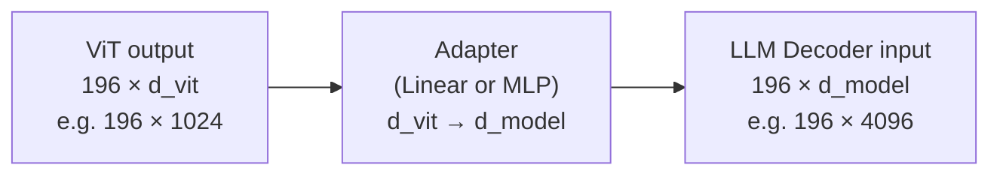

## 5. The Adapter / Projection Layer

The ViT outputs vectors of dimension $d_{vit}$ (e.g. 1024). The LLM decoder expects vectors of dimension $d_{model}$ (e.g. 4096). These don't match — the adapter bridges them.



The adapter is typically one of:

| Adapter type | Architecture | Used in |
|---|---|---|
| Linear | Single weight matrix [d_vit × d_model] | CLIP-based models |
| MLP | Two linear layers + activation | LLaVA |
| Q-Former | Small transformer that queries visual features | BLIP-2 |
| Perceiver resampler | Attention-based, fixed output length | Flamingo |

The simpler the adapter, the more the burden falls on the decoder to learn to interpret visual tokens. The more complex, the more the adapter can compress and reformat visual information before the decoder sees it.

### What happens to the ViT weights?

During VLM training, different components are often frozen or unfrozen at different stages:

```
  Stage 1 — Adapter pre-training:
    ViT: frozen (keeps vision knowledge)
    LLM: frozen (keeps language knowledge)
    Adapter: trained  ← only new weights updated

  Stage 2 — Instruction fine-tuning:
    ViT: frozen or lightly fine-tuned
    LLM: fine-tuned (unfrozen)
    Adapter: fine-tuned
```

---
