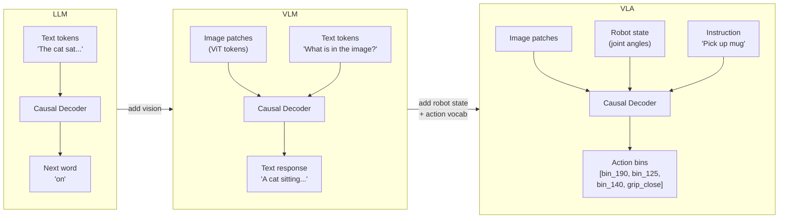

## 10. The Big Picture — LLM → VLM → VLA

A VLA is not a different architecture. It is a VLM whose vocabulary and output head have been extended to include robot actions. The transformer decoder itself is unchanged.

### What changes at each step



### The one structural change: widening the output head

```
  LLM output head:
  Linear [d_model → vocab_size]
  e.g.   [768 → 32,000]         ← 32K text tokens

  VLA output head:
  Linear [d_model → vocab_size + action_bins]
  e.g.   [768 → 32,000 + 256×7]  ← 32K text + 1792 action bin tokens
                                     (256 bins × 7 action dimensions)
```

Everything inside the transformer — attention, FFN, positional encoding — is identical. Only what counts as a "word" changes.

### The unified token stream

All modalities are flattened into one sequence before entering the decoder:

```
  One timestep of a VLA forward pass:

  ┌──────────────┬──────────────┬──────────────┬──────────────────────────┐
  │ Image Patch  │ Robot State  │  Instruction │      Action Bins         │
  │   Tokens     │   Tokens     │    Tokens    │       Tokens             │
  │              │              │              │                          │
  │ [p₁][p₂]... │[j₁][j₂][j₃] │[Pick][up]    │[bin_190][bin_125][grip]  │
  │  (ViT enc.)  │  (quantised) │[the][mug]    │                          │
  └──────────────┴──────────────┴──────────────┴──────────────────────────┘
          ↑               ↑             ↑                  ↑
        context        context       context             TARGET
        (read)         (read)        (read)            (predict)
```

One causal decoder processes all of it left-to-right. The "words" it predicts at the end are robot movements.

---
