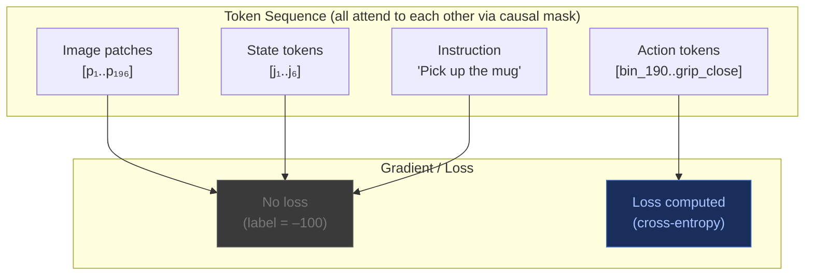

## 13. Loss Masking — What Actually Gets a Gradient

This is the mechanism that makes the above work in code.

### The labels = –100 trick

In PyTorch's `CrossEntropyLoss`, any position with label `–100` is **ignored** — it contributes zero to the loss and zero to the gradient.

```
  VLA token sequence (simplified):

  Position:   1      2      3      4      5      6      7       8       9       10      11
  Token:    [p₁]  [p₂]  [p₃]  [Pick]  [up]  [the]  [mug]  [b_190] [b_125] [b_140] [grip]
  Label:    -100  -100  -100   -100   -100   -100   -100     190     125     140    CLOSE
                                                              ↑                           ↑
                                                        loss computed here          and here
```

The image patch tokens and instruction tokens still **participate in attention** — they appear in the key-value cache for every later position. They are read by the action tokens when computing attention. They just don't produce a gradient themselves.



### Why this creates sparse supervision

```
  Typical VLA training example token budget:

  Image patches:    196 tokens   (14×14 ViT patches from one camera frame)
  Robot state:        6 tokens   (6 DOF joint angles, each quantised)
  Instruction:       ~8 tokens   ("Pick up the red mug")
  Action bins:        7 tokens   (6 DOF + gripper)
  ────────────────────────────
  Total:           ~217 tokens   per timestep

  Tokens with gradient:   7 / 217  =  ~3%

  For a 10-step trajectory:
  Total tokens:  ~2170
  Supervised:      70 action tokens  →  still only ~3%
```

> This is why VLA training requires far more trajectory data than a comparably-sized text fine-tune. Most of the sequence is "reading" — only a tiny fraction is "answering."

### Training vs inference — KV cache

| | Training | Inference |
|---|---|---|
| Tokens | Full trajectory visible at once | Generated one token at a time |
| KV cache | Not needed (parallel) | Essential (autoregressive) |
| Causal mask | Applied to prevent future-token leakage | Applied implicitly (nothing to attend forward to) |
| Loss | Cross-entropy on action tokens | N/A — just argmax or sample |

During training, causal masking lets every position predict its next token **in parallel** — whether that next token is a word or an action bin, the mechanism is identical. Loss is cross-entropy the whole way through, same as standard language modelling.

---
