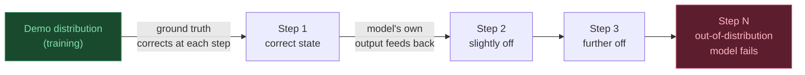

## 14. The Compounding Error Problem at Inference

Training never feels distribution shift. Deployment does.

### Why training is safe

During training, every timestep is conditioned on the **ground-truth** previous state — the human demonstrator's actual arm position and actual camera frame. Even if the model would have predicted a wrong action at step 3, step 4 still gets the correct image from the demo.

### Why inference is dangerous

At inference, the model conditions on **its own previous outputs**:

```
  Timestep 1:  model predicts action  →  arm moves  →  new camera frame captured
  Timestep 2:  model sees the NEW (slightly wrong) camera frame
               conditions on its own mistake  →  predicts next action
  Timestep 3:  another small error accumulates
  ...
  Timestep N:  arm is completely off course, camera shows a scene
               the model has never been trained on
```



Binning makes this worse: a slightly wrong bin moves the arm slightly off-course, which changes the next camera frame, which changes the next predicted bin, which compounds further.

### Mitigations

| Method | Idea |
|---|---|
| **DAgger** | Periodically query human for correction during rollout; add corrected states to training data |
| **Finer bins** | Reduce quantisation error per step so individual mistakes are smaller |
| **Chunked action prediction** | Predict several steps ahead at once (e.g. 10 action tokens) and re-plan less frequently |
| **Larger / more diverse data** | Train on enough varied trajectories that more states are in-distribution |

---
